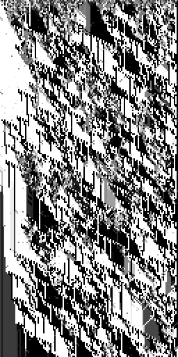
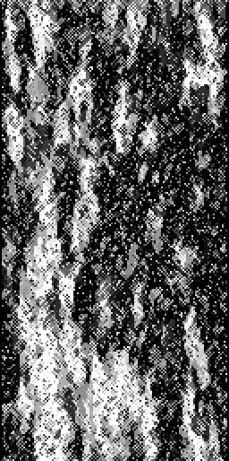
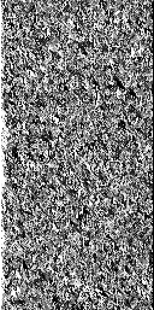

# Predictive information: ECA validation and MetaCA parent/blend comparison

## Claims table

Corrected active information storage (AIS) is in bits, reported as mean ± 95%
CI. The ECA class result pools 20 matched seeds for each of three rules; the
MetaCA comparison has 20 matched seeds per dynamic.

| Claim | Dynamic/class | Corrected AIS (bits) | n | Verdict |
|---|---|---:|---:|---|
| V1 | Ordered ECA | 0.0000 ± 0.0000 | 60 | Frozen control is uninformative |
| V1 | Chaotic ECA | 0.3575 ± 0.0078 | 60 | Chaotic control retains limited self-prediction |
| V1 | Complex/EoC ECA | 0.7891 ± 0.0099 | 60 | Above both controls without CI overlap |
| B1 | Mutating-template parent | 0.5210 ± 0.0096 | 20 | Parent A |
| B1 | Baldwin parent | 0.4501 ± 0.0075 | 20 | Parent B |
| B1 | Template-combine + Baldwin-mutate blend | 0.5708 ± 0.0011 | 20 | Above both parent CIs |

## Measured propositions

The discriminator clears its non-negotiable trust anchor. With parameters fixed
before measurement, the complex ECA class's lower 95% bound is 0.7791 bits,
above the largest frozen/chaotic upper bound of 0.3653 bits. The full per-rule
table is in `predictive-information-eca-validation.md`.

On the MetaCA dynamics, the executable blend's CI is `[0.5697, 0.5719]`, wholly
above the two-parent CI envelope `[0.4426, 0.5306]`. Thus its predictive
information sits outside—and above—the observed parent range. This is evidence
about these finite runs, not a claim that AIS alone proves universal
computational intelligence or that every blend improves its parents.

## Executable blend

The blend is not score interpolation. Each coupled update computes the new
phenotype normally, applies mutating-template's `combine-with-template` to each
genotype cell, then passes that concrete rule byte through Baldwin's existing
context-gated mutation stage. The representative seed-42 blend grid is asserted
different from both parent grids before diagrams are written.

## Protocol and statistical framing

- MetaCA: width 128, 256 updates, seeds 42–61; identical genotype and phenotype
  initial conditions for all three dynamics at each seed.
- Score: mean Miller–Madow-corrected AIS over all eight genotype bitplanes,
  `k=8`, burn-in 64. Using all planes was fixed before running; no best-plane
  selection was performed.
- The parent/blend result is a **statistical replay**. It makes no per-seed
  determinism claim and reports the distributional mean with 95% CIs.
- Machine-readable per-seed scores: `predictive-information-dynamics.edn`.
- Matched seed-42 diagrams: `predictive-information-diagrams/`.

## Matched spacetime diagrams (seed 42)

| Mutating-template | Baldwin | Blend |
|---|---|---|
|  |  |  |

The blend is visibly denser and more noise-like in this grayscale rule-byte
projection even though its individual bitplanes retain high temporal
self-prediction. That mismatch is a reason to keep the diagrams and other
discriminators beside AIS; the scalar should not be treated as a visual oracle.
