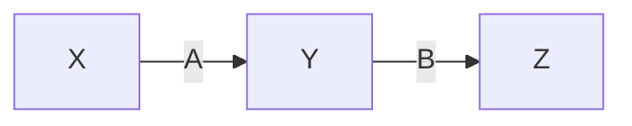
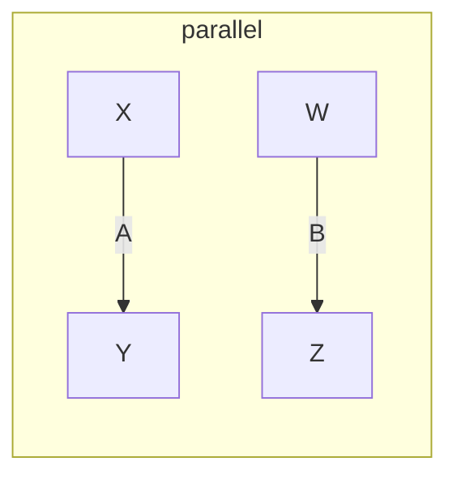
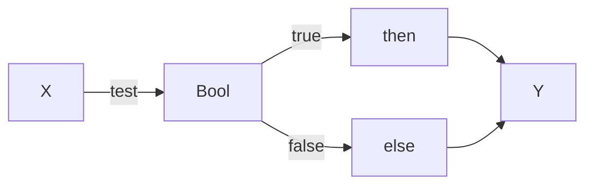
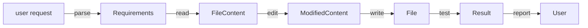

# CT Wiring Vocabulary

This document defines the **Category Theory vocabulary** for expressing xenotype
wirings as composable, renderable diagrams.

## Why CT for Wirings?

Wirings are **compositions of primitives**. Category theory gives us:

1. **Objects**: Types (sigil, [sigil], bool, float, etc.)
2. **Morphisms**: Operations that transform types
3. **Composition**: How operations chain together
4. **Identity**: The "do nothing" operation
5. **Laws**: Associativity guarantees correct refactoring

Without CT, wirings are just strings of code. With CT, wirings are **diagrams**
that can be:
- Inspected
- Compared
- Composed
- Rendered (mermaid, graphviz, etc.)

## The Wiring Category

### Objects (Types)

| Object | Description | Example Values |
|--------|-------------|----------------|
| `Sigil` | Single 8-bit sigil | 一, 二, 万 |
| `[Sigil]` | Vector of sigils | ["一" "二" "三"] |
| `Bit` | Single bit | 0, 1 |
| `[Bit]` | Bit vector (phenotype) | [1 0 1 0] |
| `Float` | Scalar in [0,1] | 0.5, 0.75 |
| `Bool` | Boolean | true, false |
| `Int` | Integer | 0, 1, 255 |
| `Context` | Full local context | {:pred "一" :self "二" ...} |
| `State` | Hidden state | {:accum 0.5 :mode :normal} |

### Morphisms (Primitives)

#### Level 2: Sigil Operations

| Morphism | Signature | CT Notation |
|----------|-----------|-------------|
| `xor` | Sigil × Sigil → Sigil | xor : Sigil ⊗ Sigil → Sigil |
| `and` | Sigil × Sigil → Sigil | and : Sigil ⊗ Sigil → Sigil |
| `majority` | [Sigil] → Sigil | majority : [Sigil] → Sigil |
| `blend` | [Sigil] × [Float] → Sigil | blend : [Sigil] ⊗ [Float] → Sigil |
| `mutate` | Sigil × Float → Sigil | mutate : Sigil ⊗ Float → Sigil |
| `similarity` | Sigil × Sigil → Float | similarity : Sigil ⊗ Sigil → Float |
| `balance` | Sigil → Float | balance : Sigil → Float |

#### Level 3: String Operations

| Morphism | Signature | CT Notation |
|----------|-----------|-------------|
| `entropy` | [Sigil] → Float | entropy : [Sigil] → Float |
| `diversity` | [Sigil] → Float | diversity : [Sigil] → Float |
| `allele-freq` | [Sigil] → {Sigil → Int} | allele-freq : [Sigil] → Freq |
| `change-rate` | [Sigil] × [Sigil] → Float | change-rate : [Sigil] ⊗ [Sigil] → Float |

#### Level 5: State Operations

| Morphism | Signature | CT Notation |
|----------|-----------|-------------|
| `accum-add` | State × Float → State | accum-add : State ⊗ Float → State |
| `threshold?` | State × Float → Bool | threshold? : State ⊗ Float → Bool |
| `apply-bias` | Sigil × State → Sigil | apply-bias : Sigil ⊗ State → Sigil |

### Composition Modes

#### Sequential Composition (;)

```
A : X → Y
B : Y → Z
───────────
A;B : X → Z
```

In mermaid:


#### Parallel Composition (⊗)

```
A : X → Y
B : W → Z
───────────────
A ⊗ B : X × W → Y × Z
```

In mermaid:


#### Conditional Composition (if)

```
test : X → Bool
then : X → Y
else : X → Y
─────────────────
if(test, then, else) : X → Y
```

In mermaid:


#### Blend Composition (α·A + β·B)

```
A : X → Y
B : X → Y
α, β : Float where α + β = 1
──────────────────────────────
blend(A, B, α) : X → Y
```

### Identity Morphisms

| Object | Identity | Description |
|--------|----------|-------------|
| `Sigil` | `id-sigil` | Returns sigil unchanged |
| `[Sigil]` | `id-string` | Returns string unchanged |
| `State` | `id-state` | Returns state unchanged |

Identity laws:
- `id ; A = A`
- `A ; id = A`

### Associativity

```
(A ; B) ; C = A ; (B ; C)
```

This means we can write `A ; B ; C` without ambiguity.

## Wiring Representation

A wiring is a record:

```clojure
{:id :xenotype-148
 :hexagram 37
 :energy :ji
 :name "Family + Press"

 ;; The wiring as a CT morphism
 :morphism
 {:source :Context
  :target :Sigil
  :body [:if [:> [:balance :phe] 0]
             [:mutate-toward :self [:majority [:pred :succ]] 0.2]
             :self]}

 ;; Primitives used (for indexing/search)
 :primitives #{:balance :mutate-toward :majority}

 ;; Mermaid rendering
 :mermaid "graph LR\n  Context -->|extract phe| Phe\n  Phe -->|balance| Float\n  ..."}
```

## Wiring DSL

To avoid writing raw morphism bodies, use the wiring DSL:

```clojure
(defwiring xenotype-148
  :hexagram 37
  :energy :ji
  :name "Family + Press"

  (if (> (balance phe) 0)
    (mutate-toward self (majority [pred succ]) 0.2)
    self))
```

This compiles to the morphism representation above.

## Mermaid Rendering

### wiring->mermaid

```clojure
(wiring->mermaid xenotype-148)
;; =>
;; "graph LR
;;     Context[Context] --> balance[balance phe]
;;     balance --> cond{> 0?}
;;     cond -->|yes| mutate[mutate-toward]
;;     cond -->|no| self[self]
;;     mutate --> Out[Sigil]
;;     self --> Out"
```

### Rendering Rules

1. **Sequential**: A → B → C (left to right)
2. **Parallel**: Subgraph with multiple paths
3. **Conditional**: Diamond node with yes/no branches
4. **Blend**: Merge node combining inputs

## Existing Infrastructure

### futon5.exotic.category

Provides CT primitives:
- `Category` record with objects, morphisms, compose-table
- `Functor` for mapping between categories
- `valid-category?` for law checking

### futon5.xenotype.wiring

Provides diagram validation:
- `load-components` - load component library from EDN
- `validate-diagram` - type-check node connections
- `example-diagram` - sample scorer diagram

### futon5.xenotype.interpret

Provides diagram evaluation:
- `default-registry` - scorer components (short, envelope, filament, etc.)
- `eval-registry` - series evaluation components
- `evaluate-diagram` - execute a wiring given context
- Topological ordering of nodes

### Gap Analysis

| Need | Exists? | Location |
|------|---------|----------|
| Category record | ✓ | exotic/category.clj |
| Functor record | ✓ | exotic/functor.clj |
| Diagram validation | ✓ | xenotype/wiring.clj |
| Diagram evaluation | ✓ | xenotype/interpret.clj |
| Scorer components | ✓ | interpret.clj default-registry |
| Generator components | ✗ | Need xenotype-generator-components.edn |
| Mermaid rendering | ✗ | Need wiring->mermaid function |
| 256 xenotype wirings | ✗ | Need wiring definitions |

The wiring category should:
1. Use the same `Category` infrastructure
2. Add generator-specific morphisms (xor, majority, mutate, etc.)
3. Create `xenotype-generator-components.edn`
4. Provide `wiring->mermaid` rendering

## Connection to Existing Lift Registry

The `exotype-xenotype-lift.edn` has `:ct-template` entries using flexiarg
vocabulary (IF/HOWEVER/THEN/BECAUSE). This is a **different category**:

| Category | Objects | Morphisms | Purpose |
|----------|---------|-----------|---------|
| Flexiarg | :context, :action, :rationale | :m-if, :m-then, :m-because | Pattern reasoning |
| Wiring | Sigil, [Sigil], Float, State | xor, majority, mutate, ... | Operation composition |

We can define a **functor** from Flexiarg → Wiring that maps:
- `:context` → `Context`
- `:action` → `Sigil` (output)
- `:m-if` → condition check primitive
- `:m-then` → main operation
- `:m-because` → (drops, no runtime effect)

## Scorer Wirings

Scorers are also wirings, but in a different signature space:

```clojure
(defwiring eoc-scorer
  :type :scorer
  :name "Edge of Chaos"

  (let [e (entropy current-gen)
        c (change-rate current-gen prev-gen)
        a (temporal-autocorr last-10-gens)
        f (filament-count gen-history)]
    (+
      (* 0.3 (band-score e 0.6 0.3))
      (* 0.3 (band-score c 0.2 0.2))
      (* 0.2 (band-score a 0.5 0.3))
      (* 0.2 (threshold-gate (> f 0))))))
```

Scorer wirings use Level 7 primitives and produce `Float` scores.

## Implementation Checklist

### Phase 1: Generator Components ✓ COMPLETE

- [x] Create `resources/xenotype-generator-components.edn` with:
  - Level 2 primitives: xor, and, or, majority, blend, mutate, similarity
  - Level 3 primitives: entropy, diversity, allele-freq, change-rate
  - Level 5 primitives: accum-add, threshold?, apply-bias
- [x] Add generator component implementations (`xenotype/generator.clj`)
- [x] Update `wiring.clj` to handle generator types (sigil, sigil-list)
- [x] Implement mermaid renderer (`xenotype/mermaid.clj`)

### Phase 2: Wiring Definitions ✓ COMPLETE

- [x] Define 8 prototype generator wirings (one per hexagram family)
  - prototype-001-creative-peng.edn (Creative + Péng)
  - prototype-038-receptive-lu.edn (Receptive + Lǚ)
  - prototype-071-difficulty-ji.edn (Difficulty + Jǐ)
  - prototype-104-youthful-an.edn (Youthful + Àn)
  - prototype-129-waiting-peng.edn (Waiting + Péng)
  - prototype-166-conflict-lu.edn (Conflict + Lǚ)
  - prototype-199-army-ji.edn (Army + Jǐ)
  - prototype-232-joy-an.edn (Joy + Àn)
- [x] Store wirings in `resources/xenotype-wirings/`

### Phase 3: CT Verification ✓ COMPLETE

- [x] Define `WiringCategory` using `futon5.exotic.category`
- [x] Add type coercion support (int→scalar, sigil→sigil-list)
- [x] Add wiring invariants to verify_invariants.clj (Invariant 7)
- [x] Verify identity laws: id_A ∘ f = f = f ∘ id_B
- [x] Verify associativity: (f ∘ g) ∘ h = f ∘ (g ∘ h)
- [x] Validate prototype wiring type edges

### Phase 4: Scorer Wirings ✓ COMPLETE

- [x] Create `resources/xenotype-scorer-components.edn` with:
  - Input: run-frames, run-genotype, frames-count, frame-at
  - Skeleton: thin-frame, thin-all
  - Metrics: skeleton-length, endpoint-density, branchpoint-density, cycle-count
  - Temporal: persistence, persistence-series, change-rate, activity-series
  - Aggregation: mean, median, variance, min-val, max-val
  - Arithmetic: add, multiply, divide, log1p, pow, clamp
  - EOC: entropy-score, lambda-estimate, eoc-distance
- [x] Add scorer component implementations (`xenotype/scorer.clj`)
- [x] Define 4 prototype scorer wirings (one per energy)
  - scorer-peng-diversity.edn (Péng: diversity-focused)
  - scorer-lu-stability.edn (Lǚ: stability-focused)
  - scorer-ji-eoc.edn (Jǐ: edge-of-chaos focused)
  - scorer-an-filament.edn (Àn: filament complexity)
- [x] Scorer wirings render as mermaid diagrams
- [x] Add scorer invariants to verify_invariants.clj (Invariant 8)

## Example: Full Xenotype Wiring

```clojure
(defwiring xenotype-004
  :hexagram 1      ; Creative
  :energy :an      ; Push
  :name "Creative Push"

  ;; Context: Sustained creative pressure
  ;; When entropy accumulates, mutate; otherwise differentiate

  (let [state (accum-add state (entropy population) 0.9)]
    (if (> (accum-read state) 0.7)
      (mutate self 0.3)
      (xor pred succ))))

;; Renders as:
;; graph LR
;;     Pop[population] -->|entropy| E[Float]
;;     State -->|accum-add E| State'
;;     State' -->|accum-read| Acc[Float]
;;     Acc -->|> 0.7?| Cond{threshold}
;;     Cond -->|yes| Mut[mutate 0.3]
;;     Cond -->|no| Xor[xor pred succ]
;;     Self --> Mut
;;     Pred --> Xor
;;     Succ --> Xor
;;     Mut --> Out[Sigil]
;;     Xor --> Out
```

## Fulab Application: Plans as Wiring Diagrams

When agents produce "plans", they should produce wiring diagrams:

**Current (bad)**:
```
Plan: First I'll read the file, then modify it, then test.
```

**Future (good)**:


This makes plans:
- Inspectable (you can see the structure)
- Composable (plans can be combined)
- Verifiable (CT laws apply)
- Comparable (which plan is simpler?)
