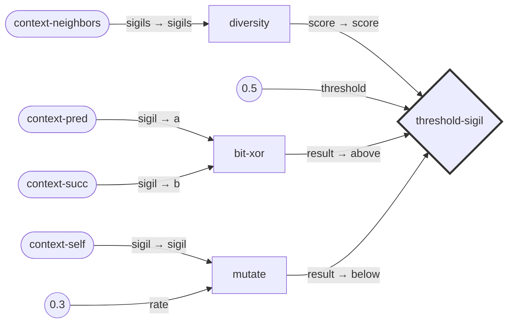
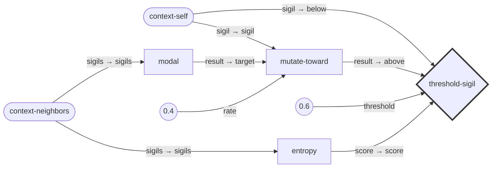
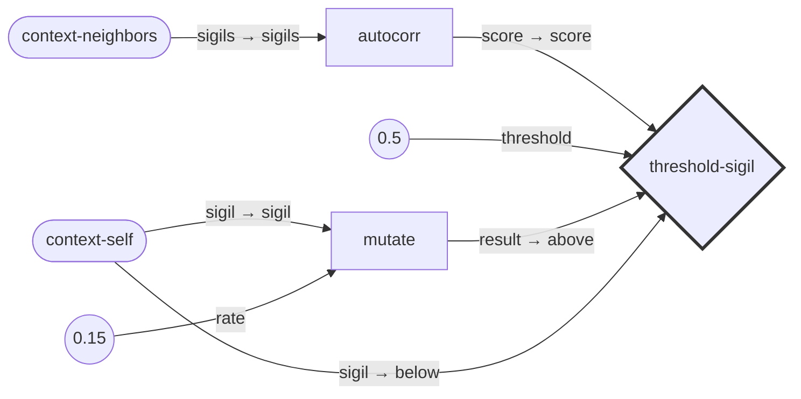
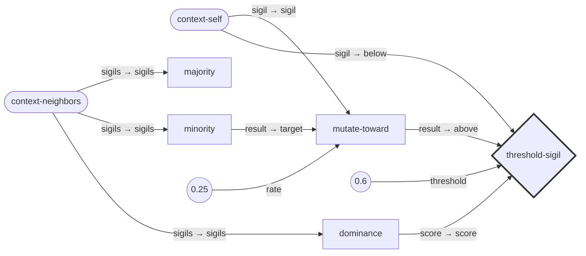
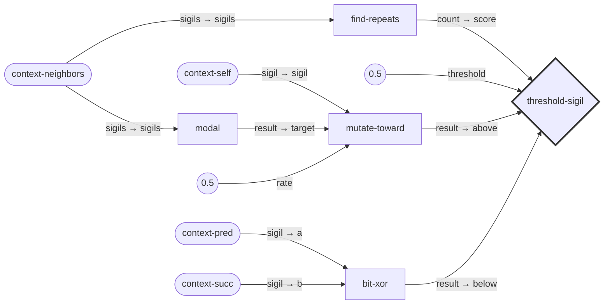
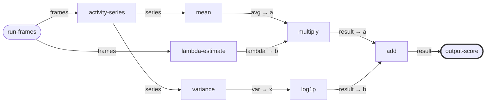
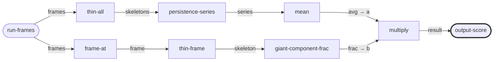
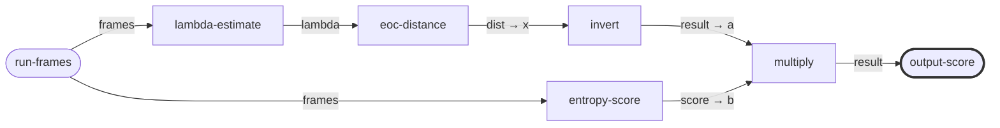
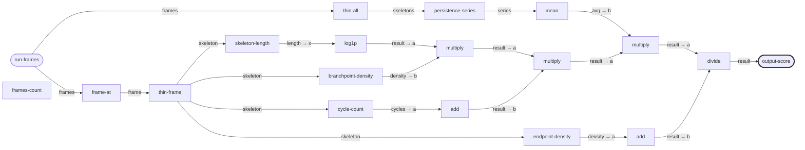

# Prototype Xenotype Wirings

These 8 prototypes demonstrate one wiring per hexagram family.

## :xenotype-001: Creative + Expand

**Family:**  | **Hexagram:** 1 | **Energy:** :peng

Creative expansion: when local diversity is low, mutate away from neighbors; otherwise XOR to differentiate



---

## :xenotype-038: Treading + Yield

**Family:** Receptive | **Hexagram:** 10 | **Energy:** :lu

Receptive yielding: preserve self when aligned with neighbors, blend toward consensus when not

```mermaid
graph LR

    %% Nodes
    ctx-self([context-self])
    neighbors([context-neighbors])
    consensus[majority]
    similarity[similarity]
    blend[blend]
    choose{threshold-sigil}
    style choose stroke:#333,stroke-width:3px

    %% Edges
    neighbors -->|sigils → sigils| consensus
    ctx-self -->|sigil → a| similarity
    consensus -->|result → b| similarity
    ctx-self -->|sigil → sigils| blend
    consensus -->|result → sigils| blend
    val_G__204(([0.4 0.6]))
    val_G__204 -->|weights| blend
    similarity -->|score → score| choose
    val_G__205((0.75))
    val_G__205 -->|threshold| choose
    ctx-self -->|sigil → above| choose
    blend -->|result → below| choose
```

---

## :xenotype-071: Work on the Decayed + Focus

**Family:** Difficulty | **Hexagram:** 18 | **Energy:** :ji

Difficulty with focus: when entropy is high (decay), focus mutation toward the modal sigil to restore order



---

## :xenotype-104: Great Taming + Push

**Family:** Youthful | **Hexagram:** 26 | **Energy:** :an

Youthful learning with sustained push: explore through crossover with neighbors, accumulating experience

```mermaid
graph LR

    %% Nodes
    ctx-self([context-self])
    ctx-pred([context-pred])
    ctx-succ([context-succ])
    cross-pred[uniform-crossover]
    cross-succ[uniform-crossover]
    blend[blend]
    style blend stroke:#333,stroke-width:3px

    %% Edges
    ctx-self -->|sigil → a| cross-pred
    ctx-pred -->|sigil → b| cross-pred
    val_G__208((0.3))
    val_G__208 -->|rate| cross-pred
    ctx-self -->|sigil → a| cross-succ
    ctx-succ -->|sigil → b| cross-succ
    val_G__209((0.3))
    val_G__209 -->|rate| cross-succ
    cross-pred -->|result → sigils| blend
    cross-succ -->|result → sigils| blend
    val_G__210(([0.5 0.5]))
    val_G__210 -->|weights| blend
```

---

## :xenotype-129: Retreat + Expand

**Family:** Waiting | **Hexagram:** 33 | **Energy:** :peng

Patient waiting with expansion: hold position but prepare for action by expanding internal diversity



---

## :xenotype-166: Increase + Yield

**Family:** Conflict | **Hexagram:** 42 | **Energy:** :lu

Resolving tension through yielding: when neighbors conflict, yield toward the minority to restore balance



---

## :xenotype-199: The Cauldron + Focus

**Family:** Army | **Hexagram:** 50 | **Energy:** :ji

Army coordination with focus: identify repeating patterns and reinforce them through focused mutation



---

## :xenotype-232: The Joyous + Push

**Family:** Joy | **Hexagram:** 58 | **Energy:** :an

Joy through sustained harmony: blend with neighbors to maximize evenness and shared patterns

```mermaid
graph LR

    %% Nodes
    ctx-self([context-self])
    ctx-pred([context-pred])
    ctx-succ([context-succ])
    neighbors([context-neighbors])
    evenness[evenness]
    harmony-blend[blend]
    joy-mutate[mutate]
    style joy-mutate stroke:#333,stroke-width:3px

    %% Edges
    neighbors -->|sigils → sigils| evenness
    ctx-pred -->|sigil → sigils| harmony-blend
    ctx-self -->|sigil → sigils| harmony-blend
    ctx-succ -->|sigil → sigils| harmony-blend
    val_G__217(([0.33 0.34 0.33]))
    val_G__217 -->|weights| harmony-blend
    harmony-blend -->|result → sigil| joy-mutate
    val_G__218((0.05))
    val_G__218 -->|rate| joy-mutate
```

---

# Prototype Scorer Wirings

These 4 prototypes demonstrate one scorer per energy type.

## :scorer-peng: Diversity Scorer

**Energy:** :peng (Expand)

Diversity-focused scorer: rewards spatial variety and change



---

## :scorer-lu: Stability Scorer

**Energy:** :lu (Yield)

Stability-focused scorer: rewards temporal persistence and coherence



---

## :scorer-ji: Edge-of-Chaos Scorer

**Energy:** :ji (Focus)

Edge-of-chaos scorer: rewards lambda near 0.5 (critical point)



---

## :scorer-an: Filament Complexity Scorer

**Energy:** :an (Push)

Filament complexity scorer: rewards branching, cycles, and persistent structure



---

