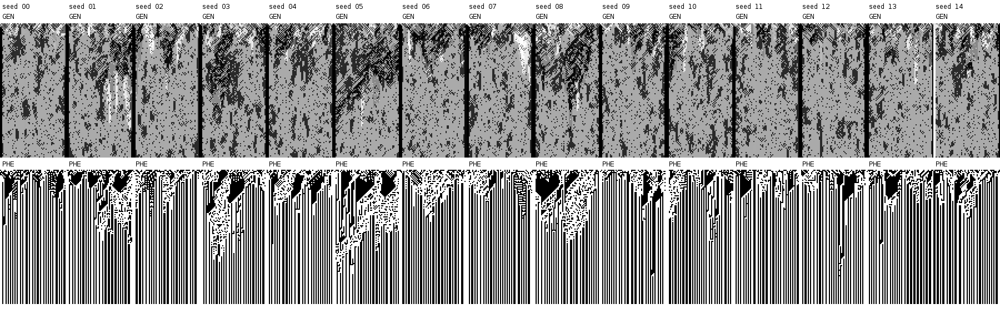
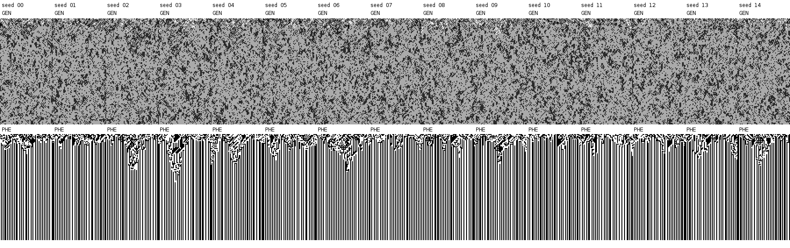
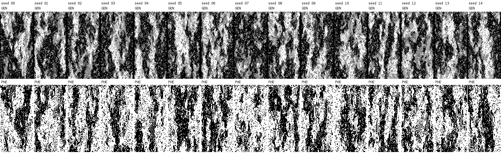

# Baldwin replay: the 2014 default does not reproduce the Figure-8 attractor

The default `evolve-sigil-with-blending-baldwin` in the 2014 Figure-8 commit
does **not** reproduce the diagnostic 42/170 two-rule attractor.  It does make
the phenotype static in all 15 runs, but later (last activity at generations
42--96), and every terminal genotype also contains rule 0 plus 0--5 additional
rules.  The established `evolve-sigil-with-blending-mutation` control reaches
exactly `{42,170}` in 15/15 runs.  This is an honest negative: the published
picture is robustly reproducible, but not under the function aliased as the
2014 file's default.

## Protocol and reproduction

The replay loads the vendored legacy files without editing them.  A
lexical-binding side-file wraps the mutation function to count requested
mutation counts and actual buffer write positions.  `goto-char` is observed
after Emacs clamps the requested position, so the position histogram is a
measurement of writes, not a source-level inference.

All arms use seeds 0--14, width 60, 120 updates (121 recorded rows), and the
legacy phenotype-first coevolution order.  Baldwin receives the four-cell
context required by its implementation.  The wrapper invokes each original
`n`-step mutation call once and observes its `goto-char` calls; it does not
decompose or reimplement the legacy state transition.  Each seed is atomically
persisted as soon as it completes under `data/baldwin-repro/runs/`; a killed
batch therefore retains completed runs.

```sh
cd /home/joe/code/futon5
clojure -M scripts/baldwin_repro.clj
```

The command writes `data/baldwin-repro/summary.edn` and regenerates the paired
panels below.  Cached complete seeds are not rerun.

## Q1: attractor and activity

| arm | exact 42/170 tail | terminal phenotype static | last active generation | terminal rule counts |
|---|---:|---:|---|---|
| 2014 Baldwin default | 0/15 | 15/15 | 42--96 (median 66) | 3--8 |
| 2014 blending-mutation control | 15/15 | 15/15 | 17--55 (median 29) | 2 in every seed |
| 2015 Baldwin control | 0/15 | 0/15 | still active at 120 in 15/15 | 26--41 |

The 2014 Baldwin terminal rule sets all contain `{0,42,170}`.  Seven seeds have
exactly that triple; the others retain one to five of
`{2,10,34,40,43,169,171,251,255}`.  Genotype mutation also remains live at the
horizon (7--17 cells change in the final step), so this is not convergence to a
frozen multi-rule field.  The phenotype nevertheless becomes vertical stripes
with exactly zero temporal activity for the final 20 rows in every run.







## Q2: does the mutation bug execute under Baldwin?

Yes.  Across the 104,400 interior-cell Baldwin calls, the measured 2014
histogram of requested `(1- mutations)` is:

| requested steps | count | share of Baldwin calls |
|---:|---:|---:|
| -1 | 1,869 | 1.790% |
| 0 | 22,539 | 21.589% |
| 1 | 72,352 | 69.303% |
| 2 | 7,640 | 7.318% |

Positive mutation requests therefore occur for 76.621% of Baldwin's interior
calls, or 74.067% of all width-by-generation cells after including the two
boundary cells that have no context.  They execute 0.8114 mutation steps per
cell.  By contrast, the 2014 blending-mutation arm requests mutation for
exactly 100% of cells (two steps per cell in this vendored commit).  An actual
genotype change is observed on 18.726% of all Baldwin cells versus 28.909% for
blending-mutation; repeated writes and writes of a value already present make
this lower than the request rate.

The same-function 2015 control is intentionally not dynamics-equivalent: its
source has a one-third gate and requests 2--5 fixed-position mutations.  It
made 34,740 positive calls (32.167% of all cells) and stayed active in every
run.  This establishes that the 2014/2015 result is not merely a renderer or
activity-detector artifact.

## Q3: direct write-position measurement and correction

The buggy 2014 Baldwin arm made 87,632 measured writes:

| zero-based written bit | 0 | 1 | 2 | 3 | 4 | 5 | 6 | 7 |
|---|---:|---:|---:|---:|---:|---:|---:|---:|
| count | 21,861 | 11,062 | 10,932 | 10,976 | 10,906 | 10,942 | 10,953 | 0 |
| share | 24.946% | 12.623% | 12.475% | 12.525% | 12.445% | 12.486% | 12.499% | 0.000% |

The blending-mutation control independently gives the same shape over 216,000
writes: bit 0 receives 53,809 writes (24.912%), bits 1--6 each receive about
12.5%, and bit 7 receives zero.  The fixed 2015 Baldwin control is uniform over
all eight positions (17,180--17,573 writes each).  Thus the off-by-one is real
and active, but “only ever flips the first bit” is not a literal description:
it doubles bit 0's probability, shifts source positions 2--7 onto written bits
1--6, and never writes bit 7.

### Diff-ready correction for `M-sci-reproduction.md`

The Figure-8 mutation bug does have an Elisp implementation in the vendored
2014 Figure-8 commit, `256ca-2014-12-29-BUGGY.el`, although it is absent from
the later `256ca.el`/2015 file previously inspected.  In
`mutate-genotype-n`, `(random 8)` produces a zero-based position but
`goto-char` consumes a one-based buffer position; Emacs clamps position 0 to
`point-min`.  Direct replay measurement recorded 21,861 writes to zero-based
bit 0, approximately 10.9k to each bit 1--6, and zero to bit 7 under 2014
Baldwin (87,632 writes total), while the fixed 2015 implementation is uniform
over all eight positions.  The paper's “only ever flips the first bit” is
therefore an imprecise gloss: the implementation doubles writes to bit 0 and
never writes bit 7.  The Clojure `:first-bit` variant remains a model of the
caption's literal claim, not an exact cross-check of the historical bug.

## Artifacts

- Per-run evidence: `data/baldwin-repro/runs/*.edn` (45 complete records)
- Machine-readable aggregation: `data/baldwin-repro/summary.edn`
- Batch driver: `scripts/baldwin_repro.clj`
- Lexical-binding legacy adapter/instrumentation: `scripts/baldwin_repro_worker.el`
