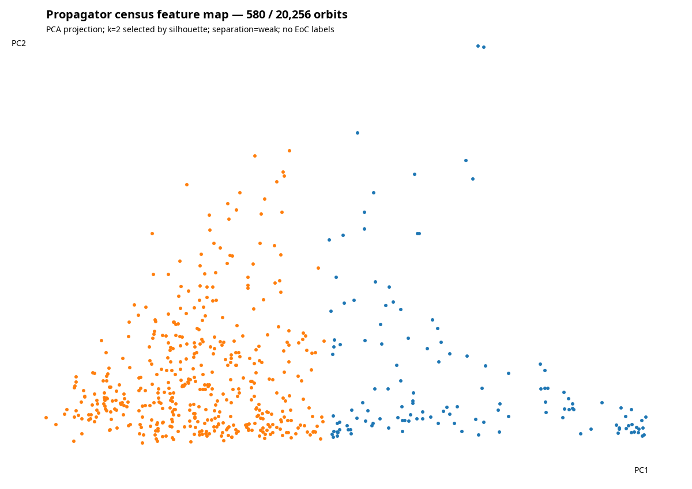

# Propagator census features and provisional clusters

**Coverage: 580 / 20,256 orbit representatives (2.86%).** This is a seeded-
shuffle prefix captured while the overnight census was still active. It is a
uniform sample, not a completed census, and every generated artifact records
that coverage and fingerprint `ac2ff1681eae5b85`.

## Reproduce

```sh
cd /home/joe/code/futon5
clojure -M scripts/propagator_features.clj
```

The command snapshots the complete `sigma-*.edn.gz` files present at startup;
new files arriving during the run are intentionally deferred to the next run.
It checkpoints extraction every 25 artifacts to `features.partial.edn`, flushes
progress to stdout, and atomically replaces final outputs. Rerun the same
command after the index completes to replace this provisional 438-row result
with the full table and clustering.

## Features

`features.csv` is the compact, one-row-per-orbit table. At full coverage its
present 273-byte/row representation projects to about 5.5 MB. It contains the
three seeded death times and terminal rule counts, cluster and PCA coordinates,
plus 18 standardized clustering inputs:

- mean/range of death time, mean terminal distinct-rule count, and total
  phenotype activity normalized by 60 cells × 120 steps;
- normalized rule-distribution entropy over early (0–39), middle (40–79), and
  late (80–120) windows, terminal entropy, and late-minus-early entropy;
- terminal top-1/top-4 rule mass, active-rule count, and final-step total-
  variation distance in rule-distribution space;
- the supplied class-4-rule population over the same three windows, terminal
  value, and peak, all normalized by width.

These are regime-description features, not EoC scores or class predictions.
The class-4 population is a census of a supplied rule list, not a claim that the
MetaCA run belongs to Wolfram class 4. No transport feature is included: a dense
rule histogram has no spatial positions, so transport cannot be derived from it.

## Data-selected clustering

Features are z-scored. For each `k=2..10`, five deterministic k-means++ starts
are compared; the minimum-inertia fit supplies the silhouette, and adjusted
Rand agreement against the other starts supplies the stability check. The
largest silhouette selects `k`; it is not manually chosen. Silhouette uses all
rows while `N≤1000` and a deterministic, evenly-spaced 1000-row sample above
that threshold, keeping the completed 20,256-row rerun bounded.

| k | silhouette | restart stability (ARI) |
|---:|---:|---:|
| 2 | **0.4441** | 1.0000 |
| 3 | 0.3949 | 0.9905 |
| 4 | 0.3295 | 0.8929 |
| 5 | 0.2879 | 0.6279 |
| 6 | 0.2954 | 0.8693 |
| 7 | 0.3059 | 0.7840 |
| 8 | 0.3075 | 0.6855 |
| 9 | 0.2952 | 0.6792 |
| 10 | 0.2579 | 0.6600 |

The provisional selection is **k=2**, sizes 447 and 133 (numeric cluster labels
are arbitrary). Separation is labelled **weak**, because silhouette is below
0.5 even though the five k=2 restarts agree exactly. The picture is currently
closer to a broad body plus a dispersed tail than to a richly partitioned
taxonomy. This verdict must be recomputed at full coverage; the script does not
preserve this `k` as a preference.



`cluster-selection.edn` carries the complete curve and ten provisional render
selections: each cluster medoid plus extremes on both PCA axes, capped globally
at 40.

## Contact sheet: blocked by irreversible source-data loss

No contact sheet is emitted from this prefix. This is an acceptance-blocking
apparatus finding, not an omitted renderer:

- Each indexed run contains only `:seed`, `:death`, `:rules`, `:activity`,
  `:class-4`, and `:census`.
- `:census` is 121 rows of 256 rule **counts**. It discards the 60 spatial cell
  positions. There is no genotype history.
- Phenotype is reduced to total `:activity` and death time. There is no
  phenotype history.
- `futon5.mmca.render/render-history-phenotype` requires the two spatial
  histories. Count vectors cannot be inverted into them; many distinct fields
  have the same census.

Therefore paired genotype/phenotype panels cannot be reconstructed from the
census, and producing them would fabricate evidence. Rendering the ten selected
sigmas requires a separately authorized deterministic replay that retains
`:gen` and `:phe`; the current task explicitly prohibits any simulation rerun.
`cluster-selection.edn` marks this as
`:render-status :blocked-no-spatial-histories` so a later authorized renderer
can consume the selection without re-selecting attractive pictures.

## Outputs

- `features.csv` — compact feature table with cluster assignments
- `cluster-selection.edn` — metadata, standardization, selection curve,
  cluster sizes, and preregistered render selection
- `cluster-map.png` — two-component PCA projection, coverage stamped in-image
