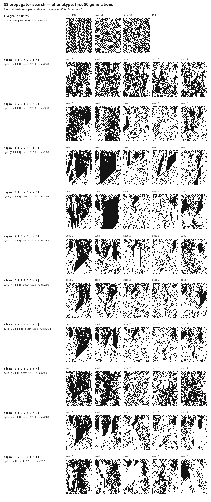

# S8 propagator search — persistent structured regimes

**Coverage: 202 of 40,320 permutations (0.501%).** This is a stratified-and-refined search, not a sweep of S8. 112 sampled permutations met the preregistered signature: all three runs survive 120 steps and mean terminal rule diversity is 20–35.

## Design

The first stage samples up to 4 deterministic hash-selected permutations from each of all 22 cycle types: 85 stratified configurations (every member when a stratum has fewer than four), plus 5 forced anchors, for 90 initial configurations total. The second stage takes the strongest 4 live candidates under a lexicographic `(survived seeds, in-band seeds, mean survival, distance from the band centre, activity)` ordering and exhausts each candidate's 28 one-transposition output neighbourhood. The three measurements remain visible; the ordering is not asserted as a scalar complexity score.

Runs use width 60, 120 steps, inversion enabled, and seeds 0–2. The top contact-sheet candidates additionally use seeds 3–4. Each run is an atomic EDN artefact whose path and contents carry fingerprint `853eb8cc6c4e4d3c`; that fingerprint covers this driver, the Elisp worker, harness, all vendored MetaCA files, and the protocol.

## Harness anchors

| anchor | death by seed | rules by seed | mean rules | verdict |
|---|---|---|---|---|
| rotate+2 | [120 120 120 120] | [30 25 34 32] | 30.3 | PASS |
| two disjoint 4-cycles | [74 40 29 33] | [1 1 1 1] | 1.0 | PASS |
| 3-cycle + 5-cycle | [120 120 120 120] | [29 18 34 24] | 26.3 | PASS |
| rotate+4 | [120 64 44 46] | [2 1 2 1] | 1.5 | PASS |
| rotate+1 | [47 41 44 42] | [1 1 1 1] | 1.0 | PASS |

The exact death generation is noisy, as expected; the specified live/collapsed regimes and terminal-diversity bands reproduce.

## Ranked live candidates

| rank | sigma | cycles | death mean | rules mean | activity mean | 3-seed vectors |
|---|---|---|---|---|---|---|
| 1 | `[3 1 2 5 7 0 6 4]` | [3 2 1 1 1] | 120.0 | 27.7 | 3363.0 | d=[120 120 120]; r=[29 23 31] |
| 2 | `[0 7 2 1 6 5 4 3]` | [3 2 1 1 1] | 120.0 | 27.7 | 2069.7 | d=[120 120 120]; r=[27 24 32] |
| 3 | `[4 1 2 7 6 5 0 3]` | [3 2 1 1 1] | 120.0 | 27.3 | 1517.7 | d=[120 120 120]; r=[24 30 28] |
| 4 | `[0 1 5 7 6 2 4 3]` | [2 2 2 1 1] | 120.0 | 27.7 | 1499.0 | d=[120 120 120]; r=[28 28 27] |
| 5 | `[2 1 0 7 6 5 4 3]` | [2 2 2 1 1] | 120.0 | 27.3 | 1447.3 | d=[120 120 120]; r=[26 28 28] |
| 6 | `[0 1 2 7 3 5 4 6]` | [4 1 1 1 1] | 120.0 | 27.0 | 1858.0 | d=[120 120 120]; r=[26 23 32] |
| 7 | `[0 1 2 7 6 5 4 3]` | [2 2 1 1 1 1] | 120.0 | 28.0 | 1708.0 | d=[120 120 120]; r=[27 31 26] |
| 8 | `[3 1 2 5 7 6 0 4]` | [4 2 1 1] | 120.0 | 28.3 | 3087.7 | d=[120 120 120]; r=[30 29 26] |
| 9 | `[5 1 2 7 6 0 4 3]` | [2 2 2 1 1] | 120.0 | 26.7 | 1714.0 | d=[120 120 120]; r=[26 30 24] |
| 10 | `[2 7 5 3 6 1 4 0]` | [5 2 1] | 120.0 | 28.3 | 1704.7 | d=[120 120 120]; r=[30 25 30] |
| 11 | `[0 2 1 7 6 5 4 3]` | [2 2 2 1 1] | 120.0 | 26.7 | 1576.3 | d=[120 120 120]; r=[21 28 31] |
| 12 | `[0 1 4 7 6 5 2 3]` | [3 2 1 1 1] | 120.0 | 28.3 | 1371.0 | d=[120 120 120]; r=[30 21 34] |
| 13 | `[0 3 7 4 1 2 5 6]` | [4 3 1] | 120.0 | 26.7 | 1347.3 | d=[120 120 120]; r=[33 27 20] |
| 14 | `[2 3 5 7 6 1 4 0]` | [6 2] | 120.0 | 26.3 | 2314.7 | d=[120 120 120]; r=[21 32 26] |
| 15 | `[2 3 5 7 6 0 4 1]` | [3 3 2] | 120.0 | 28.7 | 2186.7 | d=[120 120 120]; r=[28 25 33] |
| 16 | `[5 6 1 0 2 3 7 4]` | [5 3] | 120.0 | 29.0 | 3063.0 | d=[120 120 120]; r=[25 29 33] |
| 17 | `[6 7 4 0 5 1 2 3]` | [8] | 120.0 | 29.0 | 2222.0 | d=[120 120 120]; r=[32 24 31] |
| 18 | `[7 3 5 2 6 4 1 0]` | [6 2] | 120.0 | 26.0 | 1589.3 | d=[120 120 120]; r=[28 23 27] |
| 19 | `[0 1 2 7 6 4 5 3]` | [3 2 1 1 1] | 120.0 | 26.0 | 1493.3 | d=[120 120 120]; r=[28 24 26] |
| 20 | `[0 3 7 2 1 4 5 6]` | [7 1] | 120.0 | 29.0 | 1377.3 | d=[120 120 120]; r=[27 34 26] |
| 21 | `[5 0 6 3 4 1 2 7]` | [3 2 1 1 1] | 120.0 | 25.7 | 2163.7 | d=[120 120 120]; r=[22 29 26] |
| 22 | `[4 6 1 3 2 5 0 7]` | [5 1 1 1] | 120.0 | 29.3 | 1604.0 | d=[120 120 120]; r=[26 27 35] |
| 23 | `[6 1 2 7 0 5 4 3]` | [3 2 1 1 1] | 120.0 | 29.3 | 1492.7 | d=[120 120 120]; r=[25 32 31] |
| 24 | `[1 0 2 7 6 5 4 3]` | [2 2 2 1 1] | 120.0 | 29.7 | 2519.7 | d=[120 120 120]; r=[31 25 33] |
| 25 | `[0 1 2 6 7 5 4 3]` | [4 1 1 1 1] | 120.0 | 25.3 | 2189.3 | d=[120 120 120]; r=[24 28 24] |

## Phenotype contact sheet



The panels show the first 80 generations, before late collapse can hide the surviving phase. Candidate rows use five matched seeds; the reference row shows ECA 110, 54, 30, and 0 under the same width and horizon.

## Structural answer

**No tested single structural property characterises the live set.** Cycle type is already falsified by the two 4-cycle anchors, and the deterministic cycle-stratified stage contains mixed live/dead buckets for the tested properties shown below. These are descriptive counterexamples, not a fitted classifier; the refinement cohort is excluded because it is deliberately selected around live points.

| property | has mixed bucket? | live / sampled by value |
|---|---|---|
| `cycle-type` | true | [1 1 1 1 1 1 1 1]: 0/1; [2 1 1 1 1 1 1]: 2/4; [2 2 1 1 1 1]: 3/4; [2 2 2 1 1]: 1/4; [2 2 2 2]: 0/4; [3 1 1 1 1 1]: 0/4; [3 2 1 1 1]: 4/4; [3 2 2 1]: 2/4; [3 3 1 1]: 1/4; [3 3 2]: 3/4; [4 1 1 1 1]: 1/4; [4 2 1 1]: 1/4; [4 2 2]: 2/4; [4 3 1]: 3/4; [4 4]: 0/4; [5 1 1 1]: 3/4; [5 2 1]: 3/4; [5 3]: 4/4; [6 1 1]: 1/4; [6 2]: 3/4; [7 1]: 2/4; [8]: 3/4 |
| `cycle-count` | true | 1: 3/4; 2: 9/16; 3: 12/20; 4: 7/20; 5: 6/12; 6: 3/8; 7: 2/4; 8: 0/1 |
| `fixed-points` | true | 0: 15/28; 1: 10/16; 2: 4/16; 3: 7/8; 4: 4/8; 5: 0/4; 6: 2/4; 8: 0/1 |
| `parity` | true | :even: 19/45; :odd: 23/40 |
| `semantic-distance-sum` | true | 0: 0/1; 10: 5/8; 12: 13/28; 14: 10/14; 16: 3/6; 18: 1/2; 20: 1/2; 4: 1/5; 6: 6/12; 8: 2/7 |
| `semantic-distance-hist` | true | {0 1, 2 3, 3 2, 1 2}: 1/1; {0 3, 1 4, 2 1}: 3/3; {0 3, 2 5}: 1/1; {0 3, 3 2, 2 1, 1 2}: 1/1; {0 3, 3 3, 1 1, 2 1}: 1/1; {0 4, 2 4}: 1/1; {0 4, 3 2, 2 2}: 0/1; {0 5, 2 1, 1 2}: 0/2; {0 5, 2 3}: 0/1; {0 6, 2 2}: 1/2; {0 6, 3 2}: 1/2; {0 8}: 0/1; {1 1, 0 5, 3 1, 2 1}: 0/1; {1 1, 2 2, 3 3, 0 2}: 1/1; {1 1, 2 4, 3 3}: 1/1; {1 2, 0 4, 2 2}: 2/4; {1 2, 2 3, 0 3}: 0/1; {1 2, 2 5, 0 1}: 1/2; {1 2, 2 6}: 2/2; {1 2, 3 2, 0 4}: 1/1; {1 3, 3 1, 2 3, 0 1}: 2/4; {1 4, 0 2, 2 2}: 0/3; {1 4, 0 4}: 0/1; {1 4, 2 2, 3 2}: 1/2; {1 4, 3 4}: 0/1; {1 5, 3 1, 2 2}: 2/2; {1 6, 0 2}: 0/1; {1 6, 3 2}: 0/4; {1 8}: 0/1; {2 1, 0 1, 1 4, 3 2}: 3/5; {2 2, 1 2, 0 2, 3 2}: 0/4; {2 3, 3 1, 0 3, 1 1}: 1/1; {2 4, 0 2, 1 2}: 2/3; {2 4, 1 4}: 4/4; {2 4, 3 1, 1 3}: 2/4; {2 4, 3 2, 1 2}: 1/3; {2 6, 0 2}: 0/2; {2 6, 3 2}: 0/1; {2 7, 0 1}: 1/2; {2 8}: 1/1; {3 1, 1 3, 2 2, 0 2}: 0/1; {3 1, 2 5, 0 1, 1 1}: 2/2; {3 4, 0 2, 2 2}: 1/1; {3 4, 2 4}: 1/2 |

The tested semantic properties use the documented neighbourhood order `[000 001 010 100 011 101 110 111]`: total source→destination Hamming distance and its histogram. Neither those, parity, fixed points, cycle count, nor full cycle type is necessary and sufficient in this sample. The result is therefore a clean negative, not evidence that no higher-order semantic relation exists.

## Reproduction

```sh
clojure -M -e '(load-file "scripts/propagator_search.clj")'
```

The run is resumable. Matching fingerprinted artefacts are reused; missing, partial, or stale artefacts are recomputed.
