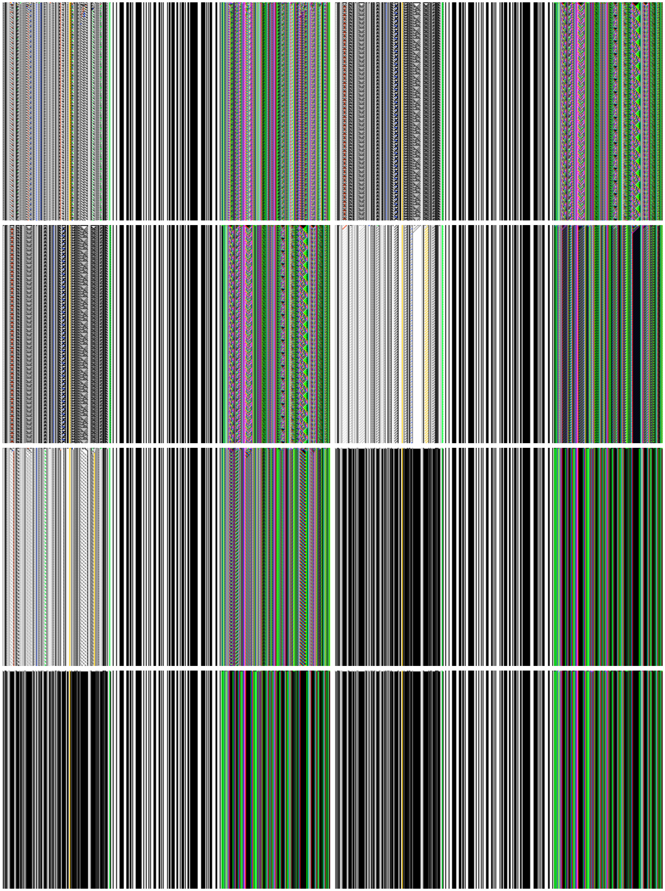
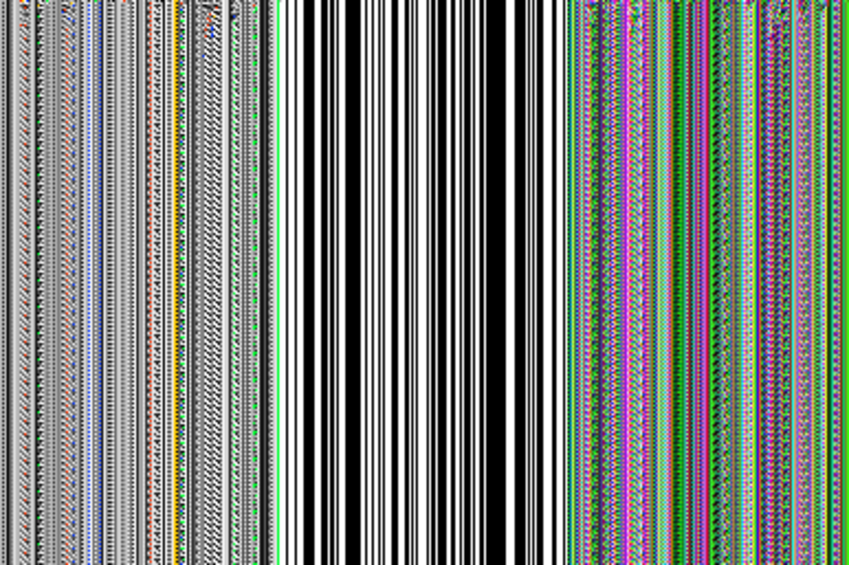
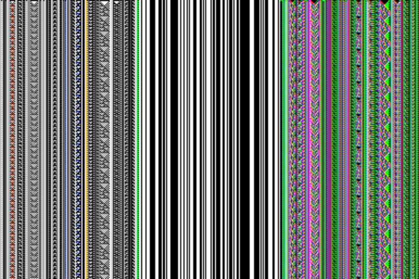
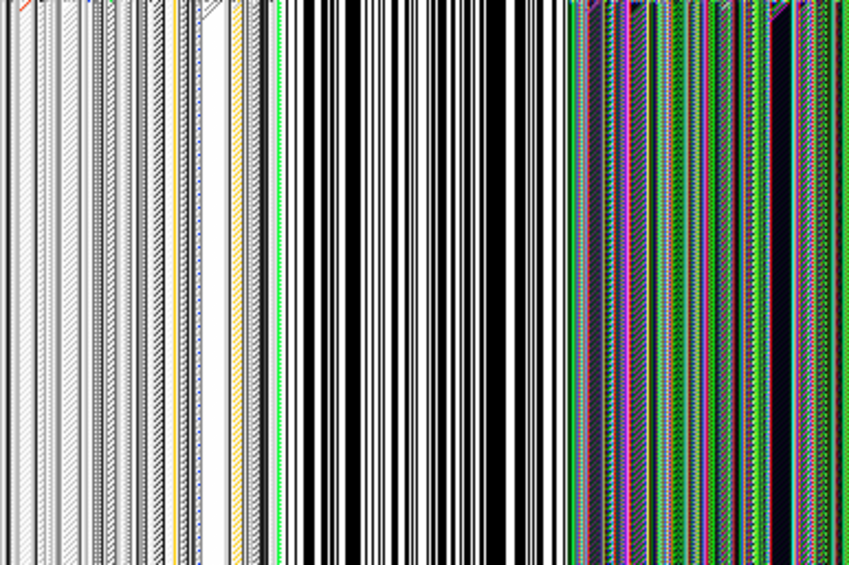
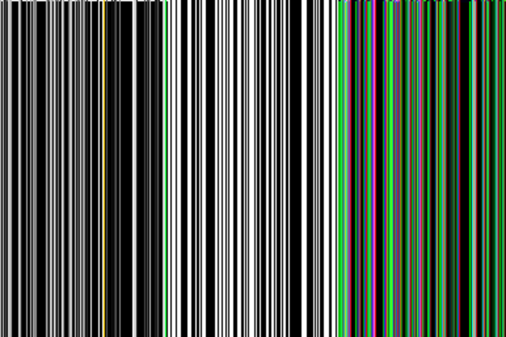

# Tensor Visual Artifacts

- Generated: `2026-02-21T20:28:56.463571653Z`
- Source report: `out/metaevolve-tensor-explore025-2026-02-21.edn`
- Output dir: `out/tensor-visuals-explore025-pheno-v1`
- Top rendered: `8`

## Top Runs

- Gallery: [`images/top-runs-gallery.png`](images/top-runs-gallery.png)

| # | seed | score | rule | history parity | image | cyber-ant diagram |
| --- | --- | --- | --- | --- | --- | --- |
| 1 | 1007 | 26.00 | 手 | true |  | [`diagram`](diagrams/run-01-score-26.00-seed-1007-rule-u624b-cyber-ant.mmd) |
| 2 | 1023 | 25.11 | 凶 | true |  | [`diagram`](diagrams/run-02-score-25.11-seed-1023-rule-u51f6-cyber-ant.mmd) |
| 3 | 1040 | 25.11 | 凶 | true |  | [`diagram`](diagrams/run-03-score-25.11-seed-1040-rule-u51f6-cyber-ant.mmd) |
| 4 | 1009 | 23.32 | 甩 | true |  | [`diagram`](diagrams/run-04-score-23.32-seed-1009-rule-u7529-cyber-ant.mmd) |
| 5 | 1008 | 19.42 | 禾 | true |  | [`diagram`](diagrams/run-05-score-19.42-seed-1008-rule-u79be-cyber-ant.mmd) |
| 6 | 1025 | 14.21 | 一 | true |  | [`diagram`](diagrams/run-06-score-14.21-seed-1025-rule-u4e00-cyber-ant.mmd) |
| 7 | 1042 | 14.21 | 一 | true |  | [`diagram`](diagrams/run-07-score-14.21-seed-1042-rule-u4e00-cyber-ant.mmd) |
| 8 | 1060 | 14.21 | 一 | true |  | [`diagram`](diagrams/run-08-score-14.21-seed-1060-rule-u4e00-cyber-ant.mmd) |

## Tensor Pipeline Diagrams

- `sigil-step`: [`diagrams/sigil-step.mmd`](diagrams/sigil-step.mmd)
- `sigil-step-gated`: [`diagrams/sigil-step-gated.mmd`](diagrams/sigil-step-gated.mmd)
- `sigil-step-with-branch`: [`diagrams/sigil-step-with-branch.mmd`](diagrams/sigil-step-with-branch.mmd)
- `tensor-transfer-pack`: [`diagrams/tensor-transfer-pack.mmd`](diagrams/tensor-transfer-pack.mmd)