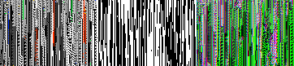
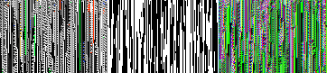
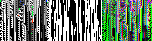
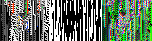

# Tensor Legacy Adapter Report

- Goal: replay legacy best-of-class initial conditions in tensor tokamak.
- Mapping used: legacy `genotype/phenotype` are ported directly; legacy exotype kernels are not directly portable and are approximated by tensor exotype program dynamics.
- Images are triptychs: genotype | phenotype | exotype.

| Case | Seed | Len | Gens | Best | Final | Regime | Rewinds | Exo sel/att | Cells |
| --- | --- | --- | --- | --- | --- | --- | --- | --- | --- |
| champion-352362012 | 352362012 | 120 | 80 | 0.539 | 0.007 | eoc | 2 | 11/14 | 44 |
| baseline-4242 | 4242 | 120 | 80 | 0.541 | 0.006 | eoc | 1 | 16/18 | 61 |
| m07a-top2 | 1701878710 | 50 | 40 | 0.458 | 0.010 | eoc | 2 | 4/9 | 14 |
| m07b-top1 | 1695261645 | 50 | 40 | 0.439 | 0.010 | magma | 0 | 6/7 | 11 |
| arrow-ding-super | 1188240613 | 32 | 40 | 0.456 | 0.008 | eoc | 1 | 3/6 | 12 |

## Champion seed 352362012

- seed `352362012`, final `0.007`, regime `eoc`, rewinds `2`
- exotype selected/attempts `11/14`, changed-cells `44`
- init-source: `legacy-explicit`
- run artifacts: [runs/champion-352362012.md](runs/champion-352362012.md), [runs/champion-352362012.edn](runs/champion-352362012.edn)

## Baseline seed 4242

- seed `4242`, final `0.006`, regime `eoc`, rewinds `1`
- exotype selected/attempts `16/18`, changed-cells `61`
- init-source: `legacy-explicit`
- run artifacts: [runs/baseline-4242.md](runs/baseline-4242.md), [runs/baseline-4242.edn](runs/baseline-4242.edn)

## Mission 7A top #2

- seed `1701878710`, final `0.010`, regime `eoc`, rewinds `2`
- exotype selected/attempts `4/9`, changed-cells `14`
- init-source: `seeded-reconstruction`
- init-note: legacy genotype/phenotype width mismatch (47 vs 50); used deterministic seed+length reconstruction
- run artifacts: [runs/m07a-top2.md](runs/m07a-top2.md), [runs/m07a-top2.edn](runs/m07a-top2.edn)

## Mission 7B top #1 (legacy 兄 super exotype)

- seed `1695261645`, final `0.010`, regime `magma`, rewinds `0`
- exotype selected/attempts `6/7`, changed-cells `11`
- init-source: `seeded-reconstruction`
- init-note: legacy genotype/phenotype width mismatch (47 vs 50); used deterministic seed+length reconstruction
- run artifacts: [runs/m07b-top1.md](runs/m07b-top1.md), [runs/m07b-top1.edn](runs/m07b-top1.edn)
- note: legacy exotype not directly mapped; tensor exotype program used

## Arrow pilot 丁 super

- seed `1188240613`, final `0.008`, regime `eoc`, rewinds `1`
- exotype selected/attempts `3/6`, changed-cells `12`
- init-source: `legacy-explicit`
- run artifacts: [runs/arrow-ding-super.md](runs/arrow-ding-super.md), [runs/arrow-ding-super.edn](runs/arrow-ding-super.edn)
- note: legacy exotype not directly mapped; tensor exotype program used

