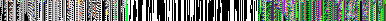
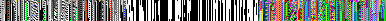
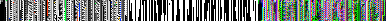
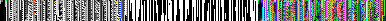
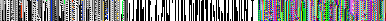
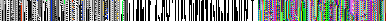
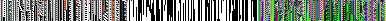
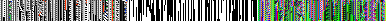

# Tokamak v3 Gate Visual Compare (Baseline vs Tuned2)

- Images are triptychs: genotype | phenotype | exotype.
- Each row compares the same seed across two configurations.

| Seed | Baseline final | Variant final | Delta final | Baseline exo sel/att | Variant exo sel/att | Rewinds b/v |
| --- | --- | --- | --- | --- | --- | --- |
| 7 | 0.106 | 0.106 | 0.000 | 0/2 | 0/2 | 2/2 |
| 11 | 0.093 | 0.093 | 0.000 | 0/4 | 0/4 | 2/2 |
| 13 | 0.088 | 0.088 | 0.000 | 2/6 | 3/6 | 2/1 |
| 17 | 0.092 | 0.089 | -0.004 | 5/7 | 4/6 | 1/0 |
| 19 | 0.100 | 0.099 | -0.001 | 0/1 | 1/1 | 1/0 |

## Seed 7

- baseline: best `0.526`, final `0.106`, rewinds `2`, exo selected/attempts `0/2`, changed-cells `7`
- tuned2: best `0.526`, final `0.106`, rewinds `2`, exo selected/attempts `0/2`, changed-cells `7`

| baseline | tuned2 |
| --- | --- |
|  |  |

## Seed 11

- baseline: best `0.527`, final `0.093`, rewinds `2`, exo selected/attempts `0/4`, changed-cells `7`
- tuned2: best `0.527`, final `0.093`, rewinds `2`, exo selected/attempts `0/4`, changed-cells `7`

| baseline | tuned2 |
| --- | --- |
|  |  |

## Seed 13

- baseline: best `0.530`, final `0.088`, rewinds `2`, exo selected/attempts `2/6`, changed-cells `6`
- tuned2: best `0.530`, final `0.088`, rewinds `1`, exo selected/attempts `3/6`, changed-cells `7`

| baseline | tuned2 |
| --- | --- |
|  |  |

## Seed 17

- baseline: best `0.499`, final `0.092`, rewinds `1`, exo selected/attempts `5/7`, changed-cells `8`
- tuned2: best `0.499`, final `0.089`, rewinds `0`, exo selected/attempts `4/6`, changed-cells `8`

| baseline | tuned2 |
| --- | --- |
|  |  |

## Seed 19

- baseline: best `0.530`, final `0.100`, rewinds `1`, exo selected/attempts `0/1`, changed-cells `3`
- tuned2: best `0.530`, final `0.099`, rewinds `0`, exo selected/attempts `1/1`, changed-cells `3`

| baseline | tuned2 |
| --- | --- |
|  |  |
