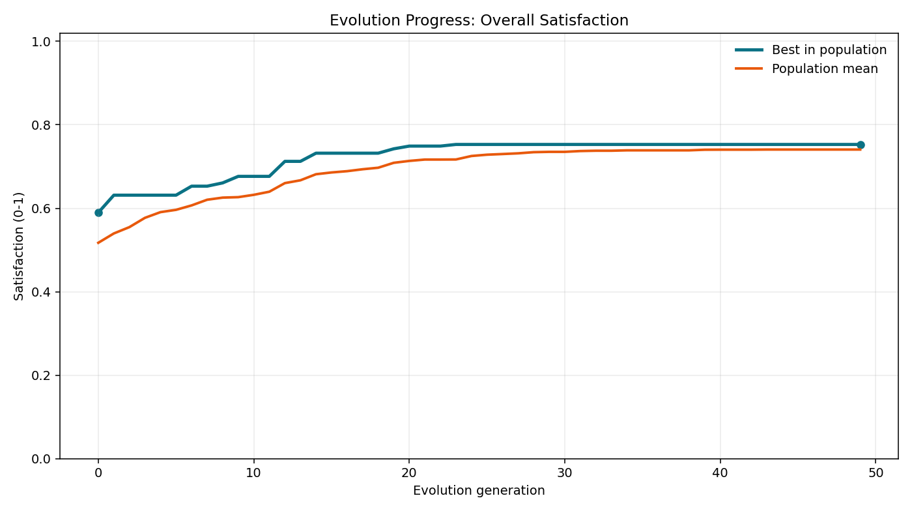
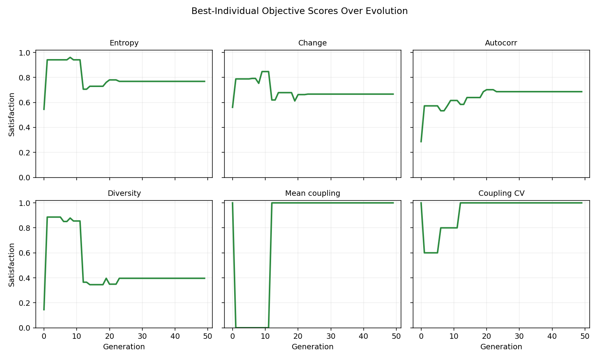
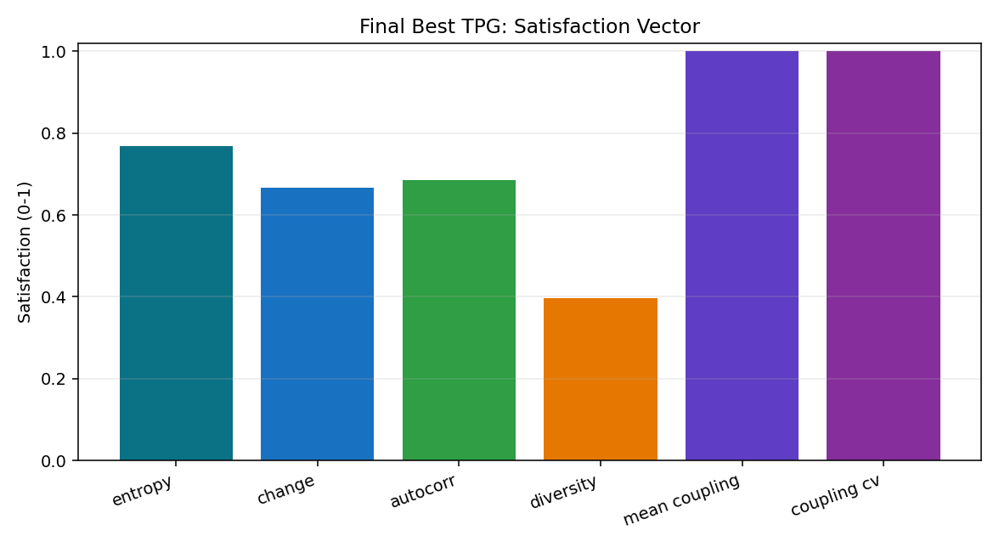
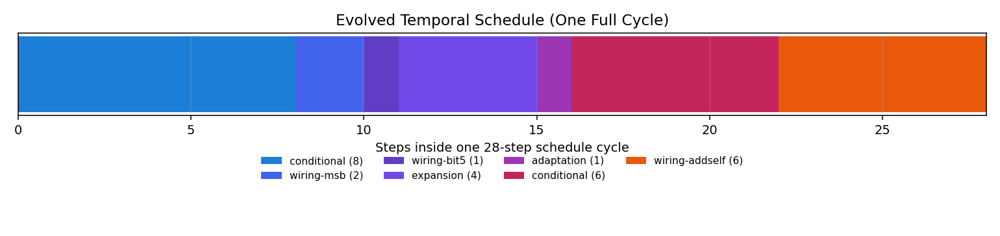
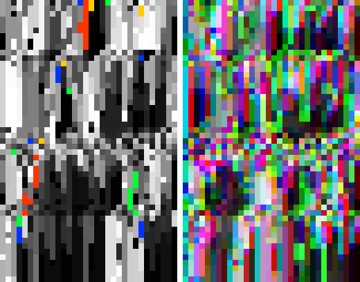
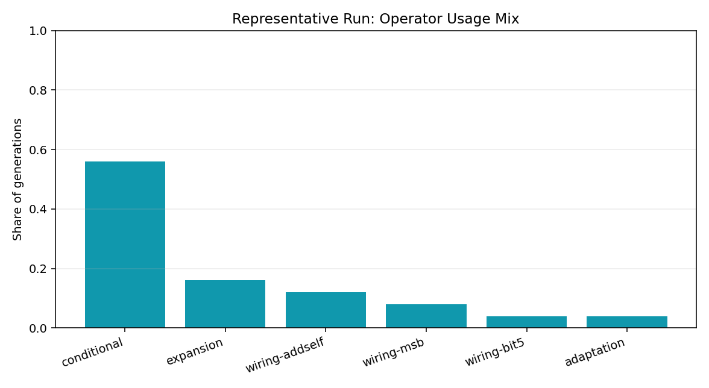

# TPG Production Evolution Report

Artifacts are for run output in `out/tpg-evo-production` (completed at generation 50).

## Executive Summary

- Best overall satisfaction reached **0.753** (from **0.590**, +**0.163**).
- Peak score first appeared at generation **23**.
- Final best controller size: **4 teams / 12 programs**.
- Coupling goals were fully satisfied (`mean-coupling=1.0`, `coupling-cv=1.0`).
- Weakest final objective was `diversity` (**0.396**).

## 1) Evolution Progress

The best line is monotonic-ish upward; the mean line rising indicates the full population improved, not only one outlier.

Pareto front size quickly saturates at 16, meaning many individuals became non-dominated under the multi-objective ranking.

## 2) Objective Behavior Over Time

These are the *best individual* objective scores per generation.

Interpretation:
- `mean_coupling` and `coupling_cv` end at 1.0 and stay high late in evolution.
- `diversity` trends lower than other objectives and appears to be the main tradeoff.

## 3) Final Winner Profile

Final objective vector:

## 4) Evolved Schedule

One schedule cycle is 28 steps long.

This schedule is dominated by `conditional` (50.0%) and `wiring-addself` (21.4%), with small injections of `wiring-msb`, `wiring-bit5`, `expansion`, and `adaptation`.

## 5) Representative Behavior Snapshot

Representative deterministic run was generated with seed `352362012` and a fixed 32-sigil random genotype.

Spacetime image:

Operator usage in that run:

Representative run overall satisfaction: **0.722**.

## Notes

- This report uses saved checkpoint history (`checkpoint-gen-0050.edn`) for evolution curves.
- The behavior snapshot is one deterministic probe run of the saved `best-tpg.edn`.
