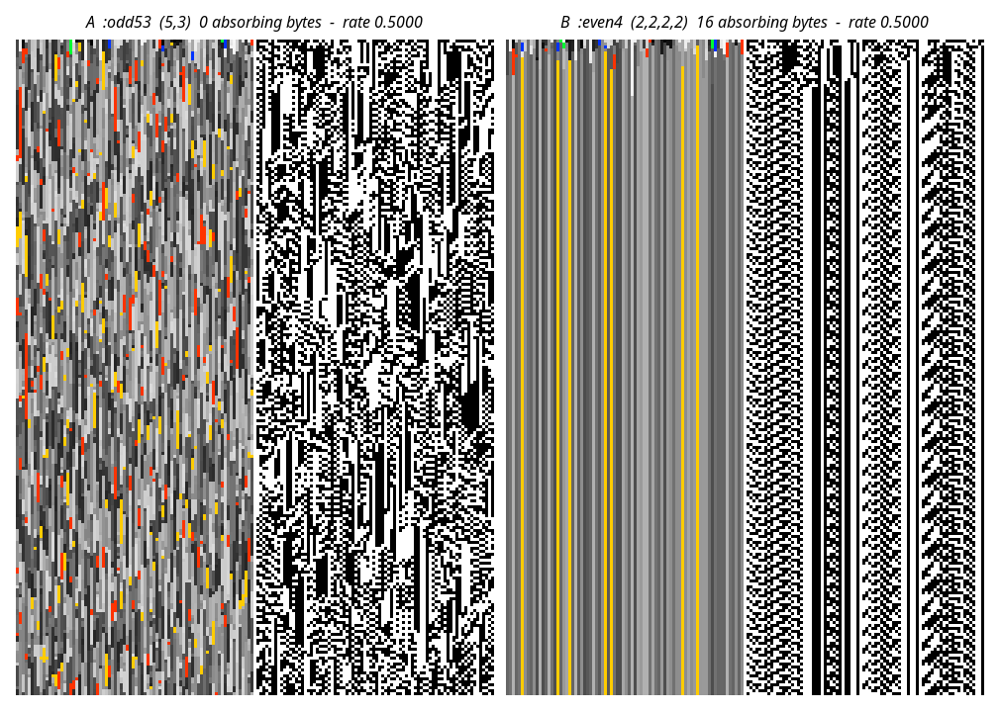

# P2 — the absorbing-byte axis

**Run on zone-joe 2026-08-04**, five arms partitioned by condition
(futon0/README-bare-metal.md §5). Determinism gate (§4) passed first: the
conditional-model resource regenerated **byte-identically** (sha256 match) on the
remote box, so these numbers are comparable to local ones.

**PREREGISTERED** in `scripts/exotype_immune_axis_p2.clj` before running. Prediction:
time-to-freeze decreases monotonically in absorbing count and `:odd53` never freezes.
Falsifier: no separation, or separation not ordered by absorbing count. **Neither fired.**

All arms have `rate = 0.5000` exactly: the coordinate the generative model
represents is IDENTICAL across every row below.

400 seeds, width 80, 300 steps, blend 0, transfer 0.

| arm | absorbing | derived rate | control rate | t=0 | t=1 | t=2 | t=3 | t=5 | t=10 | t=15 | t=20 | t=30 | t=40 | t=60 | t=100 | t=200 | t=300 | median t½ | never |
|---|---:|---:|---:|---:|---:|---:|---:|---:|---:|---:|---:|---:|---:|---:|---:|---:|---:|---:|---:|
| `odd53` | 0 | 0.5000 | 0.5011 | 0.00 | 0.00 | 0.00 | 0.00 | 0.00 | 0.00 | 0.00 | 0.00 | 0.00 | 0.00 | 0.00 | 0.00 | 0.00 | 0.00 |  | 400 |
| `even1` | 2 | 0.5000 | 0.5018 | 0.01 | 0.02 | 0.03 | 0.04 | 0.08 | 0.17 | 0.27 | 0.33 | 0.45 | 0.55 | 0.71 | 0.88 | 0.98 | 0.99 | 40 | 0 |
| `collapser` | 4 | 0.5000 | 0.4995 | 0.02 | 0.03 | 0.05 | 0.09 | 0.16 | 0.33 | 0.48 | 0.54 | 0.66 | 0.80 | 0.91 | 0.98 | 1.00 | 1.00 | 20 | 0 |
| `even8` | 8 | 0.5000 | 0.5012 | 0.03 | 0.06 | 0.11 | 0.17 | 0.30 | 0.53 | 0.70 | 0.81 | 0.92 | 0.95 | 0.98 | 1.00 | 1.00 | 1.00 | 10 | 0 |
| `even4` | 16 | 0.5000 | 0.4998 | 0.06 | 0.13 | 0.22 | 0.34 | 0.59 | 0.88 | 0.96 | 0.99 | 1.00 | 1.00 | 1.00 | 1.00 | 1.00 | 1.00 | 5 | 0 |

## Representative spacetimes

Same seed, same initial genotype and phenotype, same width. **The only difference is
sigma**, and both have `rate = 0.5000` — so `fixed-model` reports these two systems as
identical.

Each panel is genotype (left, one colour per rule byte) beside phenotype (right).

- **A `:odd53`** — the genotype churns for all 220 steps and never settles; the phenotype
  is correspondingly disordered.
- **B `:even4`** — the genotype locks into fixed vertical columns within roughly ten steps
  and never moves again. Each column is then a *frozen ECA rule*, and the phenotype shows
  exactly that: regular, periodic, per-column textures.

The vertical banding in B is the same phenomenon reported as the exotype "baseline" bands.
Two independent causes combine to produce it: the genotype layer has **no lateral coupling**
at blend 0, so nothing spreads sideways (a one-cell perturbation stays width 1 forever —
TN-baldwin-reboot.md §27), and absorbing bytes stop each column changing in time. Bands are
the signature of both, and neither is visible to `:rule-change`.

Incidental confirmation: the two PNGs are 20.7 KB (A) and 7.8 KB (B) at identical
dimensions. Freezing is visible even in the compression ratio.

## Result

**Confirmed, monotonically and without exception.**

- **`:odd53` never froze in 400/400 seeds** over 300 steps. Zero absorbing bytes, zero
  freezing.
- Median half-freeze time falls **40 → 20 → 10 → 5** as the absorbing count doubles
  **2 → 4 → 8 → 16**.
- The **control holds**: every arm's per-application change rate on random bytes is
  0.4995–0.5018 against a derived 0.5000. The arms are indistinguishable on the only
  coordinate `fixed-model` represents.

So the coordinate that decides whether a cell can freeze at all — and how fast a field
reaches the ordered regime — is invisible to the generative model. `:rule-change` reports
0.5000 for all five.

**Caveat on the apparent law.** t½ × absorbing = 80 for all four freezing arms, which looks
like t½ ∝ 1/absorbing. But t½ is quantised to the checkpoint grid
(…5, 10, 15, 20, 30, 40…), and every reported value is itself a checkpoint. The *ordering*
is unambiguous; the exact proportionality is **consistent with, not established by**, this
resolution. A finer checkpoint grid would settle it and costs minutes.

**Scope.** Uniform exotype fields at baseline (blend 0, transfer 0), where an absorbing byte
is absorbing precisely because nothing else writes the genotype. With blend or transfer on,
a neighbour can write a frozen cell and the picture will differ — untested.
