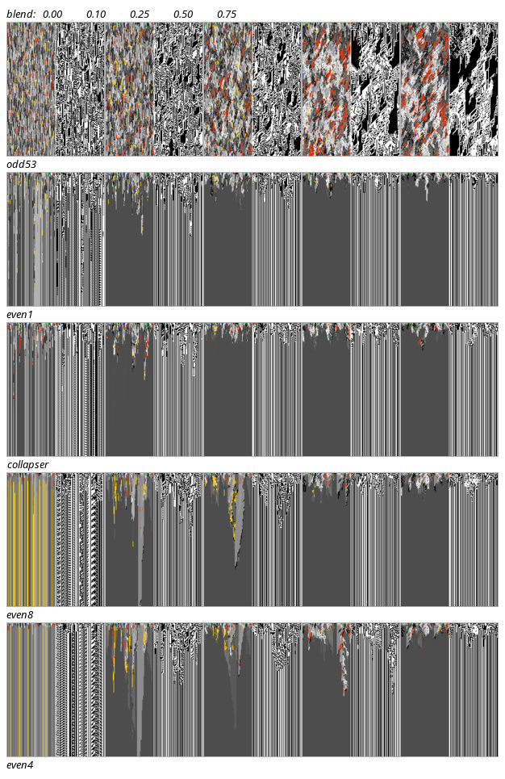

# Vocabulary x coupling — crossed A/B

40 seeds, width 80, 200 steps.

`lateral agreement` at chance is ~0.004 (1/256). `png bytes` is the representative spacetime compressed with one fixed encoder; larger = less compressible = more structure.

## The cross

Rows are vocabulary (absorbing bytes 0, 2, 4, 8, 16); columns are blend strength. Each cell
is genotype beside phenotype, same seed and same initial condition throughout.

**Only the top row sustains dynamics.** Every arm with *any* absorbing bytes — even
`:even1` with just two — is completely frozen by 200 steps. Coupling does not rescue them: it
makes them freeze *together*, into one uniform rule (the flat grey), rather than into distinct
per-column rules (the striped blend-0 column). The visible cones in `:even8` and `:even4` are
that collapse propagating.

For `:odd53`, blend trades vertical persistence for lateral structure — 0.747 → 0.364
persistence while lateral agreement rises 0.015 → 0.195 — which is what coupling is supposed
to do.

## PNG size as a structure measure — validated, not assumed

Joe proposed compressed size as a cheap interest proxy. Checked against the two structure
measures, which were computed from the field and never from an image (n = 25 cells):

| against | Pearson r |
|---|---:|
| vertical persistence | **−0.958** |
| frozen fraction | **−0.985** |
| lateral agreement | −0.682 |

It works, and it separates cleanly: `:odd53` spans 13,315–17,629 bytes while every frozen arm
sits at 2,741–5,254. A single `ls -l` classifies the regime. The correlation with lateral
agreement is weaker because uniformity and stasis are different ways to be compressible, and
size cannot tell them apart — so it is a good screen, not a substitute for the two measures.

| arm | absorbing | blend | vertical persistence | lateral agreement | frozen | png bytes |
|---|---:|---:|---:|---:|---:|---:|
| `odd53` | 0 | 0.00 | 0.7471 | 0.0153 | 0.00 | 13315 |
| `odd53` | 0 | 0.10 | 0.6641 | 0.0980 | 0.00 | 15623 |
| `odd53` | 0 | 0.25 | 0.5752 | 0.1412 | 0.00 | 17289 |
| `odd53` | 0 | 0.50 | 0.4522 | 0.1791 | 0.00 | 17629 |
| `odd53` | 0 | 0.75 | 0.3643 | 0.1946 | 0.00 | 17595 |
| `even1` | 2 | 0.00 | 0.9362 | 0.3347 | 0.99 | 5254 |
| `even1` | 2 | 0.10 | 0.9335 | 0.7837 | 1.00 | 4040 |
| `even1` | 2 | 0.25 | 0.9387 | 0.8585 | 1.00 | 3445 |
| `even1` | 2 | 0.50 | 0.9409 | 0.8967 | 1.00 | 2956 |
| `even1` | 2 | 0.75 | 0.9388 | 0.9110 | 1.00 | 2741 |
| `collapser` | 4 | 0.00 | 0.9644 | 0.2050 | 1.00 | 3432 |
| `collapser` | 4 | 0.10 | 0.9396 | 0.7543 | 1.00 | 3765 |
| `collapser` | 4 | 0.25 | 0.9416 | 0.8515 | 1.00 | 2819 |
| `collapser` | 4 | 0.50 | 0.9418 | 0.8966 | 1.00 | 3252 |
| `collapser` | 4 | 0.75 | 0.9371 | 0.9078 | 1.00 | 2956 |
| `even8` | 8 | 0.00 | 0.9798 | 0.1232 | 1.00 | 3708 |
| `even8` | 8 | 0.10 | 0.9415 | 0.7165 | 0.99 | 3830 |
| `even8` | 8 | 0.25 | 0.9363 | 0.8210 | 1.00 | 4004 |
| `even8` | 8 | 0.50 | 0.9370 | 0.8847 | 1.00 | 3294 |
| `even8` | 8 | 0.75 | 0.9350 | 0.9050 | 1.00 | 3219 |
| `even4` | 16 | 0.00 | 0.9900 | 0.0613 | 1.00 | 2863 |
| `even4` | 16 | 0.10 | 0.9488 | 0.6796 | 0.98 | 3947 |
| `even4` | 16 | 0.25 | 0.9399 | 0.8038 | 1.00 | 3538 |
| `even4` | 16 | 0.50 | 0.9358 | 0.8723 | 1.00 | 3855 |
| `even4` | 16 | 0.75 | 0.9339 | 0.9007 | 1.00 | 3085 |

## Correction (see TN-baldwin-reboot.md 34-35)

The exact-equality structure measures in the table below UNDERSTATE the spatial organisation
blend produces: neighbours become *similar* without becoming *identical*. Mean neighbour
Hamming distance falls 3.98 (random) to 1.83 as blend goes 0 to 0.5 — adjacent rules differing
in under 2 bits of 8. And genotype damage does not saturate: at t=1000 it reaches 11.9 cells
at blend 0.5 and is still growing, peaking there and collapsing to 0.0 at blend 0.75.

## Where the interesting regime is

`:odd53` at blend 0.25–0.50: peak PNG size (17,289–17,629), vertical persistence 0.45–0.58,
lateral agreement 0.14–0.18. That is the only region of this cross with both sustained change
in time and real organisation in space.

Everything with absorbing bytes is an ordered-regime generator, and the absorbing count sets
only *how fast* it gets there (P2) — not whether. Within permutations, "can freeze" and
"stays lively" are mutually exclusive, because absorbing bytes require all-even cycles and
those force rate exactly 0.5000.
