# Hexagram Wiring Pass Workup

*Generated: 2026-01-25T23:57:26.176983212*

Seed: 352362012 | Generations: 50 | Width: 80

Passing hexagrams: 41

## Learning Loop Annotations (manual notes)

- #3 屯: Rule‑90‑like EoC structure in both genotype and phenotype.
- #5 需: Barcode‑like overall, but phenotype shows diagonal bands; potential “pre‑glider” behavior.
- #9 小畜: Different angle of barcode/candycane (phenotype‑level structure still interesting).
- #10 履: Strong diagonals in genotype + phenotype; exotype looks barcode‑like.
- #18 蠱: EoC‑like genotype, borderline exotype; candidate for “heat‑up” experiments.
- #28 大過: Similar to #18 (EoC‑like genotype, borderline exotype).
- #29 坎: New type; diagonal but EoC‑like across the triptych.
- #37 家人: EoC similar to #28.
- #39 蹇: EoC with diagonal direction opposite to #29; pairing could be interesting.
- #42 益: New EoC type with very strong exotype structure.
- #44 姤: Like #28 but triangle orientation differs (distinct model).
- #46 升: Excellent EoC example.
- #47 困: Similar to #28.
- #48 井: Similar to #44 (orientation variant).
- #49 革: EoC in phenotype; diagonals from two directions interact.
- #57 巽: Similar to #44.
- #58 兌: Interacting diagonals (like #49).
- #59 渙: Similar to #28.
- #63 既濟: Similar to #28.

## #1 乾

- Lines: ⚊⚊⚊⚊⚊⚊
- Formula: `slf:bit-nand→bit-nor`
- Metrics: entropy-n=0.95, unique=48
- Failure scores: barcode=0.00, candycane=0.00

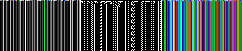

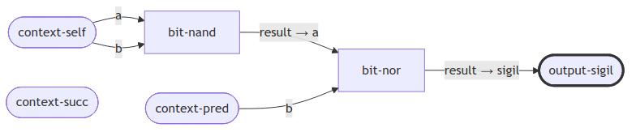

## #3 屯

- Lines: ⚋⚋⚊⚋⚊⚋
- Formula: `nei:bit-xor→bit-xor`
- Metrics: entropy-n=0.99, unique=71
- Failure scores: barcode=0.00, candycane=0.00

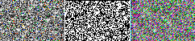

## #5 需

- Lines: ⚊⚊⚊⚋⚊⚋
- Formula: `slf:bit-xor→bit-xor`
- Metrics: entropy-n=0.99, unique=72
- Failure scores: barcode=0.00, candycane=0.00

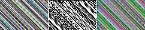

## #6 訟

- Lines: ⚋⚊⚋⚊⚊⚊
- Formula: `suc:bit-or→bit-nor`
- Metrics: entropy-n=0.93, unique=41
- Failure scores: barcode=0.00, candycane=0.00

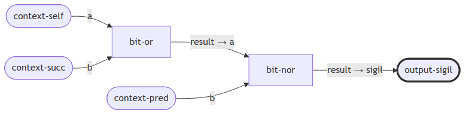

## #8 比

- Lines: ⚋⚋⚋⚋⚊⚋
- Formula: `nei:bit-and→bit-xor`
- Metrics: entropy-n=0.98, unique=63
- Failure scores: barcode=0.00, candycane=0.00

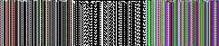

## #9 小畜

- Lines: ⚊⚊⚋⚊⚊⚊
- Formula: `slf:bit-or→bit-nor`
- Metrics: entropy-n=0.97, unique=59
- Failure scores: barcode=0.00, candycane=0.00

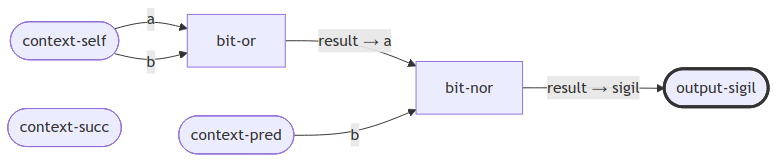

## #10 履

- Lines: ⚊⚊⚊⚋⚊⚊
- Formula: `slf:bit-xor→bit-nor`
- Metrics: entropy-n=0.99, unique=72
- Failure scores: barcode=0.00, candycane=0.00

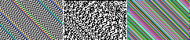

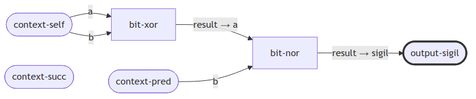

## #12 否

- Lines: ⚋⚋⚋⚊⚊⚊
- Formula: `nei:bit-or→bit-nor`
- Metrics: entropy-n=0.93, unique=41
- Failure scores: barcode=0.00, candycane=0.00

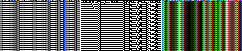

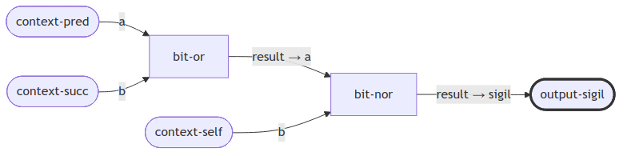

## #14 大有

- Lines: ⚊⚊⚊⚊⚋⚊
- Formula: `slf:bit-nand→bit-or`
- Metrics: entropy-n=0.95, unique=48
- Failure scores: barcode=0.00, candycane=0.00

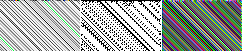

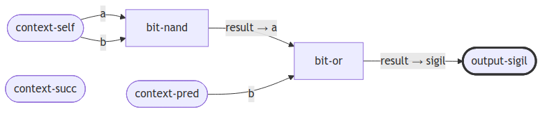

## #15 謙

- Lines: ⚋⚋⚋⚊⚋⚋
- Formula: `nei:bit-or→bit-and`
- Metrics: entropy-n=0.98, unique=63
- Failure scores: barcode=0.00, candycane=0.00

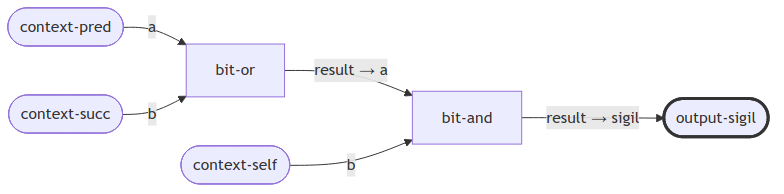

## #16 豫

- Lines: ⚋⚋⚊⚋⚋⚋
- Formula: `nei:bit-xor→bit-and`
- Metrics: entropy-n=0.74, unique=17
- Failure scores: barcode=0.00, candycane=0.00

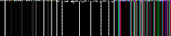

## #17 隨

- Lines: ⚋⚋⚊⚋⚊⚊
- Formula: `nei:bit-xor→bit-nor`
- Metrics: entropy-n=0.98, unique=57
- Failure scores: barcode=0.00, candycane=0.00

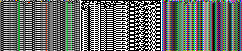

## #18 蠱

- Lines: ⚊⚋⚋⚊⚊⚋
- Formula: `pre:bit-or→bit-xor`
- Metrics: entropy-n=0.99, unique=70
- Failure scores: barcode=0.00, candycane=0.00

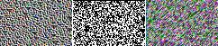

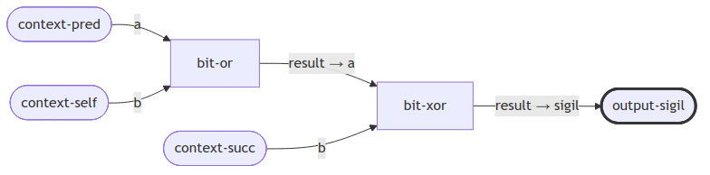

## #19 臨

- Lines: ⚋⚋⚋⚋⚊⚊
- Formula: `nei:bit-and→bit-nor`
- Metrics: entropy-n=0.97, unique=57
- Failure scores: barcode=0.00, candycane=0.00

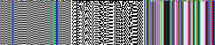

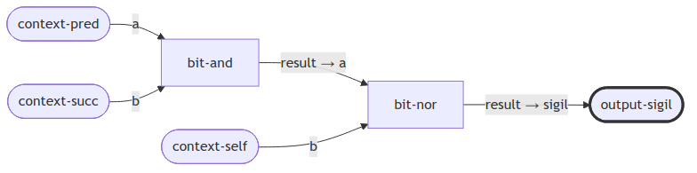

## #24 復

- Lines: ⚋⚋⚋⚋⚋⚊
- Formula: `nei:bit-and→bit-or`
- Metrics: entropy-n=0.97, unique=59
- Failure scores: barcode=0.00, candycane=0.00

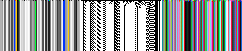

## #25 無妄

- Lines: ⚊⚊⚊⚋⚋⚊
- Formula: `slf:bit-xor→bit-or`
- Metrics: entropy-n=0.99, unique=72
- Failure scores: barcode=0.00, candycane=0.00

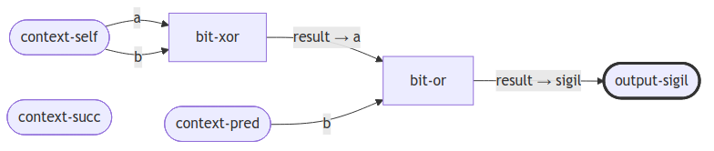

## #26 大畜

- Lines: ⚊⚋⚋⚊⚊⚊
- Formula: `pre:bit-or→bit-nor`
- Metrics: entropy-n=0.93, unique=41
- Failure scores: barcode=0.00, candycane=0.00

## #27 頤

- Lines: ⚋⚋⚊⚊⚋⚋
- Formula: `nei:bit-nand→bit-and`
- Metrics: entropy-n=0.98, unique=63
- Failure scores: barcode=0.00, candycane=0.00

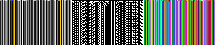

## #28 大過

- Lines: ⚋⚊⚊⚊⚊⚋
- Formula: `suc:bit-nand→bit-xor`
- Metrics: entropy-n=0.99, unique=67
- Failure scores: barcode=0.00, candycane=0.00

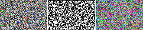

## #29 坎

- Lines: ⚋⚊⚋⚋⚊⚋
- Formula: `suc:bit-and→bit-xor`
- Metrics: entropy-n=0.99, unique=67
- Failure scores: barcode=0.00, candycane=0.00

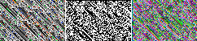

## #31 咸

- Lines: ⚋⚊⚊⚊⚋⚋
- Formula: `suc:bit-nand→bit-and`
- Metrics: entropy-n=0.98, unique=63
- Failure scores: barcode=0.00, candycane=0.00

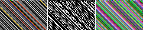

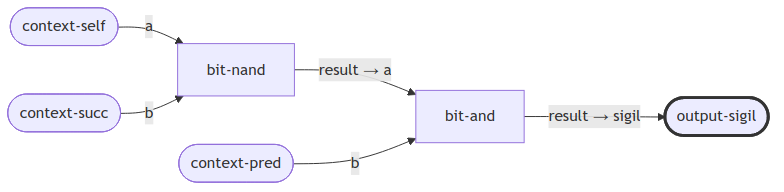

## #33 遯

- Lines: ⚊⚊⚊⚊⚋⚋
- Formula: `slf:bit-nand→bit-and`
- Metrics: entropy-n=0.92, unique=43
- Failure scores: barcode=0.00, candycane=0.00

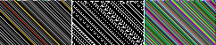

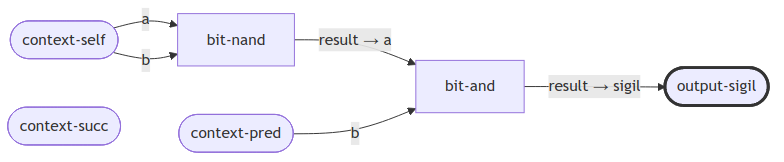

## #37 家人

- Lines: ⚊⚋⚊⚊⚊⚋
- Formula: `pre:bit-nand→bit-xor`
- Metrics: entropy-n=0.99, unique=70
- Failure scores: barcode=0.00, candycane=0.00

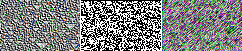

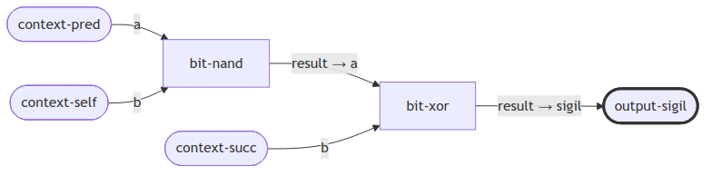

## #38 睽

- Lines: ⚋⚊⚊⚊⚋⚊
- Formula: `suc:bit-nand→bit-or`
- Metrics: entropy-n=0.81, unique=25
- Failure scores: barcode=0.00, candycane=0.00

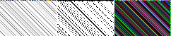

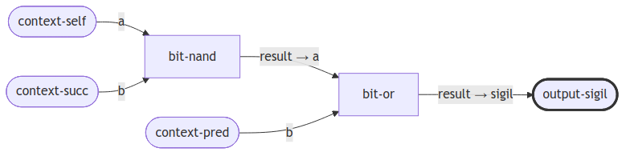

## #39 蹇

- Lines: ⚊⚋⚋⚋⚊⚋
- Formula: `pre:bit-and→bit-xor`
- Metrics: entropy-n=0.99, unique=69
- Failure scores: barcode=0.00, candycane=0.00

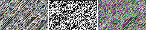

## #41 損

- Lines: ⚊⚋⚋⚋⚊⚊
- Formula: `pre:bit-and→bit-nor`
- Metrics: entropy-n=0.97, unique=54
- Failure scores: barcode=0.00, candycane=0.00

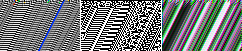

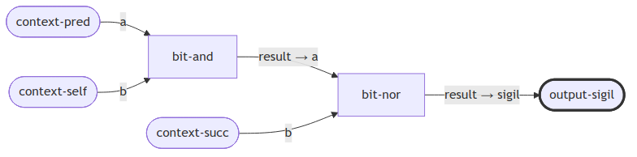

## #42 益

- Lines: ⚋⚋⚊⚊⚊⚋
- Formula: `nei:bit-nand→bit-xor`
- Metrics: entropy-n=0.98, unique=60
- Failure scores: barcode=0.00, candycane=0.00

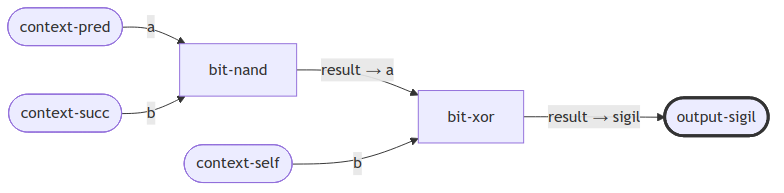

## #44 姤

- Lines: ⚊⚊⚊⚊⚊⚋
- Formula: `slf:bit-nand→bit-xor`
- Metrics: entropy-n=0.99, unique=70
- Failure scores: barcode=0.00, candycane=0.00

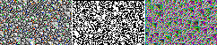

## #46 升

- Lines: ⚋⚋⚋⚊⚊⚋
- Formula: `nei:bit-or→bit-xor`
- Metrics: entropy-n=0.99, unique=65
- Failure scores: barcode=0.00, candycane=0.00

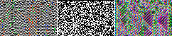

## #47 困

- Lines: ⚋⚊⚊⚋⚊⚋
- Formula: `suc:bit-xor→bit-xor`
- Metrics: entropy-n=0.99, unique=71
- Failure scores: barcode=0.00, candycane=0.00

## #48 井

- Lines: ⚊⚊⚋⚋⚊⚋
- Formula: `slf:bit-and→bit-xor`
- Metrics: entropy-n=0.99, unique=70
- Failure scores: barcode=0.00, candycane=0.00

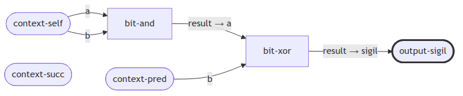

## #49 革

- Lines: ⚊⚋⚊⚋⚊⚊
- Formula: `pre:bit-xor→bit-nor`
- Metrics: entropy-n=0.95, unique=44
- Failure scores: barcode=0.00, candycane=0.00

## #51 震

- Lines: ⚋⚋⚊⚋⚋⚊
- Formula: `nei:bit-xor→bit-or`
- Metrics: entropy-n=0.84, unique=30
- Failure scores: barcode=0.00, candycane=0.00

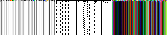

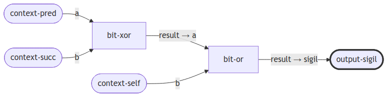

## #54 歸妹

- Lines: ⚋⚊⚊⚋⚋⚊
- Formula: `suc:bit-xor→bit-or`
- Metrics: entropy-n=0.86, unique=34
- Failure scores: barcode=0.00, candycane=0.00

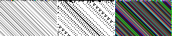

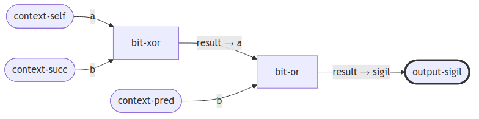

## #55 豐

- Lines: ⚋⚋⚊⚊⚋⚊
- Formula: `nei:bit-nand→bit-or`
- Metrics: entropy-n=0.73, unique=22
- Failure scores: barcode=0.00, candycane=0.00

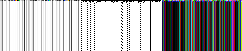

## #57 巽

- Lines: ⚊⚊⚋⚊⚊⚋
- Formula: `slf:bit-or→bit-xor`
- Metrics: entropy-n=0.99, unique=70
- Failure scores: barcode=0.00, candycane=0.00

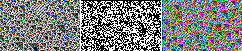

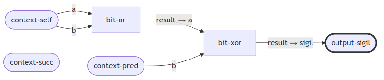

## #58 兌

- Lines: ⚋⚊⚊⚋⚊⚊
- Formula: `suc:bit-xor→bit-nor`
- Metrics: entropy-n=0.97, unique=55
- Failure scores: barcode=0.00, candycane=0.00

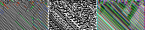

## #59 渙

- Lines: ⚋⚊⚋⚊⚊⚋
- Formula: `suc:bit-or→bit-xor`
- Metrics: entropy-n=0.99, unique=71
- Failure scores: barcode=0.00, candycane=0.00

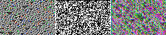

## #60 節

- Lines: ⚋⚊⚋⚋⚊⚊
- Formula: `suc:bit-and→bit-nor`
- Metrics: entropy-n=0.97, unique=48
- Failure scores: barcode=0.00, candycane=0.00

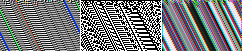

## #61 中孚

- Lines: ⚊⚊⚋⚋⚊⚊
- Formula: `slf:bit-and→bit-nor`
- Metrics: entropy-n=0.97, unique=59
- Failure scores: barcode=0.00, candycane=0.00

## #63 既濟

- Lines: ⚊⚋⚊⚋⚊⚋
- Formula: `pre:bit-xor→bit-xor`
- Metrics: entropy-n=0.99, unique=71
- Failure scores: barcode=0.00, candycane=0.00

