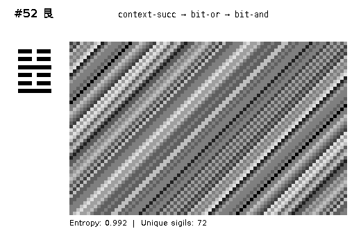
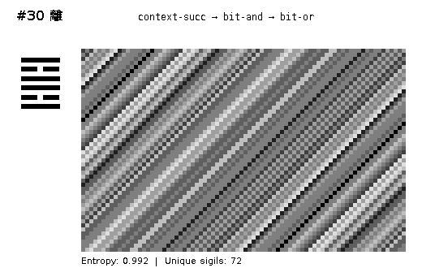
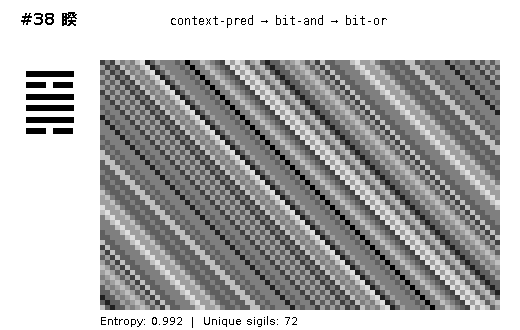
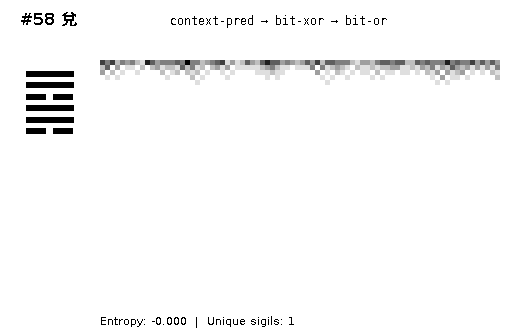
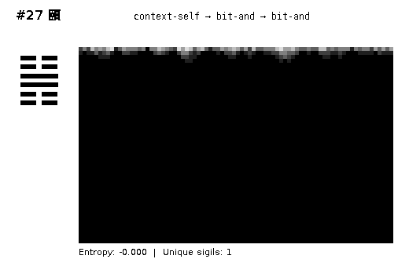
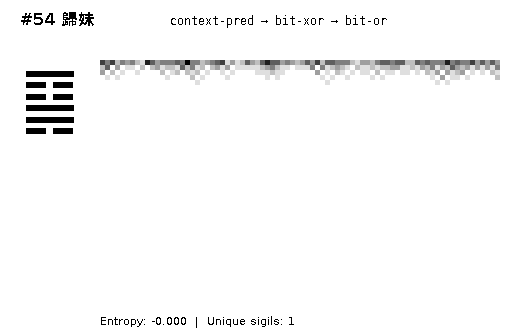

# Hexagram Wiring Test Sheet

*Generated: 2026-01-25T18:11:36.810716330*

All 64 I Ching hexagrams mapped to wiring diagrams and executed.

---

## Entropy Extremes

### Highest Entropy (Most Chaotic)

These hexagrams produce complex, information-rich patterns:

### Lowest Entropy (Most Ordered)

These hexagrams collapse to uniform or simple patterns:

---

## Summary by Trigram Pair

| # | Name | Lines | Formula | Entropy | Unique |
|---|------|-------|---------|---------|--------|
| 1 | 乾 | ⚊⚊⚊⚊⚊⚊ | `context-self → bit-and → bit-or` | 0.97 | 59 |
| 2 | 坤 | ⚋⚋⚋⚋⚋⚋ | `context-self → bit-and → bit-and` | -0.00 | 1 |
| 3 | 屯 | ⚋⚋⚊⚋⚊⚋ | `context-self → bit-xor → bit-xor` | 0.99 | 71 |
| 4 | 蒙 | ⚋⚊⚋⚊⚋⚋ | `context-pred → bit-or → bit-and` | 0.99 | 72 |
| 5 | 需 | ⚊⚊⚊⚋⚊⚋ | `context-self → bit-xor → bit-xor` | 0.99 | 71 |
| 6 | 訟 | ⚋⚊⚋⚊⚊⚊ | `context-pred → bit-or → bit-or` | -0.00 | 1 |
| 7 | 師 | ⚋⚊⚋⚋⚋⚋ | `context-pred → bit-and → bit-and` | -0.00 | 1 |
| 8 | 比 | ⚋⚋⚋⚋⚊⚋ | `context-self → bit-and → bit-xor` | 0.98 | 63 |
| 9 | 小畜 | ⚊⚊⚋⚊⚊⚊ | `context-self → bit-or → bit-or` | -0.00 | 1 |
| 10 | 履 | ⚊⚊⚊⚋⚊⚊ | `context-self → bit-xor → bit-or` | 0.84 | 30 |
| 11 | 泰 | ⚊⚊⚊⚋⚋⚋ | `context-self → bit-xor → bit-and` | 0.74 | 17 |
| 12 | 否 | ⚋⚋⚋⚊⚊⚊ | `context-self → bit-or → bit-or` | -0.00 | 1 |
| 13 | 同人 | ⚊⚋⚊⚊⚊⚊ | `context-succ → bit-and → bit-or` | 0.99 | 72 |
| 14 | 大有 | ⚊⚊⚊⚊⚋⚊ | `context-self → bit-and → bit-or` | 0.97 | 59 |
| 15 | 謙 | ⚋⚋⚋⚊⚋⚋ | `context-self → bit-or → bit-and` | 0.98 | 63 |
| 16 | 豫 | ⚋⚋⚊⚋⚋⚋ | `context-self → bit-xor → bit-and` | 0.74 | 17 |
| 17 | 隨 | ⚋⚋⚊⚋⚊⚊ | `context-self → bit-xor → bit-or` | 0.84 | 30 |
| 18 | 蠱 | ⚊⚋⚋⚊⚊⚋ | `context-succ → bit-or → bit-xor` | 0.96 | 50 |
| 19 | 臨 | ⚋⚋⚋⚋⚊⚊ | `context-self → bit-and → bit-or` | 0.97 | 59 |
| 20 | 觀 | ⚊⚊⚋⚋⚋⚋ | `context-self → bit-and → bit-and` | -0.00 | 1 |
| 21 | 噬嗑 | ⚊⚋⚊⚋⚋⚊ | `context-succ → bit-xor → bit-or` | -0.00 | 1 |
| 22 | 賁 | ⚊⚋⚋⚊⚋⚊ | `context-succ → bit-or → bit-or` | -0.00 | 1 |
| 23 | 剝 | ⚊⚋⚋⚋⚋⚋ | `context-succ → bit-and → bit-and` | -0.00 | 1 |
| 24 | 復 | ⚋⚋⚋⚋⚋⚊ | `context-self → bit-and → bit-or` | 0.97 | 59 |
| 25 | 無妄 | ⚊⚊⚊⚋⚋⚊ | `context-self → bit-xor → bit-or` | 0.84 | 30 |
| 26 | 大畜 | ⚊⚋⚋⚊⚊⚊ | `context-succ → bit-or → bit-or` | -0.00 | 1 |
| 27 | 頤 | ⚋⚋⚊⚊⚋⚋ | `context-self → bit-and → bit-and` | -0.00 | 1 |
| 28 | 大過 | ⚋⚊⚊⚊⚊⚋ | `context-pred → bit-and → bit-xor` | 0.96 | 50 |
| 29 | 坎 | ⚋⚊⚋⚋⚊⚋ | `context-pred → bit-and → bit-xor` | 0.96 | 50 |
| 30 | 離 | ⚊⚋⚊⚊⚋⚊ | `context-succ → bit-and → bit-or` | 0.99 | 72 |
| 31 | 咸 | ⚋⚊⚊⚊⚋⚋ | `context-pred → bit-and → bit-and` | -0.00 | 1 |
| 32 | 恆：亨，無咎，利貞，利有攸往。 | ⚊⚊⚋⚋⚋⚊ | `context-self → bit-and → bit-or` | 0.97 | 59 |
| 33 | 遯 | ⚊⚊⚊⚊⚋⚋ | `context-self → bit-and → bit-and` | -0.00 | 1 |
| 34 | 大壯 | ⚋⚋⚊⚊⚊⚊ | `context-self → bit-and → bit-or` | 0.97 | 59 |
| 35 | 晉 | ⚋⚋⚋⚊⚋⚊ | `context-self → bit-or → bit-or` | -0.00 | 1 |
| 36 | 明夷 | ⚊⚋⚊⚋⚋⚋ | `context-succ → bit-xor → bit-and` | 0.95 | 49 |
| 37 | 家人 | ⚊⚋⚊⚊⚊⚋ | `context-succ → bit-and → bit-xor` | 0.95 | 49 |
| 38 | 睽 | ⚋⚊⚊⚊⚋⚊ | `context-pred → bit-and → bit-or` | 0.99 | 72 |
| 39 | 蹇 | ⚊⚋⚋⚋⚊⚋ | `context-succ → bit-and → bit-xor` | 0.95 | 49 |
| 40 | 解 | ⚋⚊⚋⚋⚋⚊ | `context-pred → bit-and → bit-or` | 0.99 | 72 |
| 41 | 損 | ⚊⚋⚋⚋⚊⚊ | `context-succ → bit-and → bit-or` | 0.99 | 72 |
| 42 | 益 | ⚋⚋⚊⚊⚊⚋ | `context-self → bit-and → bit-xor` | 0.98 | 63 |
| 43 | 夬 | ⚋⚊⚊⚊⚊⚊ | `context-pred → bit-and → bit-or` | 0.99 | 72 |
| 44 | 姤 | ⚊⚊⚊⚊⚊⚋ | `context-self → bit-and → bit-xor` | 0.98 | 63 |
| 45 | 萃 | ⚋⚊⚊⚋⚋⚋ | `context-pred → bit-xor → bit-and` | 0.96 | 50 |
| 46 | 升 | ⚋⚋⚋⚊⚊⚋ | `context-self → bit-or → bit-xor` | 0.99 | 65 |
| 47 | 困 | ⚋⚊⚊⚋⚊⚋ | `context-pred → bit-xor → bit-xor` | 0.99 | 72 |
| 48 | 井 | ⚊⚊⚋⚋⚊⚋ | `context-self → bit-and → bit-xor` | 0.98 | 63 |
| 49 | 革 | ⚊⚋⚊⚋⚊⚊ | `context-succ → bit-xor → bit-or` | -0.00 | 1 |
| 50 | 鼎 | ⚊⚊⚋⚊⚋⚊ | `context-self → bit-or → bit-or` | -0.00 | 1 |
| 51 | 震 | ⚋⚋⚊⚋⚋⚊ | `context-self → bit-xor → bit-or` | 0.84 | 30 |
| 52 | 艮 | ⚊⚋⚋⚊⚋⚋ | `context-succ → bit-or → bit-and` | 0.99 | 72 |
| 53 | 漸 | ⚊⚊⚋⚊⚋⚋ | `context-self → bit-or → bit-and` | 0.98 | 63 |
| 54 | 歸妹 | ⚋⚊⚊⚋⚋⚊ | `context-pred → bit-xor → bit-or` | -0.00 | 1 |
| 55 | 豐 | ⚋⚋⚊⚊⚋⚊ | `context-self → bit-and → bit-or` | 0.97 | 59 |
| 56 | 旅 | ⚊⚋⚊⚊⚋⚋ | `context-succ → bit-and → bit-and` | -0.00 | 1 |
| 57 | 巽 | ⚊⚊⚋⚊⚊⚋ | `context-self → bit-or → bit-xor` | 0.99 | 65 |
| 58 | 兌 | ⚋⚊⚊⚋⚊⚊ | `context-pred → bit-xor → bit-or` | -0.00 | 1 |
| 59 | 渙 | ⚋⚊⚋⚊⚊⚋ | `context-pred → bit-or → bit-xor` | 0.95 | 49 |
| 60 | 節 | ⚋⚊⚋⚋⚊⚊ | `context-pred → bit-and → bit-or` | 0.99 | 72 |
| 61 | 中孚 | ⚊⚊⚋⚋⚊⚊ | `context-self → bit-and → bit-or` | 0.97 | 59 |
| 62 | 小過 | ⚊⚋⚋⚋⚋⚊ | `context-succ → bit-and → bit-or` | 0.99 | 72 |
| 63 | 既濟 | ⚊⚋⚊⚋⚊⚋ | `context-succ → bit-xor → bit-xor` | 0.99 | 72 |
| 64 | 未濟 | ⚋⚊⚋⚊⚋⚊ | `context-pred → bit-or → bit-or` | -0.00 | 1 |

## Methodology

Each hexagram's 6 lines determine wiring structure:

| Lines | Stage | Yang (⚊) | Yin (⚋) |
|-------|-------|----------|--------|
| 1-2 | Input | context-neighbors | context-self |
| 3-4 | Core | bit-xor | bit-and |
| 5-6 | Output | bit-xor | bit-or |

Line pairs select from 4 component variants (00, 01, 10, 11).
