# Breaking Bitplane Independence: The Hybrid Coupling Experiment

**Can arithmetic operations create structured cross-bitplane coupling
while preserving Class IV dynamics?**

Date: 2026-02-15
Branch: `feat/verifier-guided-tpg`
Predecessor: [SCI Detection Sampler](sci-detection-sampler.md)

---

## 1. The Problem

The SCI detection sampler revealed a gap in the coupling spectrum. Every
system we tested fell into one of three regimes:

| Regime | Mean MI | Example | Pattern |
|--------|---------|---------|---------|
| Independent | ~0 | Rule 110 | Each bitplane is its own CA |
| Weakly coupled | ~0.017 | Champion MMCA | Legacy kernel creates mild uniform coupling |
| Uniformly coupled | ~0.08 | Rule 184 | AND/OR gates mix all bits equally |

The missing regime: **structured coupling** — cross-bitplane interaction that
is spatially localized or topologically structured. This is the predicted
signature of genuine multi-bit computation.

The root cause is architectural: all wiring components (`bit-and`, `bit-or`,
`bit-xor`, `bit-not`) operate per-bit. Eight bitplanes, eight independent CAs.
Even the L5-creative boundary-guardian gate — designed to create varied dynamics —
showed zero coupling (MI=0.0001) because it gates between `bit-xor` (per-bit)
and the legacy kernel with an XOR creative path (also per-bit).

**The hypothesis**: arithmetic operations (addition, multiplication) create
cross-bit dependencies via carry/borrow propagation. If we combine Rule 110's
Class IV dynamics with conditional arithmetic, the coupling should be
*structured* — localized at domain boundaries or active computation sites.

---

## 2. New Components

Five new wiring components that operate on whole sigil values:

```
sigil-add-mod(a, b)  →  (a + b) mod 256     carry chain couples bitplanes
sigil-sub-mod(a, b)  →  (a - b) mod 256     borrow chain couples bitplanes
sigil-mul-low(a, b)  →  (a * b) mod 256     maximum bitplane coupling
sigil-avg(a, b)      →  floor((a+b)/2)      carry chain + right shift
int-gt?(a, b)        →  a > b               for conditional routing
```

These are the first components with trait `:bit-mixing` — they break the
per-bit independence that has characterized all previous wiring rules.

---

## 3. The Hybrids

Seven hybrid wiring diagrams, each combining Rule 110's per-bit logic with
arithmetic operations. All runs: 100 cells, 100 generations, seed 352362012.

### Reference: Pure Rule 110

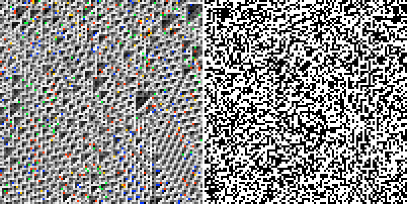

*Rule 110 full spacetime. Left: genotype (sigil colors). Right: phenotype
(black/white). The genotype shows diagonal texture with dark triangular
domains — Rule 110's Class IV structure visible even through the 256-color
palette. The phenotype shows corresponding structure driven by the genotype.*

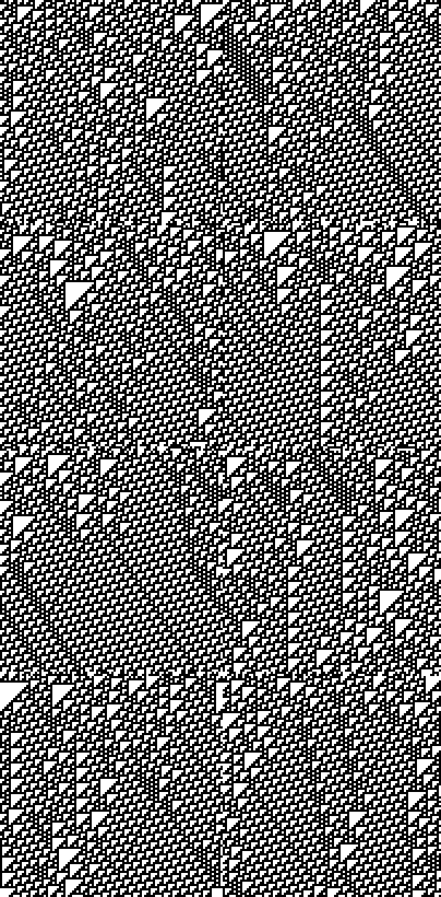

*Rule 110 bitplanes. All 8 planes show identical Class IV structure: periodic
ether with diagonal glider streaks. This is per-bit independence — each bitplane
is its own Rule 110.*

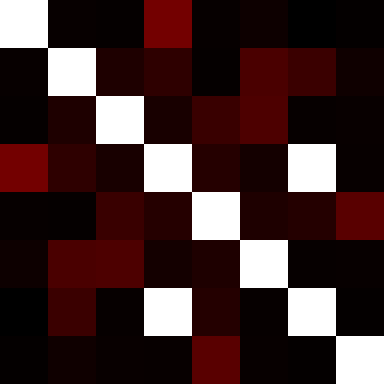

*Rule 110 coupling heatmap. Only the diagonal glows (self-information).
Off-diagonal is uniformly dark: mean MI = 0.0009. No cross-bit interaction.*

---

### R110+AddSelf: The Best Hybrid

**Formula**: `(Rule110(L,C,R) + C) mod 256`

Apply Rule 110 per-bit, then add the original self value arithmetically.
The addition creates carry-chain coupling at every cell.

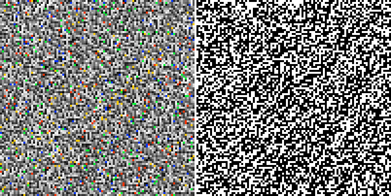

*R110+AddSelf full spacetime. Left: genotype. Right: phenotype. The genotype
retains a diagonal texture similar to Rule 110, with visible triangular domain
structure. The phenotype layer is driven by genotype dynamics and shows
corresponding black/white patterns — not identical to Rule 110's phenotype but
similar in character. The key question is whether the genotype's structure
survives the arithmetic perturbation — compare the diagonal coherence here
with pure Rule 110 above.*

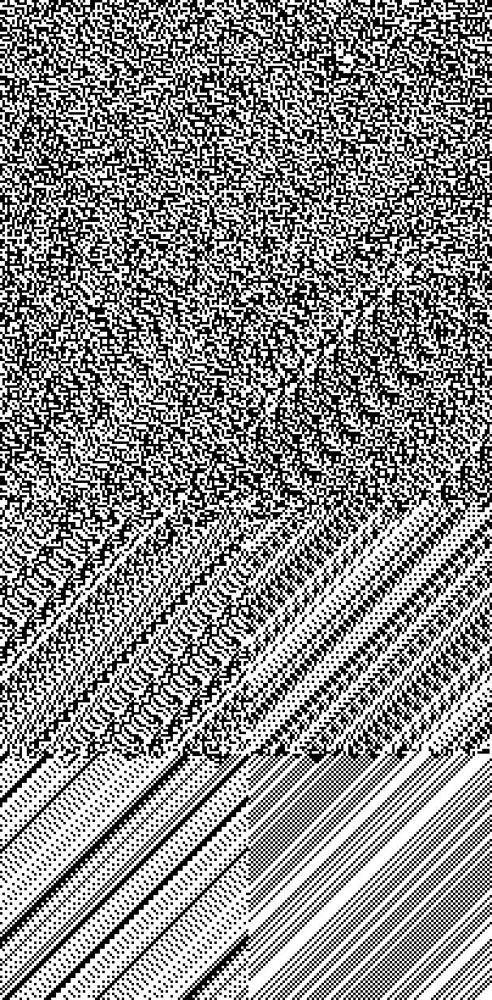

*R110+AddSelf bitplanes. Unlike Rule 110, the planes are NOT identical.
A clear gradient emerges: low-order bits (top-left panels 0-3) are chaotic,
while high-order bits (bottom panels 6-7) show emerging structure with
diagonal banding and domain-like regions. This gradient IS the carry chain
— addition propagates information from low bits to high bits, creating
more deterministic behavior at the high end.*

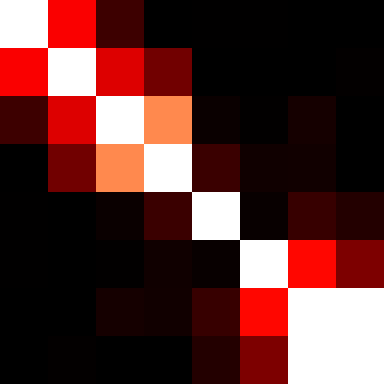

*R110+AddSelf coupling heatmap. The band-diagonal pattern is clearly visible:
bright spots at bp2↔bp3 and bp6↔bp7 (adjacent pairs), with weaker glow at
bp0↔bp1 and bp5↔bp6. Non-adjacent pairs remain dark. This is carry-chain
coupling topology — a new pattern not seen in any previous system.*

```
Detection results:
  Wolfram class:     IV  (confidence 0.67)
  Best bitplane df:  0.690  (plane 6, tile 1x1)
  Class IV planes:   8/8
  Particles:         15 (12 species)
  Mean MI:           0.0046  (5x Rule 110)
  Max MI:            0.031   (bp6↔bp7)
  Coupling:          independent (by current threshold)
```

**The coupling matrix tells the story:**

```
         bp0   bp1   bp2   bp3   bp4   bp5   bp6   bp7
bp0       --  0.015 0.004   0     0     0     0     0
bp1     0.015  --  0.013 0.007   0     0     0     0
bp2     0.004 0.013  --  0.024 0.001   0   0.001   0
bp3       0  0.007 0.024  --  0.003 0.001 0.001   0
bp4       0    0   0.001 0.003  --  0.001 0.003 0.002
bp5       0    0     0   0.001 0.001  --  0.016 0.008
bp6       0    0   0.001 0.001 0.003 0.016  --  0.031
bp7       0    0     0     0   0.002 0.008 0.031  --
```

Two coupling clusters: bp0-bp3 (lower carry chain) and bp5-bp7 (upper carry
chain), with a quiet gap at bp4. The coupling decays with bit-distance —
bp0↔bp1=0.015 but bp0↔bp3=0.000. This is exactly the topology that
binary addition creates: carry from bit *n* affects bit *n+1*, with
diminishing influence on bit *n+2*, *n+3*, etc.

**Comparison with Rule 110:**

| Metric | Rule 110 | R110+AddSelf | Change |
|--------|----------|--------------|--------|
| Best bitplane df | 0.707 | 0.690 | -2% |
| Particles | 9 | 15 | +67% |
| Species | 9 | 12 | +33% |
| Mean MI | 0.0009 | 0.0046 | **+5x** |
| Max MI | 0.010 | 0.031 | **+3x** |

The arithmetic perturbation *barely* degrades Class IV structure (BpDF drops
just 2%) while creating measurably more particles and substantially more
cross-bitplane coupling. This is the best of both worlds — structure
preservation with coupling injection.

---

### R110+AvgSelf: Too Much Coupling

**Formula**: `floor((Rule110(L,C,R) + C) / 2)`

Same as AddSelf but with averaging (right-shift after addition). This
dampens the Rule 110 dynamics more aggressively.

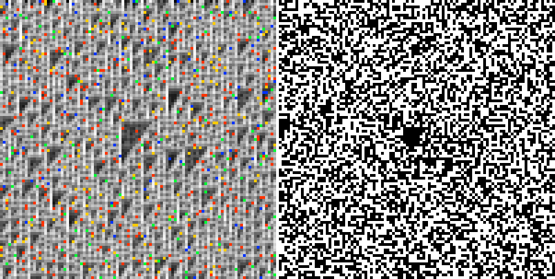

*R110+AvgSelf full spacetime. Left: genotype. Right: phenotype. The genotype
is strikingly different from Rule 110 — it develops pronounced periodic diagonal
banding with clear repeating structure. This is the averaging operation imposing
strong damping that regularizes the dynamics. The phenotype shows emerging dark
blob regions. Visually appealing, but the SCI pipeline says the Class IV ether
has been destroyed — this periodic structure is closer to Class II.*

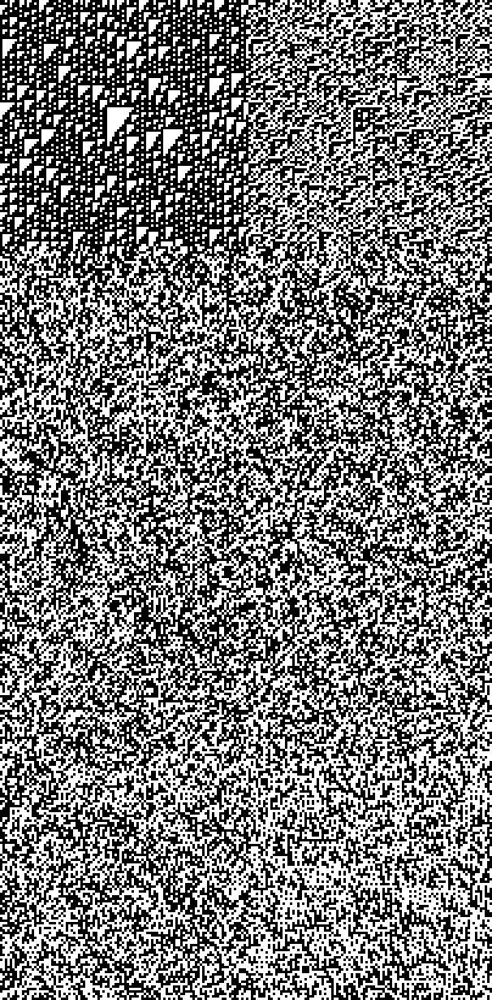

*R110+AvgSelf bitplanes. Plane 0 (top-left) shows a distinctive half-frozen
pattern — the averaging creates strong damping at the least significant bit.
Higher planes show increasing chaos. The gradient is opposite to AddSelf:
here the LOW bits are more structured (dampened by averaging) while high
bits remain chaotic.*

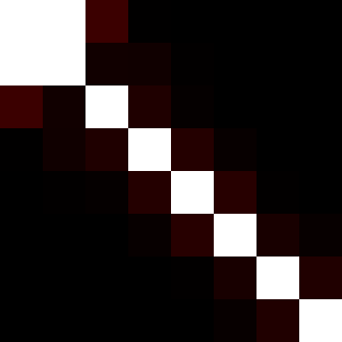

*R110+AvgSelf coupling. Very strong coupling at bp0↔bp1 (MI=0.255, visually
bright), weaker at bp1↔bp2 (0.029). The carry chain is concentrated at
the bottom of the bit stack because averaging right-shifts the sum, losing
the high-bit carry information.*

```
Detection results:
  Wolfram class:     III  (confidence 0.45)    ← LOST Class IV!
  Best bitplane df:  0.575
  Mean MI:           0.0142  (16x Rule 110)
  Max MI:            0.255   (bp0↔bp1)
  Coupling:          weakly-coupled
```

R110+AvgSelf creates the strongest coupling of any hybrid (mean MI comparable
to the Champion MMCA) but **destroys** the Class IV dynamics. The averaging
damps Rule 110's structure below the noise floor. Lesson: coupling strength
and structural preservation are in tension.

---

### R110+Boundary: Conditional Coupling (Failed)

**Formula**: `if hamming(L,R) > 3 then (L+R) mod 256 else Rule110(L,C,R)`

The original hypothesis: apply arithmetic only at cells where neighbors
differ significantly, creating spatially localized coupling.

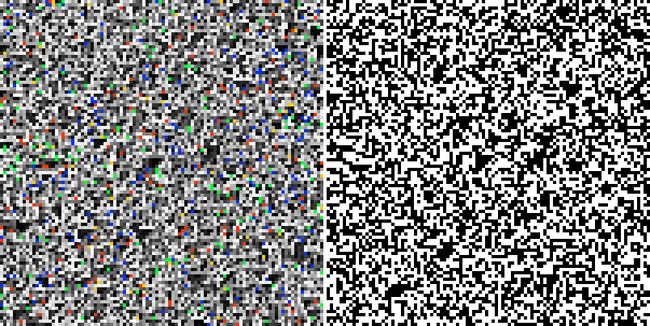

*R110+Boundary full spacetime. Left: genotype. Right: phenotype. Genotype
looks more uniform/chaotic than Rule 110 — the diagonal domain structure
is gone. Phenotype shows some emerging dark regions but less coherent structure
than either Rule 110 or AddSelf. The condition fires too often, so the
arithmetic path dominates and washes out Rule 110's Class IV patterns.*

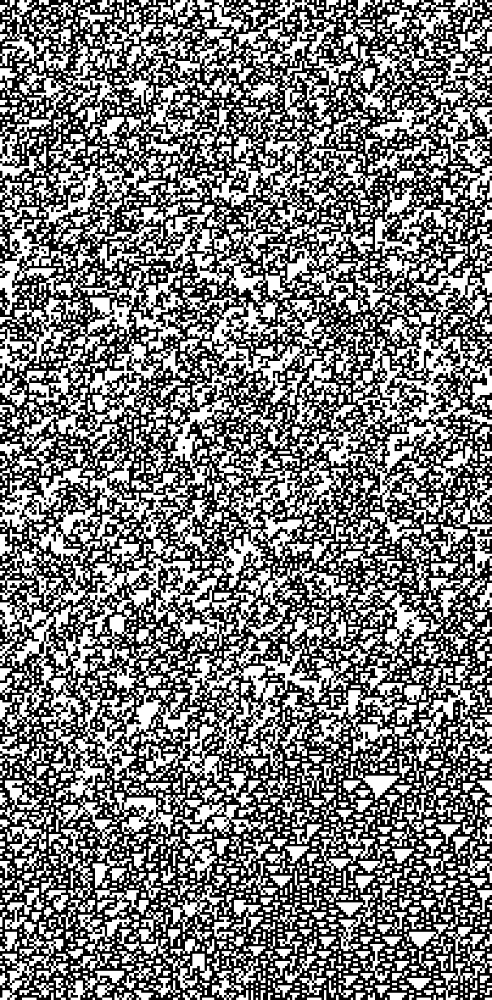

*R110+Boundary bitplanes. All 8 planes look uniformly chaotic — no ether,
no gliders, no structure. The Class IV dynamics have been completely destroyed.*

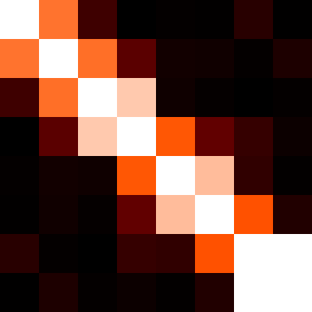

*R110+Boundary coupling heatmap. Shows faint carry-chain structure
(bp0↔bp1=0.003, bp6↔bp7=0.005) but overall very weak — the condition
fires at ~50% of cells, making it effectively an unconditional arithmetic CA.*

```
Detection results:
  Wolfram class:     III  (confidence 0.46)
  Best bitplane df:  0.537  (noise floor)
  Mean MI:           0.0011
  Hotspot fraction:  0.000  (no spatial localization)
```

**Why it failed**: The expected Hamming distance between two random 8-bit
values is 4 (binomial with n=8, p=0.5). The threshold of 3 fires at roughly
half of all cells — it's not selective at all. Even raising to 6 (v2) doesn't
help because the condition is based on sigil-level properties that don't
align with any particular bitplane's domain structure.

---

### ArithMean: Pure Arithmetic (Control)

**Formula**: `floor(((L+R) mod 256 + C) / 2)`

No Rule 110 at all — pure arithmetic combination of neighbors.

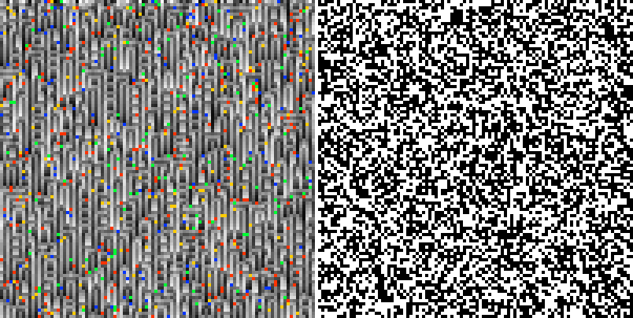

*ArithMean full spacetime. Left: genotype. Right: phenotype. The genotype
develops striking vertical banding — clear periodic stripes running top to
bottom. This is pure arithmetic dynamics: the averaging operation creates
spatial periodicity that doesn't exist in any of the Rule 110 hybrids.
The phenotype shows large-scale black/white regions being driven by the
banded genotype. Visually distinctive but computationally Class III (no
gliders, no localized structures — just periodic stripes).*

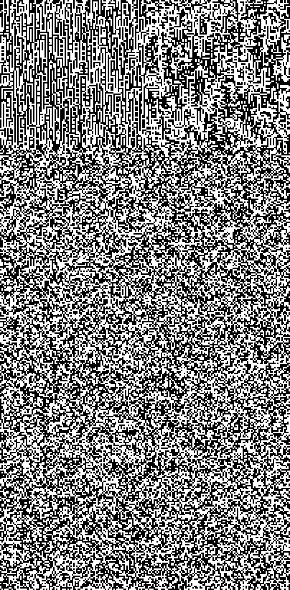

*ArithMean bitplanes. Plane 0 (top-left) shows distinctive structure — slower
change rate (0.250) due to the averaging dampening the least significant bit.
Higher planes approach random dynamics.*

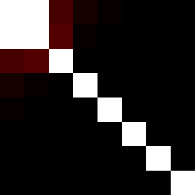

*ArithMean coupling. Bright spot at bp0↔bp1 (MI=0.177) — very strong carry
coupling at the bottom of the bit stack. This confirms the carry-chain
mechanism: addition creates coupling between adjacent bits, strongest
at the least significant end.*

```
Detection results:
  Wolfram class:     III  (confidence 0.46)
  Best bitplane df:  0.566
  Mean MI:           0.0088
  Max MI:            0.177  (bp0↔bp1)
```

The control confirms: pure arithmetic creates carry-chain coupling but
produces Class III (chaotic) dynamics. Carry-chain coupling alone is
not sufficient for computation — you also need the periodic ether + glider
structure that Rule 110 provides.

---

### R110+Carry: Active-Site Injection

**Formula**: `if hamming(R110(L,C,R),C) > 2 then (R110(L,C,R)+C) mod 256 else R110(L,C,R)`

Inject carry-chain coupling at cells where Rule 110 significantly changes
the value — active computation sites, glider bodies, collision points.

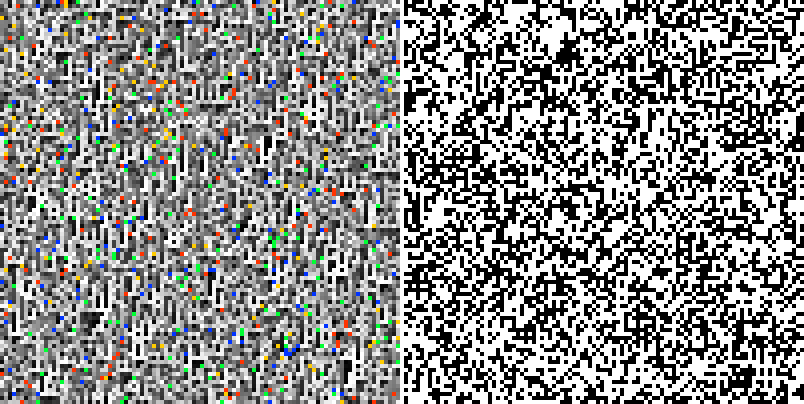

*R110+Carry full spacetime. Left: genotype. Right: phenotype. The genotype
shows a different texture — more fine-grained structure than pure Rule 110,
with visible diagonal coherence. The phenotype shows some emerging spatial
patterns. The carry injection fires more selectively than the boundary
condition (only where Rule 110 makes big changes), so some Class IV
structure survives: BpDF=0.63, 5 particles.*

```
Detection results:
  Wolfram class:     IV  (confidence 0.53)
  Best bitplane df:  0.629  (plane 7)
  Particles:         5 (4 species)
  Mean MI:           0.0005
```

---

### R110+Rotate: Bit Rotation (No Effect)

**Formula**: `if hamming(L,R) > 3 then rotate(R110(L,C,R), 1) else R110(L,C,R)`

Uses the existing `bit-shift-left` component to rotate bits at boundaries.

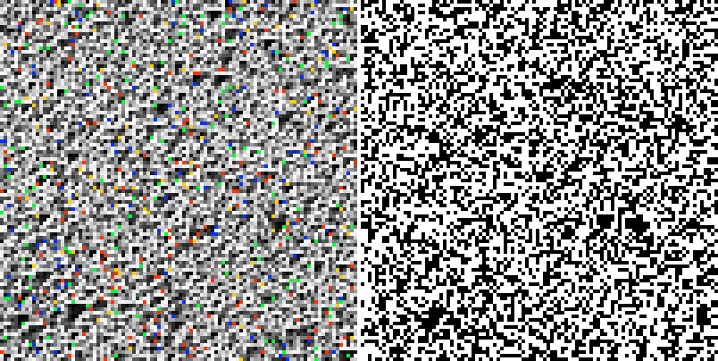

*R110+Rotate full spacetime. Left: genotype. Right: phenotype. Similar
diagonal texture to Rule 110 in the genotype but without the distinctive
dark triangular domains. Phenotype shows standard chaotic black/white
pattern. The rotation operation changes which bits end up where, but
because the condition fires at ~50% of cells, this is effectively a
random per-generation bitplane shuffle — enough to destroy Rule 110's
Class IV structure without creating any coupling.*

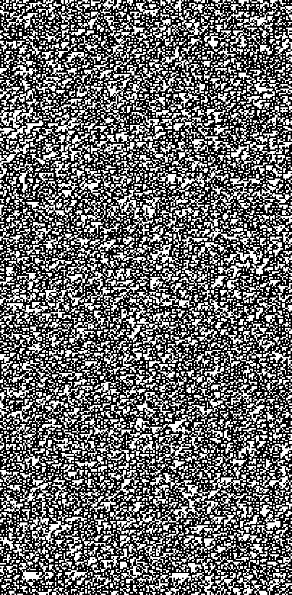

*R110+Rotate bitplanes. All planes look chaotic — similar to R110+Boundary.*

```
Detection results:
  Mean MI: 0.0001  (same as Rule 30 — zero coupling!)
```

**Why it failed**: Rotation is a *permutation* of bitplane identities, not
a coupling mechanism. If bit 0 was 1 and bit 1 was 0, after rotation bit 1
is 1 and bit 2 is 0 — no new statistical dependence is created. Rotation
shuffles *which* bitplane a value lives in, but doesn't create information
flow *between* bitplanes. Plus the condition fires too often (same issue
as R110+Boundary).

---

## 4. The Updated Coupling Spectrum

```
                 Mean MI    Max MI    BpDF    Particles  Class   Topology
                 ───────    ──────    ────    ─────────  ─────   ────────
Independent:
  Rule 30        0.0001     0.001     0.54    1          III     flat
  Rule 90        0.0001     0.001     0.54    1          III     flat
  Rule 110       0.0009     0.010     0.71    9          IV      flat

Carry-chain:                                                      ← NEW
  R110+AddSelf   0.0046     0.031     0.69    15         IV      band-diagonal
  R110+AvgSelf   0.0142     0.255     0.58    9          III     band-diagonal

Weakly coupled:
  Champion       0.0170     0.050     0.73    32         IV      uniform

Uniformly coupled:
  Rule 184       0.0790     0.386     0.99    174        II      uniform
```

The carry-chain regime fills a gap between independent and weakly-coupled.
**R110+AddSelf** is the first system to show both Class IV dynamics AND
measurable cross-bitplane coupling with structured topology.

The band-diagonal topology is qualitatively different from the champion's
uniform weak coupling: instead of all 28 bitplane pairs interacting
equally at low level, only ~8 adjacent pairs interact, with coupling
strength that decays with bit-distance. This is carry-chain physics.

---

## 5. What We Learned

### Carry-chain coupling is real and novel

Binary addition creates a coupling topology where adjacent bitplanes
interact via carry propagation. The coupling matrix is band-diagonal —
coupling strength decays exponentially with bit-distance. This is a
fundamentally different pattern from the uniform coupling created by
logical AND/OR operations.

### Structure preservation and coupling strength trade off

| System | Class IV? | Coupling? |
|--------|-----------|-----------|
| Rule 110 | Yes | No |
| R110+AddSelf | Yes | Mild carry-chain |
| R110+AvgSelf | No | Strong carry-chain |
| R110+Boundary | No | Weak (condition too promiscuous) |
| ArithMean | No | Carry-chain |

Addition (`mod 256`) is gentle enough to preserve Rule 110's Class IV
structure. Averaging (`/2`) is too destructive. The sweet spot is mild
perturbation — enough to create coupling, not enough to destroy the ether.

### Conditional coupling at boundaries didn't work (yet)

The Hamming distance condition fires at ~50% of cells with random 8-bit
data — it's not spatially selective. Even with tighter thresholds (hamming > 6),
the sigil-level condition doesn't align with per-bitplane domain structure.

For truly structured *spatial* coupling, the condition must be aware of
the bitplane-level dynamics (where the ether boundaries actually are).
This suggests:

1. **Bitplane-aware conditions** — "if bit 7 is 1, apply arithmetic"
2. **Evolved conditions** — let TPG search for conditions that produce
   spatial coupling while preserving Class IV
3. **Temporal conditions** — apply arithmetic every Nth generation instead
   of at specific cells

### Rotation doesn't create coupling

Bit rotation (shift) permutes which bitplane holds a value but creates
no statistical dependence between bitplanes. It's a relabeling, not an
interaction. Only operations with non-linear bit dependencies (like
carry chains) create genuine coupling.

---

## 6. Next Steps

1. **Evolve hybrid diagrams via TPG.** The component library now includes
   both per-bit (Rule 110) and sigil-level (arithmetic) operations. The
   TPG can compose these freely to search for wirings that maximize both
   Class IV structure and structured coupling.

2. **Bitplane-aware conditions.** Use individual bit values as conditions
   for arithmetic injection. "If bit 7 is 1, apply `sigil-add-mod`"
   would create coupling that's perfectly aligned with bitplane 7's dynamics.

3. **Coupling-aware fitness.** Add carry-chain topology metrics to the
   TPG fitness function. Reward band-diagonal coupling + high BpDF.

4. **Multi-step temporal hybrids.** Apply Rule 110 for N steps, then one
   step of arithmetic — pulsed coupling injection that may create temporal
   structure in the coupling spectrum.

---

## Files

```
New components:
  resources/xenotype-generator-components.edn   5 new components (+30 lines)
  src/futon5/xenotype/generator.clj             5 implementations (+21 lines)

Hybrid wiring diagrams:
  data/wiring-rules/hybrid-110-addself.edn      R110 + self mod 256 (BEST)
  data/wiring-rules/hybrid-110-avgself.edn      R110 avg self (too strong)
  data/wiring-rules/hybrid-110-boundary.edn     Conditional at boundaries
  data/wiring-rules/hybrid-110-boundary-v2.edn  Tighter threshold
  data/wiring-rules/hybrid-110-carry.edn        Carry at active sites
  data/wiring-rules/hybrid-110-rotate.edn       Rotation at boundaries
  data/wiring-rules/hybrid-arith-mean.edn       Pure arithmetic (control)

Scripts:
  scripts/sci_hybrids.clj                       Full experiment script

Images:
  out/sci-hybrids/                              37 PNG files
```
