# Elementary CA Rules as MMCA Wirings

A visual exploration of classic cellular automaton rules implemented as wiring diagrams.

**Seed**: 352362012 | **Generations**: 80 | **Width**: 120

Each rule is implemented as a wiring diagram that computes the next cell state from the neighborhood.

---

## Rule 90 (Class 3)

**XOR(left, right) - Sierpinski triangle patterns, fractal structure**

Formula: `L XOR R`

### Wiring Diagram

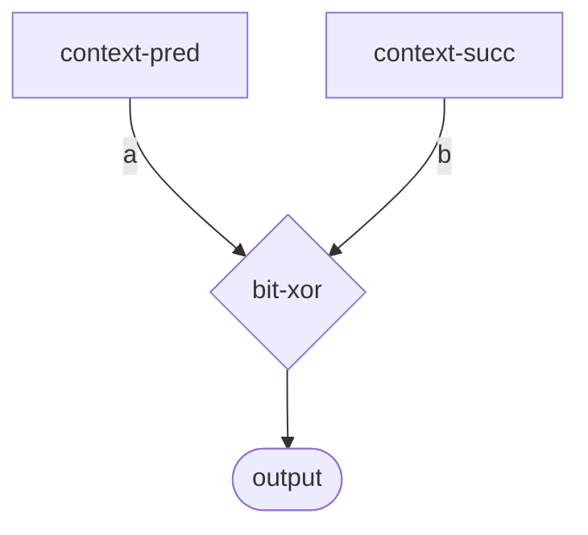

### Spacetime Diagrams

| Color (RGB from bits) | Grayscale (bit count) |
|:---------------------:|:---------------------:|
| 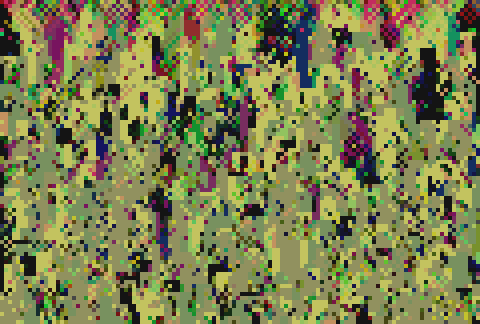 | 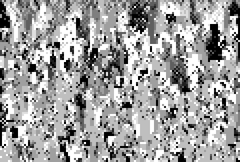 |

---

## Rule 110 (Class 4)

**Turing-complete, produces localized structures and 'gliders'**

Formula: `(C OR R) AND NOT(L AND C AND R)`

### Wiring Diagram

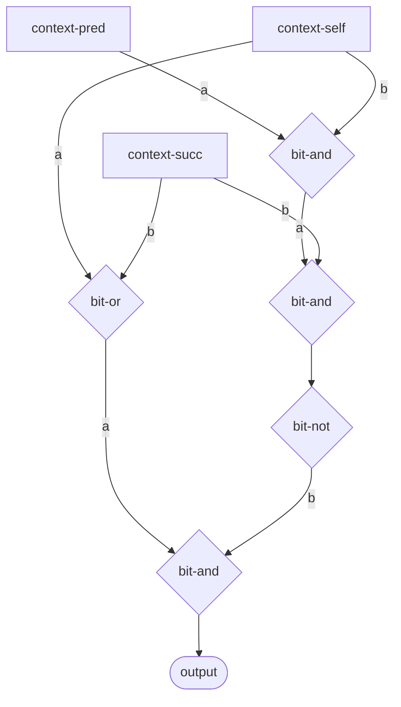

### Spacetime Diagrams

| Color (RGB from bits) | Grayscale (bit count) |
|:---------------------:|:---------------------:|
| 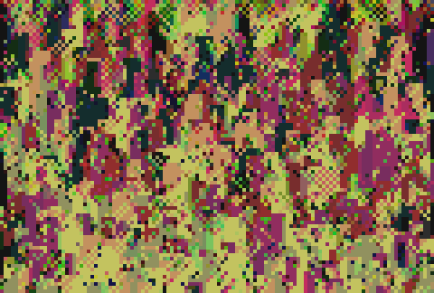 | 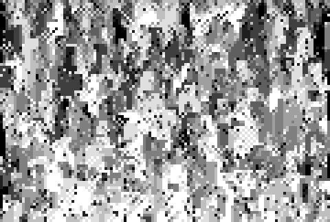 |

---

## Rule 30 (Class 3)

**Chaotic, used for randomness generation in Mathematica**

Formula: `L XOR (C OR R)`

### Wiring Diagram

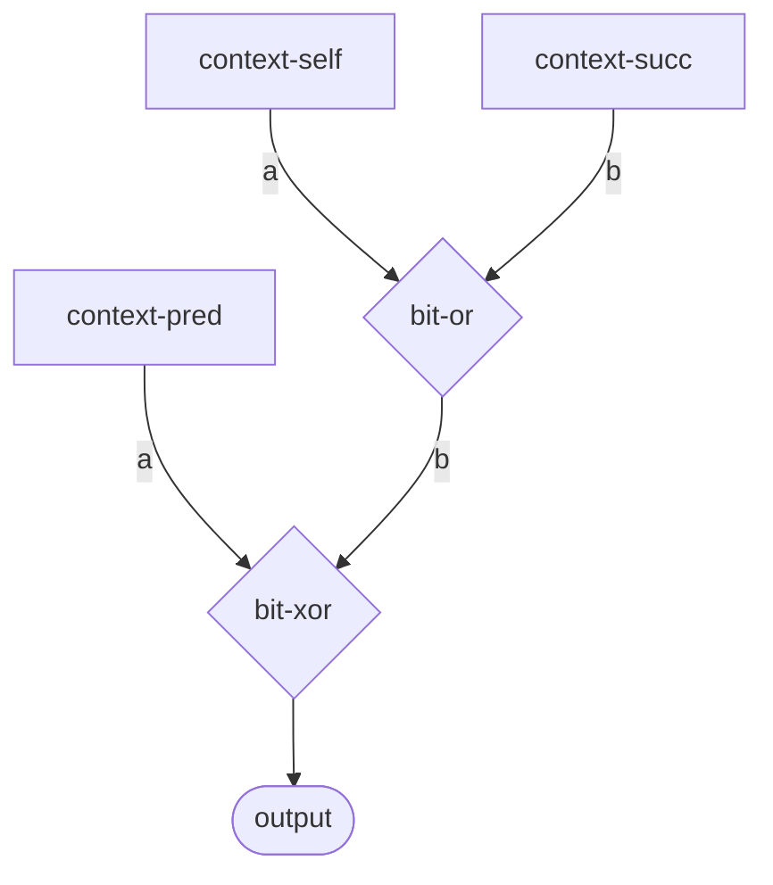

### Spacetime Diagrams

| Color (RGB from bits) | Grayscale (bit count) |
|:---------------------:|:---------------------:|
| 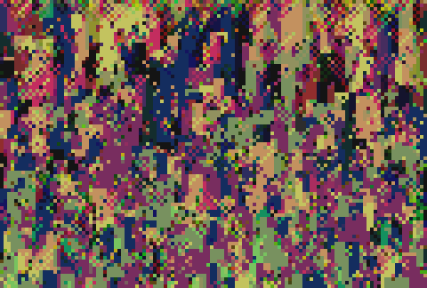 | 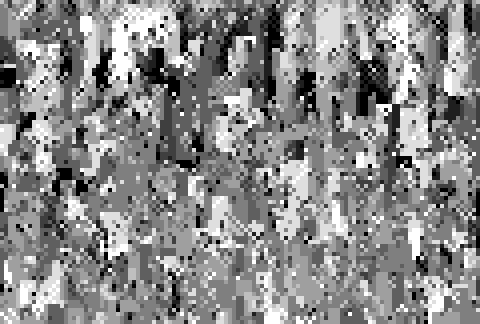 |

---

## Rule 184 (Class 2)

**Traffic/particle flow - conserves number of particles**

Formula: `(C AND R) OR (L AND NOT C)`

### Wiring Diagram

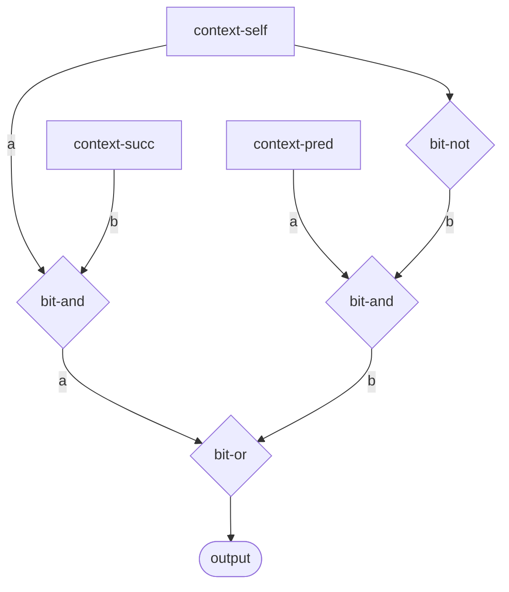

### Spacetime Diagrams

| Color (RGB from bits) | Grayscale (bit count) |
|:---------------------:|:---------------------:|
| 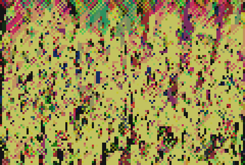 | 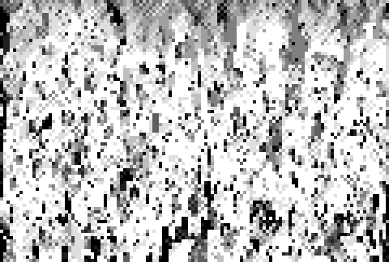 |

---

## Rule 54 (Class 4)

**Complex periodic structures with localized patterns**

Formula: `(NOT L AND (C XOR R)) OR (L AND NOT C)`

### Wiring Diagram

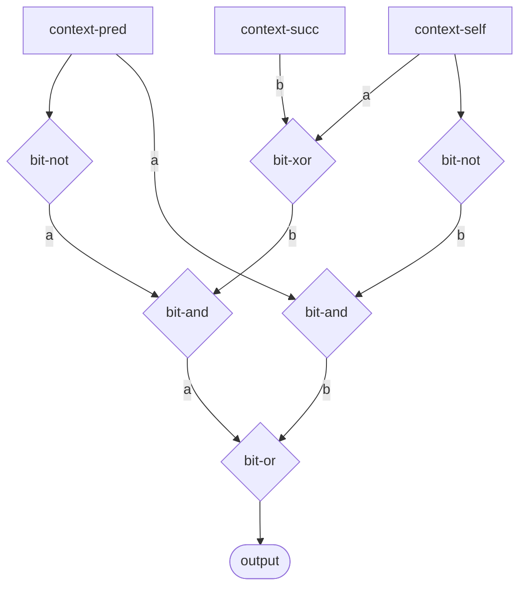

### Spacetime Diagrams

| Color (RGB from bits) | Grayscale (bit count) |
|:---------------------:|:---------------------:|
| 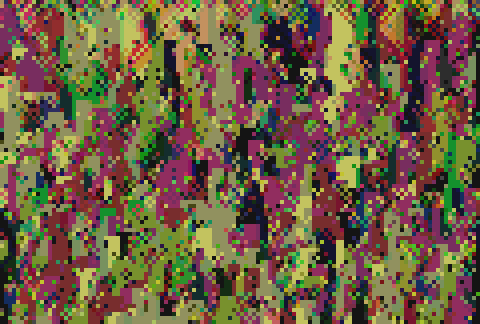 | 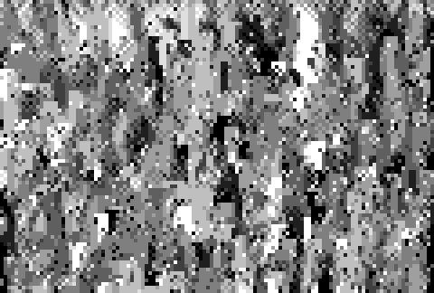 |

---

## Comparison

| Rule | Wolfram Class | Key Property | Formula |
|------|---------------|--------------|--------|
| 90 | 3 (Chaotic) | Sierpinski fractal | `L XOR R` |
| 110 | 4 (Complex) | Turing-complete | `(C OR R) AND NOT(L AND C AND R)` |
| 30 | 3 (Chaotic) | High entropy | `L XOR (C OR R)` |
| 184 | 2 (Periodic) | Particle conservation | `(C AND R) OR (L AND NOT C)` |
| 54 | 4 (Complex) | Localized structures | `(NOT L AND (C XOR R)) OR (L AND NOT C)` |

## Hexagram Connections

When these rules run on 8-bit sigils, the exotype sampling shows different hexagram distributions:

- **Rule 90** (XOR) produces alternating bitplane patterns mapping to hexagrams 63/64 (既濟/未濟)
- **Rule 184** (traffic) shows highest affinity for hexagram 11 (泰 - Peace)
- The 8-bit sigil space creates richer dynamics than binary CAs

## Technical Notes

- **Color images**: RGB derived from 8 sigil bits (bits 0-2 → R, bits 3-5 → G, bits 6-7 → B)
- **Grayscale images**: Brightness proportional to number of 1-bits in sigil
- Each wiring implements the rule's boolean formula using `bit-xor`, `bit-and`, `bit-or`, `bit-not` components
