# Elementary CA Rules as Wiring Diagrams

*Generated: 2026-01-25T15:50:23.840945700*

This essay visualizes elementary cellular automaton rules implemented as
wiring diagrams in the futon5 xenotype system. Each rule is executed through
the `futon5.wiring.runtime` interpreter, producing spacetime diagrams that
show the evolution of 8-bit sigil states.

---

## Overview

| Rule | Wolfram Class | Formula | Description |
|------|---------------|---------|-------------|
| Rule 90 | 3 | `L ⊕ R` | XOR(L,R) - Sierpinski triangle, additive |
| Rule 110 | 4 | `(C ∨ R) ∧ ¬(L ∧ C ∧ R)` | Turing-complete, localized structures |
| Rule 30 | 3 | `L ⊕ (C ∨ R)` | L XOR (C OR R) - chaotic, used for randomness |
| Rule 184 | 2 | `(C ∧ R) ∨ (L ∧ ¬C)` | Traffic flow, particle conservation |
| Rule 54 | 4 | `(¬L ∧ (C ⊕ R)) ∨ (L ∧ ¬C)` | Complex periodic structures |

## Rule 90

**Wolfram Class 3**: XOR(L,R) - Sierpinski triangle, additive

### Wiring Diagram

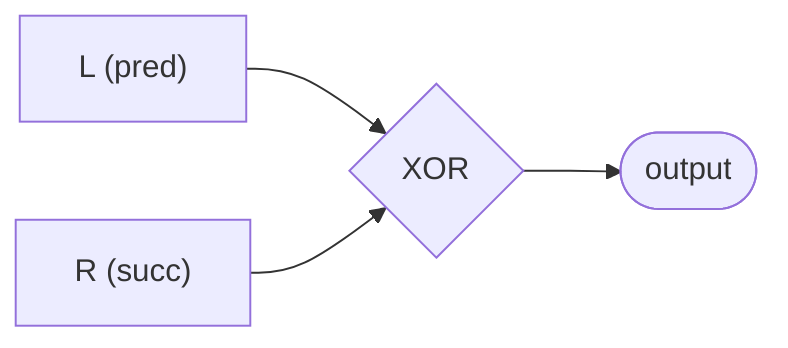

### Run Statistics

- **Generations**: 101
- **Width**: 150 cells
- **Seed**: 352362012
- **Dynamics**: Entropy: 0.98 → 0.98 | Unique sigils: 111 → 111

### Spacetime Diagrams

| Color (8-bit) | Grayscale | Bitplane 0 |
|---------------|-----------|------------|
| 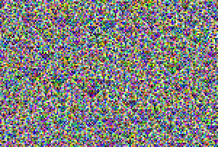 | 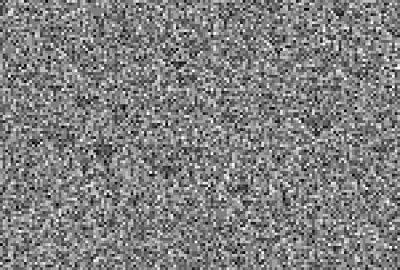 | 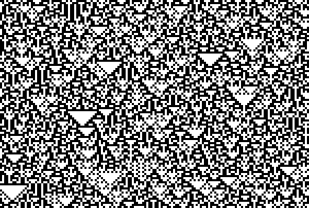 |

---

## Rule 110

**Wolfram Class 4**: Turing-complete, localized structures

### Wiring Diagram

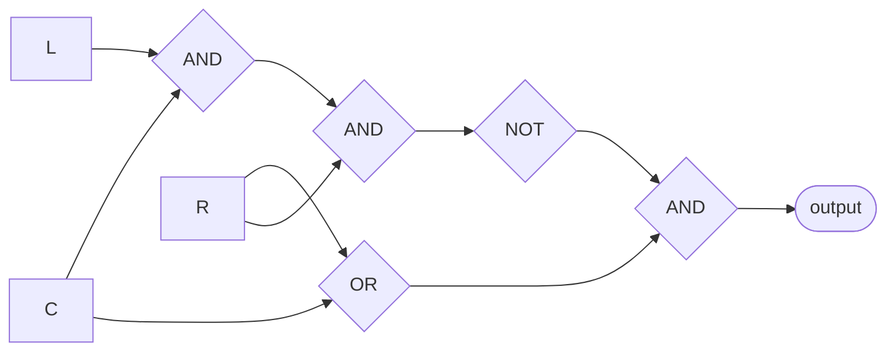

### Run Statistics

- **Generations**: 101
- **Width**: 150 cells
- **Seed**: 352362012
- **Dynamics**: Entropy: 0.98 → 0.98 | Unique sigils: 111 → 116

### Spacetime Diagrams

| Color (8-bit) | Grayscale | Bitplane 0 |
|---------------|-----------|------------|
| 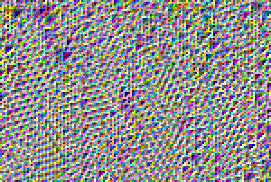 | 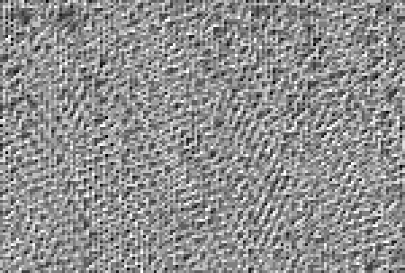 | 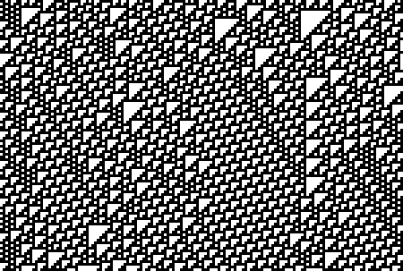 |

---

## Rule 30

**Wolfram Class 3**: L XOR (C OR R) - chaotic, used for randomness

### Wiring Diagram

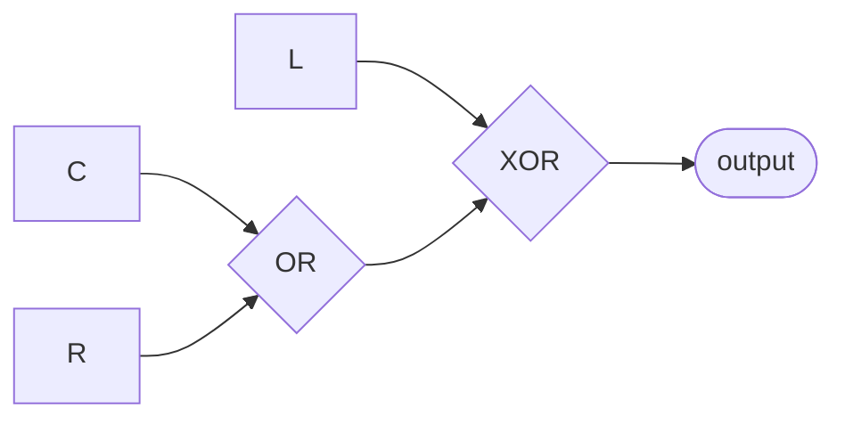

### Run Statistics

- **Generations**: 101
- **Width**: 150 cells
- **Seed**: 352362012
- **Dynamics**: Entropy: 0.98 → 0.98 | Unique sigils: 111 → 113

### Spacetime Diagrams

| Color (8-bit) | Grayscale | Bitplane 0 |
|---------------|-----------|------------|
| 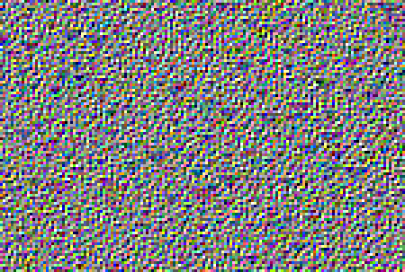 | 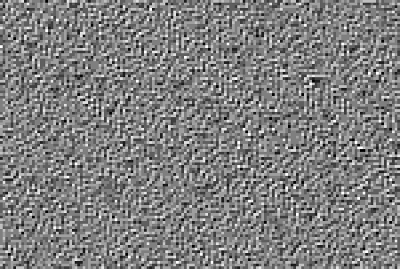 | 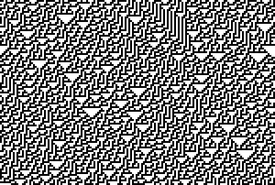 |

---

## Rule 184

**Wolfram Class 2**: Traffic flow, particle conservation

### Wiring Diagram

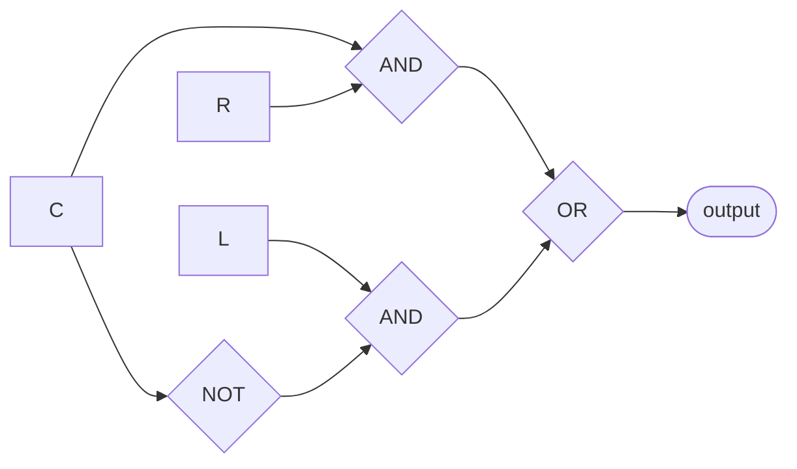

### Run Statistics

- **Generations**: 101
- **Width**: 150 cells
- **Seed**: 352362012
- **Dynamics**: Entropy: 0.98 → 0.89 | Unique sigils: 111 → 24

### Spacetime Diagrams

| Color (8-bit) | Grayscale | Bitplane 0 |
|---------------|-----------|------------|
| 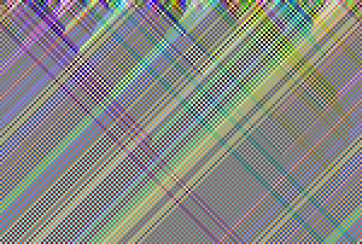 | 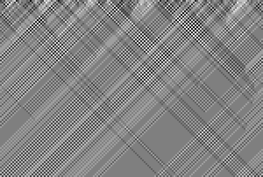 | 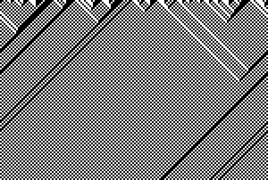 |

---

## Rule 54

**Wolfram Class 4**: Complex periodic structures

### Wiring Diagram

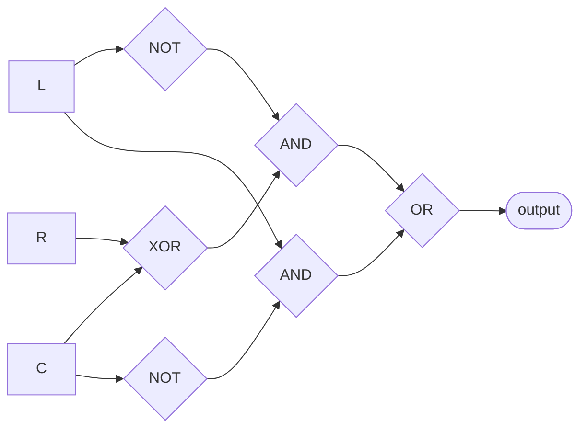

### Run Statistics

- **Generations**: 101
- **Width**: 150 cells
- **Seed**: 352362012
- **Dynamics**: Entropy: 0.98 → 0.98 | Unique sigils: 111 → 101

### Spacetime Diagrams

| Color (8-bit) | Grayscale | Bitplane 0 |
|---------------|-----------|------------|
| 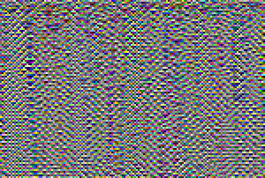 | 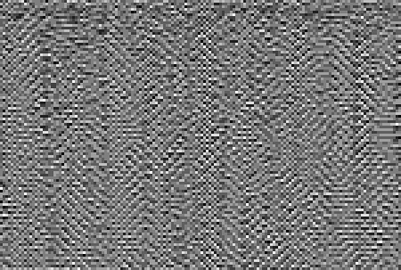 | 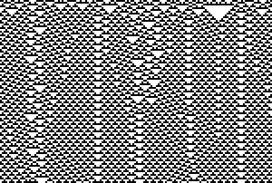 |

---

## Methodology

Each rule is implemented as a wiring diagram with these components:

- **Context extractors**: `:context-pred`, `:context-self`, `:context-succ`
- **Boolean operations**: `:bit-xor`, `:bit-and`, `:bit-or`, `:bit-not`
- **Output**: `:output-sigil`

The wiring interpreter (`futon5.xenotype.interpret/evaluate-diagram`) executes
the diagram in topological order for each cell at each generation.

**Note**: These are 8-bit sigil CAs, not binary CAs. Each sigil represents
256 possible states. The boolean operations work bitwise across all 8 bits,
producing richer dynamics than traditional binary CAs.

## Files

- **Wiring definitions**: `data/wiring-rules/rule-*.edn`
- **Runtime**: `src/futon5/wiring/runtime.clj`
- **This script**: `scripts/wiring_photo_essay.clj`
- **Images**: `reports/images/*-wiring-*.png`
