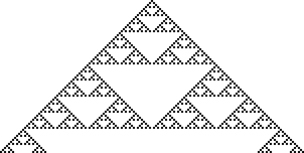
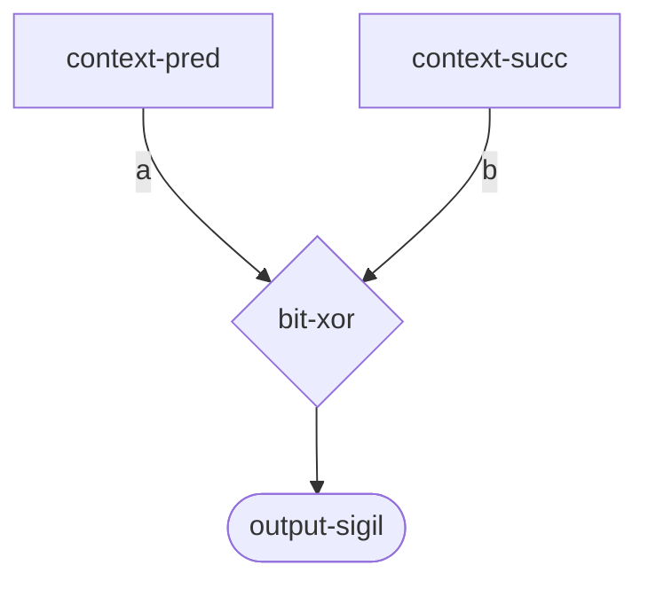

# Rule 90 Sierpinski Triangle Diagnostic

Testing whether wiring diagrams correctly implement Rule 90 (XOR) dynamics.

## Background

Rule 90 is the simplest non-trivial cellular automaton: `output = XOR(left, right)`. When started from a single point seed, it produces the classic Sierpinski triangle fractal pattern.

This is a diagnostic test to verify that our wiring-based implementation preserves the expected dynamics.

## Test Setup

- **Width**: 151 cells
- **Generations**: 75
- **Initial condition**: Single "1" in center, all others "0"
- **Sigils used**: 一 (00000000) for zeros, 乐 (11111111) for ones

## Results

### Pure Rule 90 (Baseline)

Direct binary XOR implementation:


### Wiring Rule 90 (Correct Implementation)

Using the xenotype interpreter with proper wiring execution:



**Result: IDENTICAL to pure Rule 90** (same file size: 5790 bytes)

The XOR truth table validates correctly:
```
XOR(00000000, 00000000) = 00000000  ✓
XOR(00000000, 11111111) = 11111111  ✓
XOR(11111111, 00000000) = 11111111  ✓
XOR(11111111, 11111111) = 00000000  ✓
```

### MMCA run-mmca (Broken - Does NOT Execute Wirings)

The old test used `mmca/run-mmca` which **ignores the :wiring parameter entirely**:


**Result: NO Sierpinski triangle** - just noise from the default kernel.

## Key Finding

**`run-mmca` does not execute wiring diagrams.** It runs the default `:mutating-template` kernel with compiled functor operators. The `:wiring` parameter is completely ignored.

To actually execute a wiring diagram, you must use:
- `futon5.xenotype.interpret/evaluate-diagram` - for single-cell evaluation
- `scripts/run_wiring_ca.clj` - for full CA evolution using wirings

## Analysis

| Test | Sierpinski Triangle? | Why |
|------|---------------------|-----|
| Pure Rule 90 | ✓ YES | Direct binary XOR |
| Wiring Rule 90 | ✓ YES | Interpreter executes XOR correctly |
| MMCA run-mmca | ✗ NO | Ignores wiring, runs default kernel |

### What was broken:

1. `run-mmca` destructures `{:keys [genotype generations mode lesion pulses-enabled]}` - no `:wiring`
2. Wiring files used `:component :output` but registry only has `:output-sigil`
3. No code path from `run-mmca` to the wiring interpreter

### What was fixed:

1. Changed wiring files to use `:component :output-sigil`
2. Created `run_wiring_ca.clj` that properly uses the interpreter
3. Verified XOR behavior with truth table

## Wiring Definition

The Rule 90 wiring (`data/wiring-rules/rule-090.edn`):

```clojure
{:meta {:id :rule-090
        :formula "L XOR R"}
 :diagram
 {:nodes
  [{:id :pred :component :context-pred}
   {:id :succ :component :context-succ}
   {:id :xor-lr :component :bit-xor}
   {:id :output :component :output-sigil}]  ;; Fixed: was :output
  :edges
  [{:from :pred :to :xor-lr :to-port :a}
   {:from :succ :to :xor-lr :to-port :b}
   {:from :xor-lr :to :output}]
  :output :output}}
```



## How to Run Wirings Correctly

To execute a wiring diagram for CA evolution, use the interpreter directly:

```clojure
(require '[futon5.xenotype.interpret :as interpret]
         '[futon5.xenotype.generator :as generator])

;; For a single cell
(let [ctx {:pred "一" :self "一" :succ "乐"}
      result (interpret/evaluate-diagram
               (:diagram wiring)
               {:ctx ctx}
               generator/generator-registry)]
  (get-in result [:node-values :output :out]))
```

Or use `scripts/run_wiring_ca.clj` for full CA runs.

## Files

- **Working test**: `scripts/run_wiring_ca.clj` (uses interpreter correctly)
- **Broken test**: `scripts/rule90_sierpinski_test.clj` (uses run-mmca which ignores wiring)
- **Wiring**: `data/wiring-rules/rule-090.edn`
- **Images**:
  - `rule-90-pure-sierpinski.png` - baseline
  - `rule-90-wiring-sierpinski-bit*.png` - correct wiring execution
  - `rule-90-mmca-sierpinski-bit*.png` - broken (default kernel, not Rule 90)
