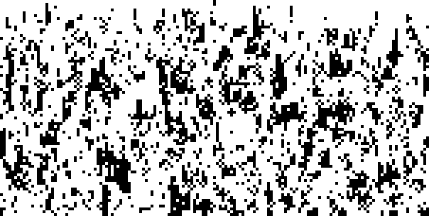
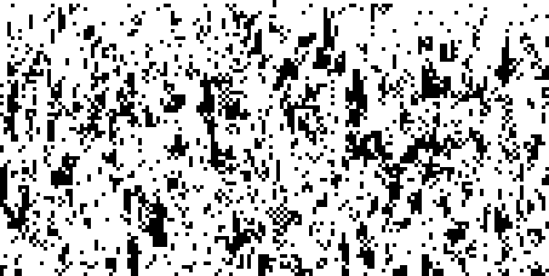
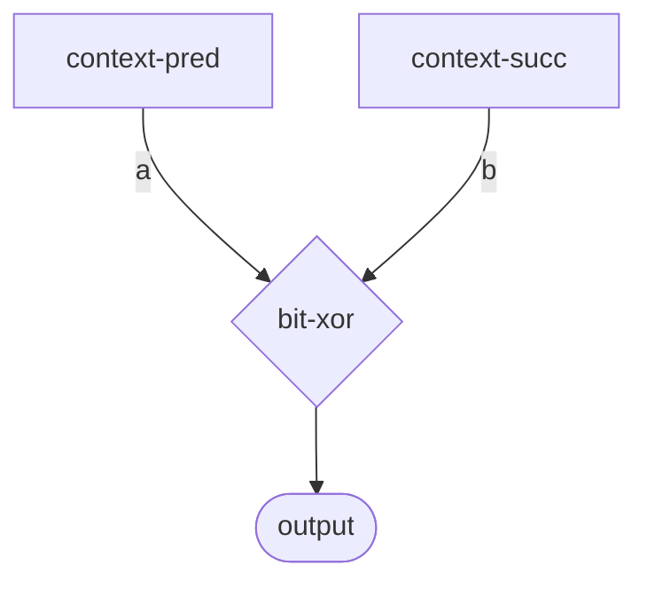

# Rule 90 Sierpinski Triangle Diagnostic

Testing whether the MMCA wiring framework correctly implements Rule 90 (XOR) dynamics.

## Background

Rule 90 is the simplest non-trivial cellular automaton: `output = XOR(left, right)`. When started from a single point seed, it produces the classic Sierpinski triangle fractal pattern.

This is a diagnostic test to verify that our wiring-based implementation preserves the expected dynamics.

## Test Setup

- **Width**: 151 cells
- **Generations**: 75
- **Initial condition**: Single "1" in center, all others "0"
- **Sigils used**: 一 (00000000) for zeros, 乐 (11111111) for ones

## Results

### Pure Rule 90 (Baseline)

Direct binary XOR implementation, no MMCA framework:


This should show a perfect Sierpinski triangle pattern.

### MMCA Rule 90 (Bitplane 0)

Same initial conditions, run through the MMCA wiring framework, extracting bit 0:



### MMCA Rule 90 (Bitplane 7)

Same initial conditions, extracting bit 7:



## Analysis

Compare the three images:

| Image | Expected | Actual |
|-------|----------|--------|
| Pure Rule 90 | Sierpinski triangle | (observe) |
| MMCA Bitplane 0 | Same triangle | (observe) |
| MMCA Bitplane 7 | Same triangle | (observe) |

### If triangles match:
The wiring framework correctly implements Rule 90.

### If triangles don't match:
Something in the MMCA framework is modifying the dynamics:
- Update probability < 1.0
- Phenotype interactions
- Legacy kernel blending
- Sigil round-trip quantization

## Wiring Definition

The Rule 90 wiring (`data/wiring-rules/rule-090.edn`):

```clojure
{:meta {:id :rule-090
        :formula "L XOR R"}
 :diagram
 {:nodes
  [{:id :pred :component :context-pred}
   {:id :succ :component :context-succ}
   {:id :xor-lr :component :bit-xor}
   {:id :output :component :output}]
  :edges
  [{:from :pred :to :xor-lr :to-port :a}
   {:from :succ :to :xor-lr :to-port :b}
   {:from :xor-lr :to :output}]}}
```



## Implications

If the MMCA framework doesn't preserve Rule 90 dynamics, we need to investigate:

1. **Wiring interpreter**: Is the graph being executed correctly?
2. **Component implementations**: Does `bit-xor` do what we expect?
3. **Runtime overhead**: What else happens during `run-mmca`?

This diagnostic helps validate that our wiring-based approach to CA rule implementation is sound.

## Files

- Test script: `scripts/rule90_sierpinski_test.clj`
- Wiring: `data/wiring-rules/rule-090.edn`
- Images: `reports/images/rule-90-*sierpinski*.png`
