# The Search for Computational Intelligence: Detection Sampler

**First results from the SCI detection pipeline on known Wolfram rules
and the champion MMCA run**

Date: 2026-02-15
Branch: `feat/verifier-guided-tpg`

---

## 1. The Question

Rule 110 is the existence proof: a simple 1D cellular automaton capable
of universal computation. If we built a Rule 110-like system inside
futon5's multi-layer CA, **would we be able to detect it?**

This report runs 5 known Wolfram rules and the champion MMCA run through
the new SCI detection pipeline — 9 analysis modules measuring dynamics
at three scales:

- **Sigil level** (256 symbols): compression variance, domain detection, particles
- **Bitplane level** (8 binary layers): per-bitplane domain fractions
- **Cross-bitplane coupling**: mutual information between bitplane pairs

The question is whether the pipeline can distinguish Class IV (complex,
computational) from Class III (chaotic, random) — the hardest discrimination
in CA classification, and the one that matters most for SCI.

---

## 2. The Test Rules

All wiring rules operate per-bit on 8-bit sigils, so each bitplane evolves
as an independent elementary CA. Grid: 120 cells, 200 generations, seed 352362012.

### Rule 110: The Existence Proof (Class IV)

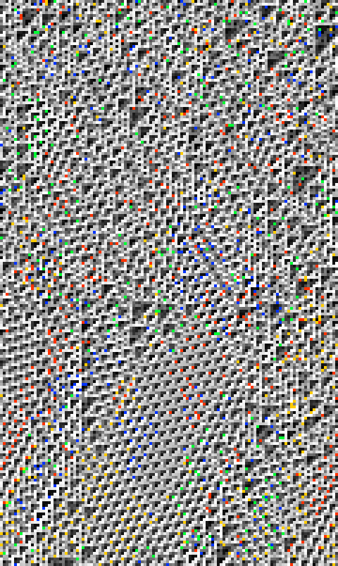

*Sigil-level spacetime diagram. 120 cells, 200 generations. Time flows downward.
Each cell is colored by its sigil's assigned color (256-entry palette).*

The only known Turing-complete elementary CA. At the sigil level, the texture
appears chaotic — similar to Rule 30. But the bitplane view tells a different story:

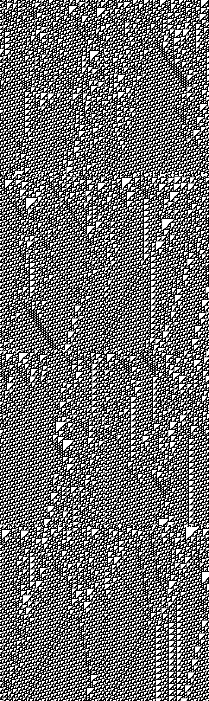

*All 8 bitplanes of Rule 110. Grid reads left-to-right, top-to-bottom: planes 0–7.
Each bitplane independently shows the signature Class IV structure — periodic
background ("ether") punctuated by localized dark streaks (gliders/particles).*

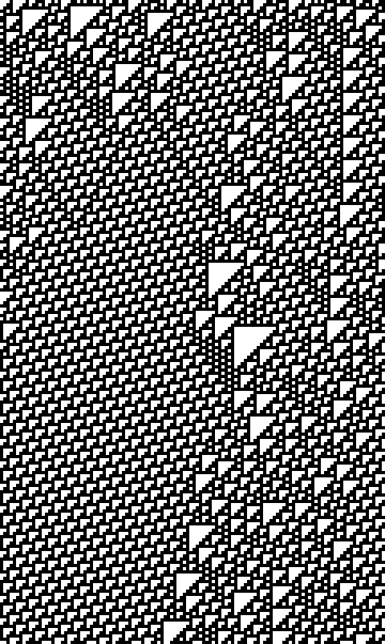

*Bitplane 4 (the best: domain fraction 0.773). The periodic ether is the
uniform white/grey background; the dark diagonal streaks are gliders propagating
through the ether. This is the canonical Class IV pattern.*

```
Detection results:
  Wolfram class:     IV  (confidence 0.85)  CORRECT
  Best bitplane df:  0.773  (plane 4, tile 14x7)
  Class IV planes:   8/8
  Particles:         28 (18 species)
  Coupling:          independent (MI = 0.001)
  Info transport:    0.678
  TE variance:       0.0153
```

The pipeline correctly identifies Rule 110 as Class IV with high confidence.
The best bitplane shows 77% domain coverage — a clear periodic ether with
23% occupied by defects/particles. All 8 bitplanes independently show
Class IV domain fractions (0.56–0.77).

### Rule 30: The Chaotic Baseline (Class III)

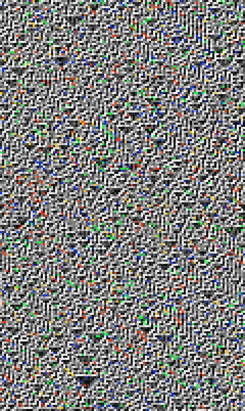

*Sigil-level spacetime diagram. Visually similar to Rule 110 above — the
256-symbol palette makes both look like random static.*

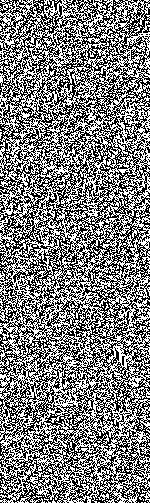

*All 8 bitplanes of Rule 30. Unlike Rule 110, there is no periodic ether —
every bitplane shows uniform noise. No localized structures, no repeating
background, just chaos at every scale.*


*Bitplane 0. Compare with Rule 110's bitplane 4 above: no periodic background,
no diagonal glider streaks. This is what Class III looks like per-bitplane.*

```
Detection results:
  Wolfram class:     III  (confidence 0.47)  CORRECT
  Best bitplane df:  0.527  (plane 6, tile 7x10)
  Class IV planes:   8/8 (spurious — all near noise floor)
  Particles:         7 (7 species)
  Coupling:          independent (MI = 0.0001)
  Info transport:    0.423
  TE variance:       0.0039
```

Correctly classified as Class III. The bitplane domain fraction of 0.527
is barely above the binary noise floor (~0.50 expected by chance with 256
tile searches). The tile sizes are inconsistent across bitplanes (7x10,
14x14, 15x14) — noise fits, not real periodicity.

### The Key Discrimination: Rule 110 vs Rule 30

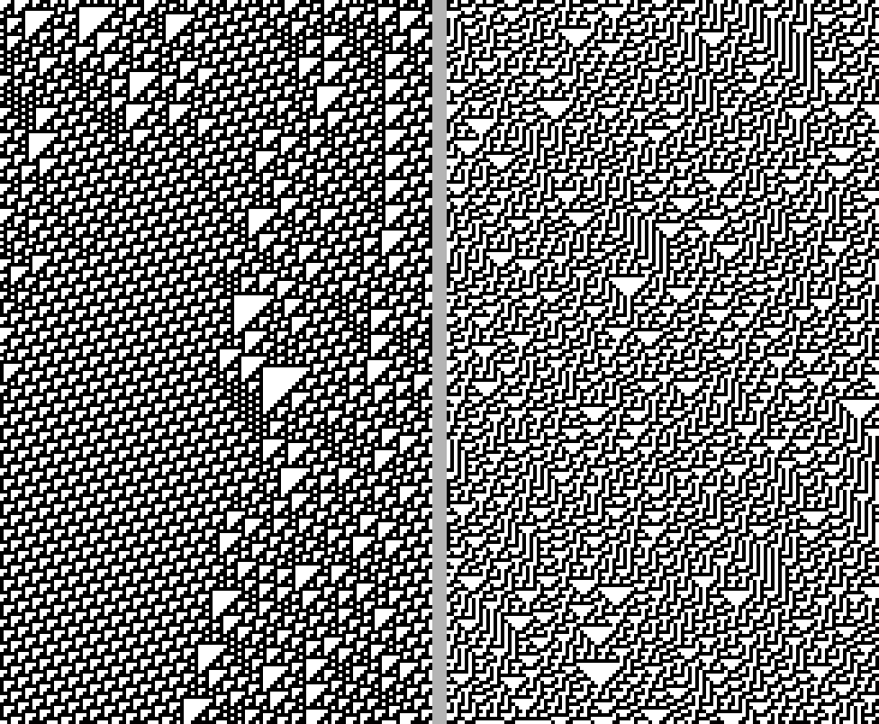

*Side-by-side: Rule 110 bitplane 4 (left) vs Rule 30 bitplane 0 (right).
The difference is immediately visible — Rule 110 has coherent diagonal
structures against a periodic background; Rule 30 is uniform noise.*

These two rules have nearly identical sigil-level statistics (entropy ~0.93,
change rate ~0.99, compression CV ~0.05). At the sigil level, they're
indistinguishable. But the SCI pipeline separates them clearly:

```
                        Rule 110    Rule 30     Discriminates?
  Best bitplane df:     0.773       0.527       YES (0.77 >> 0.53)
  Particles:            28          7           YES (4x more)
  Species:              18          7           YES (2.6x more)
  TE variance:          0.0153      0.0039      YES (4x higher)
  Info transport:       0.678       0.423       YES (60% higher)
  Coupling:             0.001       0.0001      — (both independent)
```

The bitplane domain fraction is the strongest single discriminator. Rule 110's
ether (df=0.77) is real structure; Rule 30's apparent match (df=0.53) is noise.

### Rule 90: Linear Sierpinski (Class III)

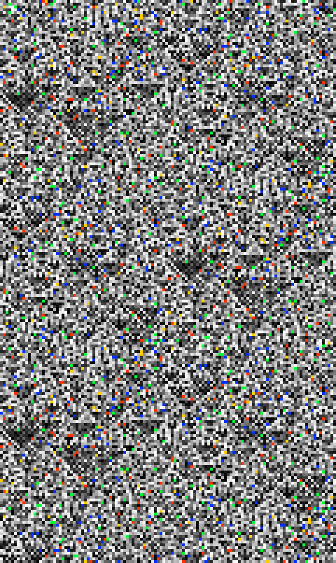

*Rule 90 sigil-level spacetime. Again looks like random static at the 256-symbol
level, though the underlying bitplanes contain Sierpinski triangle structure.*

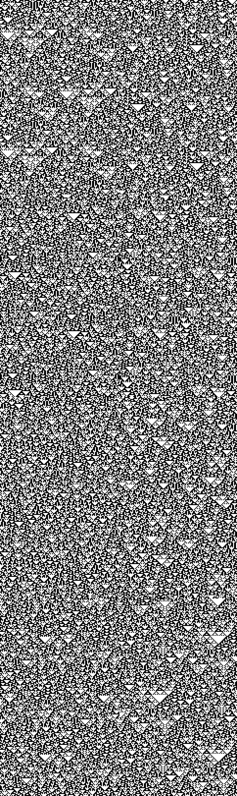

*Rule 90 bitplanes. On a 120-cell lattice with random initial conditions, the
Sierpinski triangles are disrupted by the random seed — the self-similar fractal
structure doesn't produce a small periodic tile.*

Rule 90 is XOR — linear over GF(2). It produces beautiful Sierpinski triangles
but cannot compute anything nontrivial. The Z3 wiring analyzer confirms its
linearity.

```
Detection results:
  Wolfram class:     III  (confidence 0.47)  CORRECT
  Best bitplane df:  0.537  (plane 6, tile 15x10)
  Coupling:          independent (MI = 0.0001)
  Z3 analysis:       linear, surjective, sensitivity 0.667
```

Correctly classified despite its visual structure. At the bitplane level, Rule 90
on a 120-cell lattice with random initial conditions shows near-chance domain
matching — the Sierpinski structure doesn't repeat with a small spatial period,
so the tile-based detector doesn't find it. (This is expected: Sierpinski
triangles have *self-similar* structure, not *periodic* structure.)

### Rule 184: Traffic Flow (Class II)

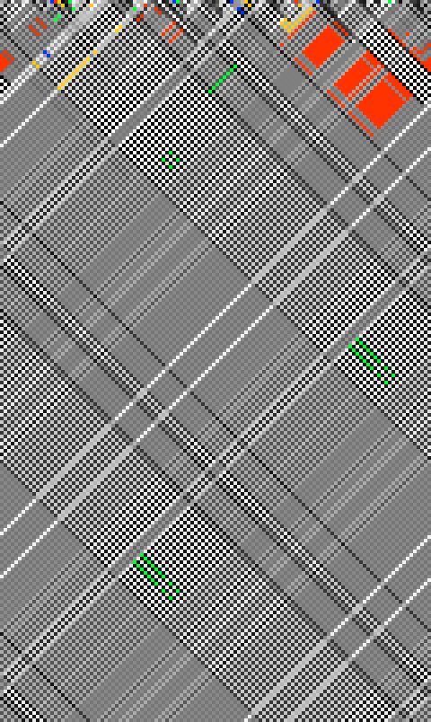

*Rule 184 sigil-level spacetime. Strikingly different from the chaotic rules —
clear diagonal banding visible even at the sigil level. The alternating
light/dark stripes are traffic flow particles propagating at velocity 1.*


*Rule 184 bitplanes. Most bitplanes show near-perfect period-2 temporal tiling
(alternating rows), especially planes 3, 4, 5 with domain fractions > 0.95.
The diagonal streaks in other planes are traffic particles.*

```
Detection results:
  Wolfram class:     II  (confidence 0.84)  CORRECT
  Best bitplane df:  0.992  (plane 3, tile 1x2)
  Diag autocorr:     0.834
  Coupling:          uniformly coupled (MI = 0.160, max = 0.579)
  Particles:         174 (27 species, 19 interactions)
```

Correctly classified as Class II via the diagonal autocorrelation pathway
(0.83 + high domain fraction). The period-2 temporal tile captures the
alternating traffic flow perfectly.

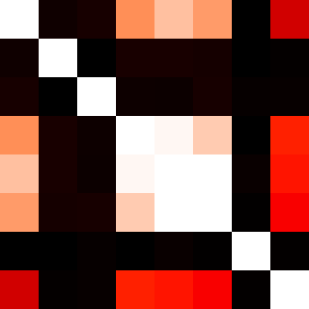

*Coupling heatmap (8x8 bitplane pairs). Bright = high mutual information.
The diagonal (self-information) is maximal. Off-diagonal entries show
substantial cross-bit coupling — Rule 184's AND/OR/NOT gates mix bits
at every cell position equally.*

**The coupling signal is significant.** Rule 184's formula `(C AND R) OR (L AND NOT C)`
uses AND/OR/NOT, which create cross-bit dependencies when different sigil bits
interact. Mean MI = 0.16 is an order of magnitude above the pure-XOR rules.
This is the first rule in our sample with nonzero coupling — and it shows
up as "uniformly coupled" because the AND/OR gates mix bits everywhere equally.

### Rule 54: The Controversial One (Class II or IV?)


*Rule 54 sigil-level spacetime. Visually the most chaotic-looking of the wiring
rules, though the bitplane analysis reveals structure.*

```
Detection results:
  Wolfram class:     IV  (confidence 0.69)
  Best bitplane df:  0.699  (plane 6, tile 1x2)
  Particles:         18 (16 species)
  Coupling:          independent (MI = 0.003)
  Info transport:    0.720
```

The pipeline calls it Class IV. This is genuinely debatable — Wolfram classifies
Rule 54 as Class II, but many researchers (Martinez, Lind) observe localized
structures and complex dynamics. The bitplane domain fraction of 0.70 puts it
well above the noise floor and below the fully-periodic threshold, exactly
where Class IV lives.

---

## 3. The Champion MMCA

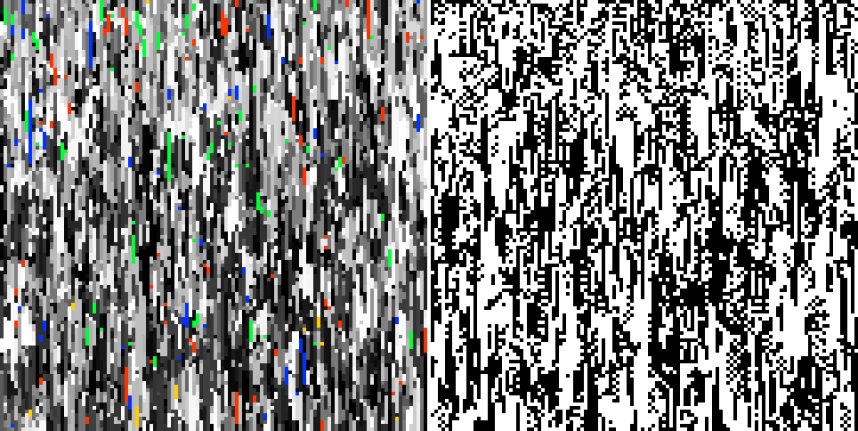

*Champion MMCA run (seed 352362012, 120 cells, 120 generations). Left: genotype
(sigil colors). Right: phenotype (black/white). The fluid diagonal texture with
rare bright sigils is the signature champion pattern.*

The champion run uses the legacy MMCA kernel — not a wiring rule, but the original
mutating-template system.

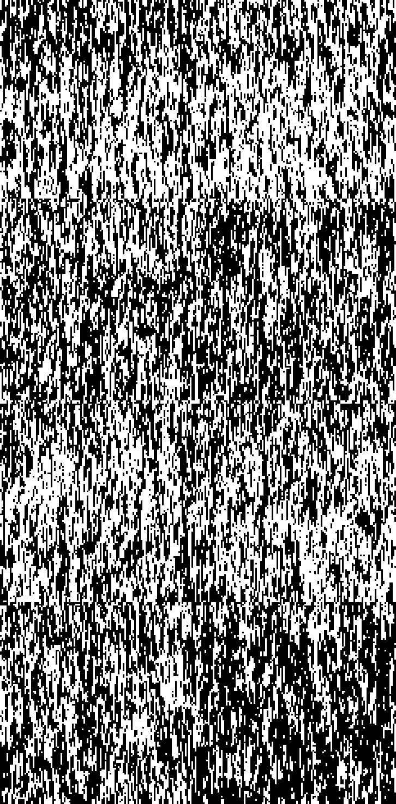

*Champion genotype decomposed into 8 bitplanes. Unlike the wiring rules,
the bitplanes show different structures — some have more frozen regions,
others more active. The variation across bitplanes is itself a signal of
cross-bit interaction from the legacy kernel.*

```
Detection results:
  Wolfram class:     IV  (confidence 0.86)
  Best bitplane df:  0.728  (plane 0, tile 1x1)
  Class IV planes:   8/8
  Particles:         32 (30 species)
  Coupling:          weakly coupled (MI = 0.017, max = 0.050)
  Info transport:    0.801
  TE variance:       0.0351
```

The pipeline classifies the champion as **Class IV** — periodic background with
localized defects. This is an unexpected and potentially important result.

We had labeled it "expected Class II" for the survey, but the SCI pipeline
sees something more. The champion's bitplane domain fraction (0.73) is in the
same range as Rule 110 (0.77). It has more particle species (30 vs 18) and
higher information transport (0.80 vs 0.68). The TE variance is the highest
in the sample (0.035) — suggesting that information flow is concentrated at
specific spacetime locations rather than spread uniformly.

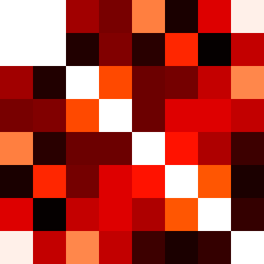

*Champion coupling heatmap. The off-diagonal entries show weak but nonzero
mutual information — the legacy kernel creates mild cross-bitplane interaction.
Compare with Rule 184's much brighter heatmap: the champion's coupling is
an order of magnitude weaker but still present.*

**The coupling signal is the key differentiator.** While all the pure wiring
rules show either independent (bitwise ops) or uniformly coupled (AND/OR mixing)
bitplanes, the champion shows **weak coupling** — MI = 0.017. This is a regime
that no elementary CA can produce: mild but nonzero cross-bitplane interaction,
creating dynamics that are neither 8 parallel 1D CAs nor a fully mixed system.

This is exactly the regime we should be searching in.

---

## 4. The Coupling Spectrum

The most novel finding from this survey is the coupling spectrum — measuring
*how much* the 8 bitplanes interact, not just *whether* they do.

```
Coupling regimes observed:

  Independent (MI ~ 0):
    Rule 30     MI = 0.0001    Pure XOR-like: each bitplane is its own CA
    Rule 90     MI = 0.0001    Same — linear gates create no cross-bit interaction
    Rule 110    MI = 0.0013    Same — even Turing-complete rules can be per-bit

  Weakly coupled (MI ~ 0.01):
    Champion    MI = 0.0165    Legacy kernel creates mild cross-bit interaction

  Uniformly coupled (MI ~ 0.16):
    Rule 184    MI = 0.1597    AND/OR/NOT gates mix bits at every cell equally

  Structured coupling (MI localized):
    ???         Not yet observed — predicted for boundary-guardian wirings
```

There is a conspicuous gap in this spectrum: **no structured coupling**. None of
the rules in our sample show coupling that is spatially localized — high at some
cells, low at others. The hotspot fraction is zero or near-zero for everything.

Structured coupling is the predicted signature of genuine multi-bit computation:
a system where cross-bitplane interaction happens at specific locations (like
glider collision sites) rather than everywhere. This is the regime L5-creative's
boundary-guardian gate was designed to create — routing cells to different
computational paths based on local conditions.

---

## 5. What the SCI Pipeline Can See

| Signal | Sees | Misses |
|--------|------|--------|
| Bitplane domain fraction | Class IV ether (Rule 110: 0.77) vs Class III noise (Rule 30: 0.53) | Self-similar structure (Rule 90 Sierpinski) |
| Particle count & species | Localized defects (Rule 110: 28 particles, 18 species) | Particle interactions (collision counting is weak) |
| Transfer entropy | Information concentration (Rule 110 TE-var 4x Rule 30) | Directional flow (which way do gliders go?) |
| Coupling spectrum | Independence vs uniform coupling | Structured coupling (not yet observed) |
| Diagonal autocorrelation | Traffic flow / traveling waves (Rule 184: 0.83) | Diagonal structure at non-unit velocity |

---

## 6. Next Steps

1. **L5-creative through the pipeline.** The boundary-guardian wiring should show
   *structured* coupling — the diversity gate creates spatially varying cross-bit
   interaction. This would fill the gap in the coupling spectrum.

2. **Hybrid wiring rules.** Combine Rule 110 structure (Class IV per-bitplane)
   with cross-bitplane gates. Can we create a system where the bitplanes interact
   at glider collision sites?

3. **Collision detection improvement.** The particle tracker finds particles but
   barely detects interactions (Rule 184 shows 19, everything else shows 0). Better
   collision counting would strengthen the Class IV signal.

4. **Self-similar structure detection.** Rule 90's Sierpinski triangles are invisible
   to the tile-based domain detector. A wavelet or multiscale correlation measure
   would catch this. (Low priority for SCI — linear rules can't compute.)

5. **TPG integration.** Wire the SCI metrics into the TPG fitness function. Evolve
   wiring diagrams toward high bitplane domain fraction + structured coupling +
   particle interactions. The search for computational intelligence begins.

---

## Files

```
Analysis modules:
  src/futon5/mmca/bitplane_analysis.clj    Multi-scale bitplane decomposition + coupling
  src/futon5/mmca/domain_analysis.clj      Spatiotemporal periodic tile detection
  src/futon5/mmca/particle_analysis.clj    Defect tracking, species cataloging
  src/futon5/mmca/info_dynamics.clj        Transfer entropy, active information storage
  src/futon5/mmca/wolfram_class.clj        Decision-tree Wolfram class estimator
  src/futon5/mmca/metrics.clj              Compression variance (per-row LZ78 CV)

Structural analysis:
  tools/tpg/wiring_analyzer.py             Z3-based GF(2) linearity, sensitivity
  tools/tpg/test_wiring_analyzer.py        Validates Rules 0/30/90/110/184/255

Rendering:
  scripts/sci_survey_render.clj            Generates all images for this report

Integration:
  scripts/sci_survey.clj                   Full pipeline survey script
  src/futon5/tpg/diagnostics.clj           Extended diagnostic vector

Data:
  data/wiring-rules/rule-{030,054,090,110,184}.edn

Images:
  out/sci-survey/                          All spacetime diagrams and heatmaps
```
