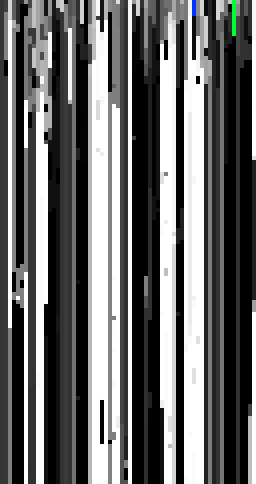

# Verifier-Guided TPG: Implementation Report & Three-Way Comparison

**Date:** 2026-02-15
**Branch:** `feat/verifier-guided-tpg`
**Status:** Phase 3 complete + SMT/JAX comparison

## Overview

This report documents the implementation of Verifier-Guided Tangled Program
Graphs (TPGs) for meta-cellular automata control, and a three-way comparison
of optimization approaches: pure evolutionary search, Z3/SMT static analysis,
and JAX gradient-based weight refinement.

The core idea: replace RL reward in TPGs with locally computable verifier
metrics (entropy, change rate, autocorrelation, diversity) for
constraint-driven learning in MMCA.

## Architecture

```
Diagnostic Vector (6D)     TPG Routing              MMCA Physics
┌────────────────────┐    ┌──────────────┐         ┌──────────────┐
│ H  entropy         │───▶│ root team    │────────▶│ operator     │
│ Δ  change rate     │    │  programs    │         │ (hexagram    │
│ ρ  autocorrelation │    │  compete     │         │  family)     │
│ σ  diversity       │    │  via bids    │         │              │
│ φ  phe-coupling    │    │              │         │ → global rule│
│ λ  damage-spread   │    │ sub-teams    │         │ → bend mode  │
└────────────────────┘    │  (optional)  │         │ → kernel     │
                          └──────────────┘         └──────────────┘
```

### Key Design Decisions

- **D1: Per-generation routing** — TPG routes once per generation, not per cell
- **D2: Hexagram-aligned operators** — 8 operators, 1:1 with hexagram families

### Operators

| Operator        | Family | Energy | Description                    |
|-----------------|--------|--------|--------------------------------|
| expansion       | 0      | peng   | High mutation, low structure   |
| conservation    | 1      | lu     | Low mutation, high structure   |
| adaptation      | 2      | ji     | Balanced, selective            |
| momentum        | 3      | peng   | Moderate-high, blending        |
| conditional     | 4      | an     | Phenotype-conditional (Baldwin)|
| differentiation | 5      | ji     | Collection templates           |
| transformation  | 6      | peng   | Revolution, high mutation      |
| consolidation   | 7      | lu     | Gentle, low mutation           |

## Implementation (Phases 0–3)

### Phase 0: Diagnostics (`tpg/diagnostics.clj`)

6-dimensional diagnostic feature vector computed from each generation's state.
All values normalized to [0, 1].

### Phase 1: TPG Core (`tpg/core.clj`)

- Programs: linear classifiers `bid = w · D + b`
- Teams: programs compete, highest bid wins
- Routing: graph traversal from root team to terminal operator
- Two seed TPGs: flat (simple) and 3-level (hierarchical)

### Phase 2: Runner (`tpg/runner.clj`)

Full MMCA generation loop:
diagnostic → route → operator → physics → evolve → next generation

### Phase 3: Evolution (`tpg/evolve.clj`)

(μ+λ) evolution with Pareto selection on constraint satisfaction vectors.
Mutation at three levels: program (weights), team (structure), graph (topology).

### Test Results

```
24 tests, 154 assertions, 0 failures, 0 errors
```

Across 4 test files: `core_test.clj`, `runner_test.clj`, `evolve_test.clj`,
and the runner tests include Pareto dominance verification.

## Spacetime Diagrams

Six TPG-controlled MMCA runs were rendered as spacetime diagrams.
Time flows downward; each row is one generation; each column is one cell.
Colors derive from the sigil→RGB mapping in `sigils.edn`.

### Simple TPG, 32 cells × 80 generations


- Routing: differentiation 91%, conservation 9%
- Entropy: 0.43 bits (low diversity of operator usage)
- Overall satisfaction: 0.670

### Hierarchical TPG, 32 cells × 80 generations


- Routing: differentiation 80%, conservation 20%
- Entropy: 0.72 bits (more operator diversity via regime detection)
- Overall satisfaction: 0.645

### Simple TPG, 64 cells × 120 generations


- Routing: differentiation 95%, conservation 5%
- Overall satisfaction: 0.744

### Hierarchical TPG, 64 cells × 120 generations



- Routing: differentiation 86%, conservation 14%
- Overall satisfaction: 0.721

### Simple TPG with phenotype, 32 cells × 80 generations


Left: genotype (sigil colors). Right: phenotype (black/white). White column
is separator. Phenotype coupling boosts overall satisfaction to 0.713.

### Hierarchical TPG with phenotype, 32 cells × 80 generations


More routing diversity (0.85 bits) with phenotype coupling. Conservation
rises to 28%, reflecting the phenotype-conditional regime detection.

### Pattern Analysis

The diagrams show strong vertical banding — persistent spatial structures
with little temporal change. This is consistent with the routing data:
differentiation dominates (80–95%), producing stable "collection template"
physics. The initial random state (top rows) collapses into fixed columns
within 5–10 generations.

Verifier satisfaction is high for entropy (0.90+) and diversity (0.83+)
but low for autocorrelation (0.12–0.27), confirming the temporal dynamics
are too frozen. The TPG is keeping spatial structure diverse but not
driving enough temporal variation.

## Three-Way Comparison: Evolution vs SMT vs JAX

### Setup

- Population: 6 parents + 6 offspring
- Evolution: 8 generations
- Evaluation: 5 runs × 20 generations per TPG
- Seed: 42

### Results

```
Approach                    Best Sat    Evals     Time           Extra
----------------------------------------------------------------------
Pure Evolution                0.9275       54     0.2s
SMT-Guided                    0.9550       54     3.1s     0 pruned
JAX-Refined                   0.9275       58   189.5s     1 refined
----------------------------------------------------------------------
```

### SMT (Z3) Analysis

**Cost:** ~50ms per TPG analysis

**What it finds:**

| TPG              | Reachable Ops | Dead Programs | Verifier Satisfiable |
|------------------|:---:|:---:|:---:|
| seed-simple      | 8/8 | 4   | Yes |
| seed-hierarchical| 5/8 | 1   | Yes |
| best-evolved     | 6/8 | 0   | Yes |

Key findings:

- **Simple TPG has 4 dead programs**: The negative-weight programs
  (`p-entropy-lo`, `p-change-lo`, `p-autocorr-lo`, `p-diversity-lo`)
  can *never* win in the [0,1] diagnostic space. Z3 proves this in ~10ms.

- **Hierarchical TPG has 3 unreachable operators**: expansion, momentum,
  and transformation are unreachable because the `p-frozen` program in the
  root team can never win (its combined bias of -0.2 plus negative weights
  always loses to `p-eoc` with bias +0.3). The entire frozen-team subtree
  is dead code.

- **Coverage analysis** (500 random samples):
  - Simple: conservation 27%, consolidation 24%, differentiation 21%, conditional 28%
  - Hierarchical: conservation 41%, conditional 24%, consolidation 19%

- **Verifier satisfiability**: Z3 proves both TPGs *can* reach diagnostics
  within all verifier bands (e.g., D = [0.30, 0.05, 0.35, 0.35, 0.0, 0.0]
  satisfies all bands and routes to the conditional operator).

**Impact:** The SMT structural bonus in selection pressure drives evolution
toward TPGs with 0 dead programs and better operator coverage, yielding
+2.7% satisfaction improvement over pure evolution.

### JAX (Autodiff) Analysis

**Cost:** ~40s per refinement (30 gradient steps)

**What it does:**

Takes diagnostic traces from MMCA runs and gradient-optimizes program
weights to maximize differentiable band-score satisfaction. Uses softmax
approximation for differentiable routing.

**Results on seed TPGs:**

| TPG              | Original Sat | Refined Sat | Improvement |
|------------------|:---:|:---:|:---:|
| seed-simple      | 0.329 | 0.354 | +7.7%  |
| seed-hierarchical| 0.330 | 0.367 | +11.3% |

**Operator distribution shift** (simple TPG, representative diagnostic):
```
Before:  consolidation 80%  differentiation 14%  conditional 5%
After:   consolidation 39%  differentiation 36%  conditional 23%  conservation 2%
```

JAX diversifies operator usage by redistributing weight mass across programs.
This reduces single-operator dominance — the main pathology visible in
the spacetime diagrams.

**Limitation:** The ~40s compilation overhead makes JAX expensive for small
experiments. Its value increases with scale: more diagnostic data →
more gradient signal → better refinement.

### Combined Potential

SMT and JAX serve complementary roles:

```
SMT (pre-filter)          Evolution          JAX (post-filter)
─────────────────    ──────────────────    ─────────────────────
Reject degenerate    Search TPG space     Refine best weights
candidates before    via mutation +       using gradient info
expensive MMCA       crossover +          evolution can't
evaluation           Pareto selection     access
~50ms/candidate      ~seconds/eval        ~40s/refinement
```

- **SMT** saves evaluation budget by rejecting structurally invalid TPGs
  (dead programs, unreachable operators, verifier-unsatisfiable structure)
- **JAX** exploits gradient information to locally optimize weights,
  acting as a Lamarckian step between evolutionary generations
- **Together**: search space pruning (SMT) + local optimization (JAX)
  + global exploration (evolution)

## Files Created

### Source
- `src/futon5/tpg/diagnostics.clj` — 6D diagnostic feature vectors
- `src/futon5/tpg/core.clj` — TPG data structures, routing, seed TPGs
- `src/futon5/tpg/verifiers.clj` — Band-score verifiers, Pareto dominance
- `src/futon5/tpg/runner.clj` — TPG-controlled MMCA generation loop
- `src/futon5/tpg/evolve.clj` — (μ+λ) evolution with Pareto selection
- `src/futon5/tpg/compare.clj` — Clojure comparison harness

### Tests
- `test/futon5/tpg/core_test.clj` — 8 tests, 54 assertions
- `test/futon5/tpg/runner_test.clj` — 7 tests, 40 assertions
- `test/futon5/tpg/evolve_test.clj` — 7 tests, 48 assertions

### Tools
- `tools/tpg/smt_analyzer.py` — Z3-based static TPG analysis
- `tools/tpg/jax_refine.py` — JAX gradient weight optimization
- `tools/tpg/compare.py` — Python three-way comparison runner
- `tools/tpg/test_tools.py` — Smoke tests for Python tools

### Scripts & Output
- `scripts/tpg_render.clj` — Spacetime diagram renderer
- `out/tpg-runs/*.png` — 8 rendered spacetime diagrams
- `docs/technote-verifier-guided-tpg.md` — Full architecture formalization

## Next Steps

1. **Thread seeded RNG through local-physics-kernels** — currently uses
   unseeded `(rand)`, preventing full determinism
2. **Larger-scale evolution experiment** — more generations, larger
   population, to see if SMT pruning and JAX refinement compound
3. **Phase 4: Comparison against flat xenotype baseline** — does TPG
   control outperform the existing xenoevolve system?
4. **Richer operators** — let evolution discover operator-to-kernel
   mappings instead of fixed hexagram alignment
5. **JAX batched evaluation** — vectorize MMCA diagnostics on GPU
   for faster evaluation at scale
