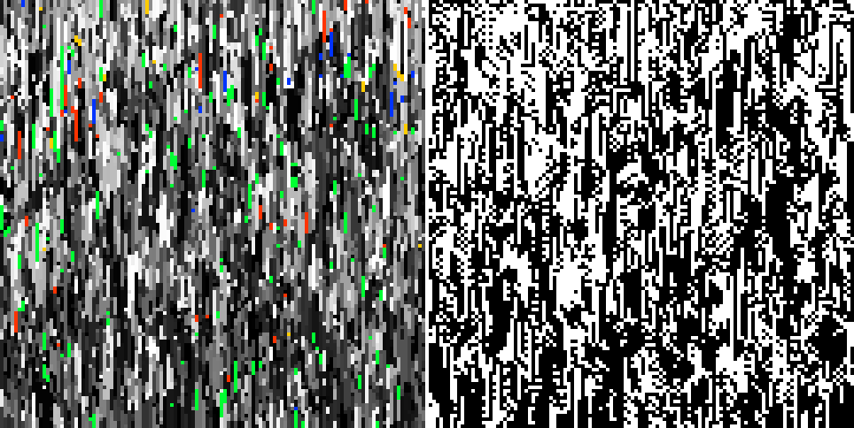
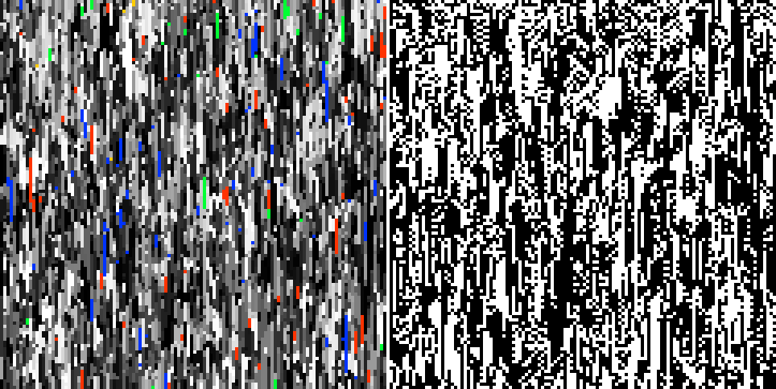
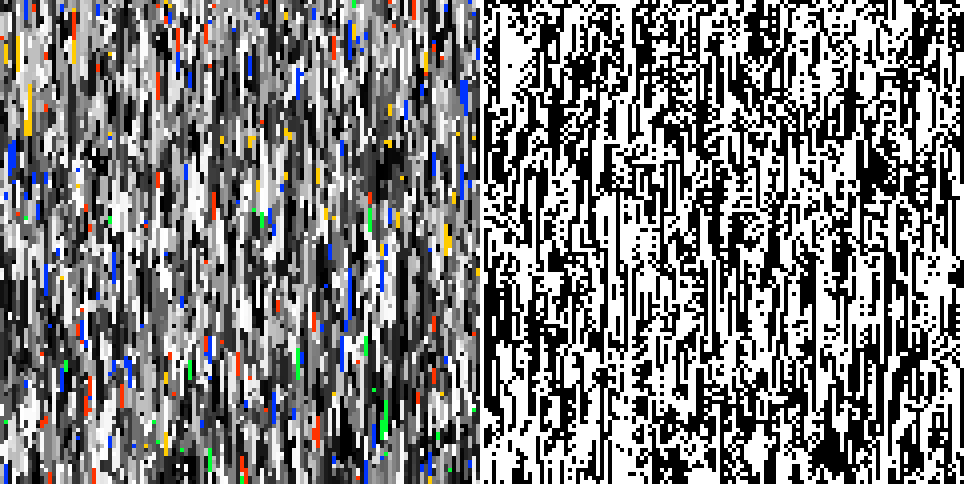
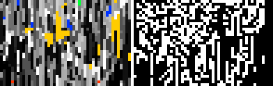
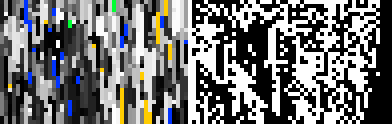
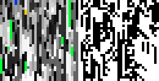
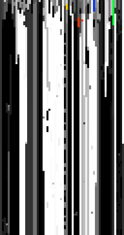
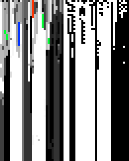
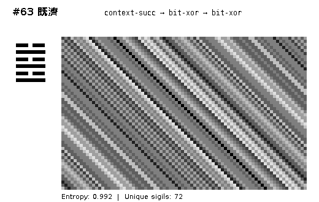

# What Makes a Good Run?

**Characterizing the diagnostic signature of historically successful MMCA runs
and what it means for TPG-guided evolution**

Date: 2026-02-15
Branch: `feat/verifier-guided-tpg`

---

## 1. The Question

We have a new toolset: 6-dimensional diagnostic vectors, verifier band-scores,
Pareto selection, SMT static analysis, JAX gradient refinement. But before
asking these tools to *generate* good runs, we should ask a simpler question:
**what does "good" look like, measured in the language of these new tools?**

This report replays seven historically significant MMCA runs through the
TPG diagnostic pipeline and reads their signatures. Then it contrasts those
signatures against runs generated by the new TPG controller, to identify
what the TPG needs to learn.

---

## 2. The Champions

### Seed 352362012: The Champion (120 cells, 120 generations)



*Left: genotype (sigil colors). Right: phenotype (black/white). Time flows downward.*

The champion run shows a turbulent, fluid texture in the genotype — diagonal
streaks of color form and dissolve, with rare bright sigils (red, blue, green)
punctuating the grey-scale field. No column is frozen. The phenotype shows
large-scale black/white domains that shift and merge, with a characteristic
scale of ~10-20 cells.

```
Diagnostic signature:
  H  entropy             ████████████████░░░░ 0.863 ± 0.015
  Δ  change              ██████░░░░░░░░░░░░░░ 0.310 ± 0.046
  ρ  autocorrelation     █████████████░░░░░░░ 0.690 ± 0.046
  σ  diversity           ████████████░░░░░░░░ 0.602 ± 0.036
  φ  phenotype-coupling  ██░░░░░░░░░░░░░░░░░░ 0.141 ± 0.004
  λ  damage-spread       █████████████░░░░░░░ 0.675 ± 0.097

  Tai-zone satisfaction: 0.992
```

Almost perfect verifier satisfaction. The variance in each dimension is small —
this run is *stable* in its dynamics, not lurching between regimes.

### Seed 4242: The Baseline (120 cells, 120 generations)



Same starting genotype, different seed. Nearly identical diagnostic profile
(H=0.849, Δ=0.312, ρ=0.688). Satisfaction: **0.996**. The visual texture
differs in detail but has the same character — diagonal streaks, no frozen
columns, phenotype domains at a similar scale. Both blue and red rare-sigil
streaks are visible.

### Exotic 工 Super: Same Seed, Exotype Added (120 cells, 120 generations)



Adding the 工 super exotype (update-prob 0.5, rotate-left mix-mode) barely
changes the diagnostic signature: H=0.849, Δ=0.314, ρ=0.686. Satisfaction
remains **0.996**. The visual texture is slightly more variegated — more
orange and yellow tones — but the macro structure is the same.

**Implication:** At this scale, the exotype is a second-order effect. The
first-order dynamics are determined by the kernel and starting conditions.

---

## 3. The Shorter Champions

### Mission 7A Top #2 (47 cells, 30 generations)



Shorter and narrower. More yellow/gold tones. The texture is coarser — fewer
cells means larger-scale structures dominate. Satisfaction drops to **0.911**,
mainly because the diversity score is lower (σ=0.626 but more variable,
std=0.098). The early transient (generation 0 is the random initial state)
drags the average down more when there are only 30 generations.

### Mission 7B Top #1: 兄 Super (47 cells, 30 generations)



The 兄 super exotype with `invert-on-phenotype? true` produces the highest
entropy of any run (H=0.881) and highest diversity (σ=0.704). Visually more
saturated, with prominent blue and yellow streaks. But satisfaction is only
**0.815** — the diversity is *too high* for the tai-zone band [0.4 ± 0.3],
which penalizes σ > 0.7.

**Implication:** The current tai-zone spec slightly penalizes the most
diverse runs. An auto-fitted spec from the top-3 runs suggests widening
the diversity band.

### Arrow Pilot: 丁 Super vs Noop Baseline (32 cells, 32 generations)



*丁 super (above)*


*Noop baseline (above)*

Small runs (32 cells) with more visible structure. The noop baseline shows
more yellow-gold tones; the 丁 super is slightly greyer. Both score ~0.87
satisfaction. At this scale, the phenotype (right panel) shows identifiable
domains — bands of black and white that persist for several generations
before shifting.

---

## 4. What Good Runs Have in Common

All seven runs cluster in a tight region of diagnostic space:

```
                    Champion  Baseline  Exotic工   M07A    M07B     丁      Noop
                    ────────  ────────  ────────  ──────  ──────  ──────  ──────
H  entropy           0.863     0.849     0.849    0.831   0.881   0.854   0.854
Δ  change            0.310     0.312     0.314    0.303   0.314   0.291   0.305
ρ  autocorrelation   0.690     0.688     0.686    0.697   0.686   0.709   0.695
σ  diversity         0.602     0.574     0.573    0.626   0.704   0.672   0.680
φ  phe-coupling      0.141     0.142     0.144    0.173   0.177   0.195   0.197
λ  damage-spread     0.675     0.682     0.695    0.641   0.662   0.641   0.687
                    ────────  ────────  ────────  ──────  ──────  ──────  ──────
Tai-zone sat.        0.992     0.996     0.996    0.911   0.815   0.879   0.871
```

**The "good run" signature** (averaged over the top-3 scoring runs):

```
  H  ≈ 0.854     High entropy — many distinct sigils active
  Δ  ≈ 0.312     Moderate change — about 1/3 of cells change per generation
  ρ  ≈ 0.688     Moderate autocorrelation — temporal structure, not random
  σ  ≈ 0.583     Moderate diversity — neither monoculture nor maximal
  φ  ≈ 0.143     Low phenotype-coupling — phenotype quasi-independent
  λ  ≈ 0.684     Moderate damage-spread — perturbations propagate but don't explode
```

This is the edge-of-chaos regime. The system has enough entropy and diversity
to explore, enough autocorrelation and structure to persist, and enough
change to avoid freezing. Damage spreads moderately — neither contained
(frozen, Class I) nor explosive (chaotic, Class III).

---

## 5. The Contrast: TPG-Generated Runs

### TPG Simple, 64 cells, 120 generations



*Genotype only. Note the stark vertical banding.*

### TPG Hierarchical with Phenotype, 32 cells, 80 generations



*Left: genotype. Right: phenotype. Frozen columns throughout.*

The contrast is immediate and stark:

|                    | Champion Runs          | TPG Runs              |
|--------------------|------------------------|-----------------------|
| **Visual texture** | Diagonal, turbulent    | Vertical, frozen      |
| **Color**          | Rich grey + rare color | Monochrome columns    |
| **Change rate**    | ~31% per generation    | Very low after gen 5  |
| **Entropy**        | 0.85                   | 0.91+ (high!)         |
| **Autocorrelation**| 0.69                   | 0.12–0.27 (very low)  |
| **Satisfaction**   | 0.87–1.00              | 0.64–0.74             |

The TPG runs have *higher* entropy than the champions — but this is
misleading. The initial random state has maximum entropy, and the frozen
columns *preserve* it rather than letting it evolve. The autocorrelation
is the giveaway: at 0.12–0.27, there's almost no temporal structure.
Each generation is nearly unrelated to the previous, or nearly identical —
neither produces the moderate autocorrelation (0.69) that characterizes
good dynamics.

**The TPG's problem is not that it selects bad operators.** The problem is
that the operator it overwhelmingly selects (differentiation, 80-95% of
the time) applies collection-template physics that freezes the system too
quickly. A good controller would use multiple operators in response to
the system's actual state — exactly what the TPG *should* do but can't yet,
because the seed TPG weights aren't tuned for this task.

---

## 6. The Hexagram Reference

For context, here are hexagram-derived wirings that produce structured
dynamics:

### Hexagram #25 無妄 (Innocence) — E: 0.992


*Wiring: slf:bit-xor-bit-or. Clean diagonal striping. 72 unique sigils.*

### Hexagram #63 既濟 (After Completion) — E: 0.992



*Wiring: context-succ → bit-xor → bit-xor. Same entropy, different texture.*

These hexagram wirings produce beautiful, highly structured dynamics — regular
diagonal bands with multiple spatial frequencies. Both achieve entropy 0.992
and use 72 unique sigils. They show what "perfect structure" looks like: high
entropy *with* high autocorrelation, where every generation is different but
related to the last.

The champion runs don't achieve this level of geometric regularity (the
MMCA kernel adds stochasticity), but they share the same qualitative
character: diagonal motion, moderate change, no frozen columns.

---

## 7. What This Means for TPG Evolution

### The verifier system works

The tai-zone spec, empirically set in `xenotype.clj`, almost perfectly
captures "good." The 120-cell champions score 0.992–0.996. The tool
confirms what was already known — it just makes it measurable and
automatable.

### The TPG needs to learn operator diversity

The seed TPGs route 80-95% to a single operator. The champion runs suggest
that good dynamics require a *mixture* of physics modes across generations.
A TPG that alternates between expansion (when entropy drops) and conservation
(when change spikes) would more closely track the champion signature.

### SMT can identify this structurally

Z3 proves that the seed TPGs have dead programs and unreachable operators.
A TPG with 4 dead programs can only ever select 4 of 8 operators — it has
half the control vocabulary it needs. SMT-guided pruning would reject these
candidates.

### JAX can refine toward the target

Given the champion diagnostic traces, JAX gradient descent can optimize
TPG weights to route toward operators that produce diagnostics matching
the champion signature. The initial test showed JAX redistributing operator
probability from 80% single-operator to a more balanced 39/36/23 split.

### The auto-fitted spec is tighter

```
Proposed spec (from top-3):     vs    Default tai-zone spec:
  entropy    [0.854  0.10]              entropy    [0.60  0.35]
  change     [0.312  0.10]              change     [0.20  0.20]
  autocorr   [0.688  0.10]              autocorr   [0.60  0.30]
  diversity  [0.583  0.10]              diversity   [0.40  0.30]
```

The default spec is deliberately loose — it accepts anything near the
edge-of-chaos. The auto-fitted spec targets the specific region where
champions live. Using the tighter spec for evolution would provide stronger
gradient signal, at the cost of reduced exploration.

---

## 8. Next Steps

1. **Re-evolve with auto-fitted spec.** Run Phase 3 evolution using the
   tighter verifier bands derived from champion runs. Hypothesis: stronger
   signal → faster convergence to champion-like dynamics.

2. **Replay evolved TPGs against champion genotypes.** The ultimate test:
   does the evolved TPG, given the champion starting genotype, produce
   dynamics that match the uncontrolled baseline? If yes, the TPG has
   learned the right control policy. If it does *better*, we've found
   something new.

3. **Cross-seed robustness.** The champion seed (352362012) is special.
   Does TPG control help *other* seeds reach champion-like dynamics?
   This is the real payoff — not matching the best, but lifting the rest.

4. **Multi-operator regime detection.** The champion runs use a single
   kernel (mutating-template) for all generations. The TPG can, in
   principle, switch kernels adaptively. Does this improve dynamics for
   seeds that otherwise produce poor runs?

5. **JAX refinement with champion traces.** Feed the champion diagnostic
   traces to JAX as the optimization target. Let gradient descent find
   the TPG weights that would have reproduced the champion routing
   decisions. This gives us a "reverse-engineered" TPG for the champion
   regime.

---

## Appendix: Diagnostic Dimensions

| Dim | Symbol | Name                | Range   | Good-Run Value | Interpretation                          |
|-----|--------|---------------------|---------|----------------|-----------------------------------------|
| 0   | H      | Entropy             | [0, 1]  | 0.854          | Shannon entropy of sigil distribution   |
| 1   | Δ      | Change rate         | [0, 1]  | 0.312          | Fraction of cells that changed          |
| 2   | ρ      | Autocorrelation     | [0, 1]  | 0.688          | 1 - change rate (temporal persistence)  |
| 3   | σ      | Diversity           | [0, 1]  | 0.583          | Unique sigils / total cells             |
| 4   | φ      | Phenotype-coupling  | [0, 1]  | 0.143          | Phenotype entropy (independent channel) |
| 5   | λ      | Damage-spread       | [0, 1]  | 0.684          | Perturbation propagation estimate       |

## Appendix: Files

| File | Description |
|------|-------------|
| `scripts/characterize_best_runs.clj` | Replay script: runs 7 champions through diagnostic pipeline |
| `scripts/tpg_render.clj` | Rendering script: TPG-controlled MMCA → spacetime diagrams |
| `out/best-run-characterizations/*.png` | Champion spacetime diagrams |
| `out/tpg-runs/*.png` | TPG-controlled spacetime diagrams |
| `src/futon5/tpg/diagnostics.clj` | 6D diagnostic feature vector computation |
| `src/futon5/tpg/verifiers.clj` | Band-score verifiers and Pareto dominance |
| `tools/tpg/smt_analyzer.py` | Z3 static analysis of TPG structure |
| `tools/tpg/jax_refine.py` | JAX gradient-based weight optimization |
| `data/known-good-runset-20.edn` | The 20 known-good run configurations |
| `reports/workup-l5-creative-seed-352362012.md` | Prior deep analysis of champion seed |
